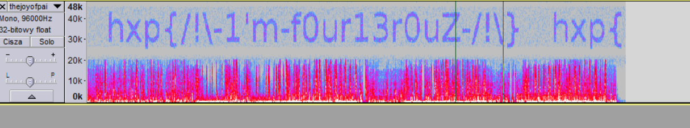

# The joy of painting (Stegano 50)

###ENG
[PL](#pl-version)

In the task we get an audio [file](thejoyofpainting.flac) with some german radio recording.
The task name suggest painting and we once made a very similar stegano on our own CTF so the first thing we checked was loading the file into Audacity, displaying spectrogram and raising the frequency limit to some high value.
This gave us:

###PL version

W zadaniu dostajemy [plik](thejoyofpainting.flac) z nagraniem niemieckiego radia.
Nazwa zadania sugeruje malowanie a my zrobiliśmy kiedyś bardzo podobne stegano na naszym własnym CTFie więc pierwsze co zrobiliśmy, to załadowanie pliku do Audacity, wyświetlenie spektrogramu i podniesienie zakresów częstotliwości.
To dało nam:

