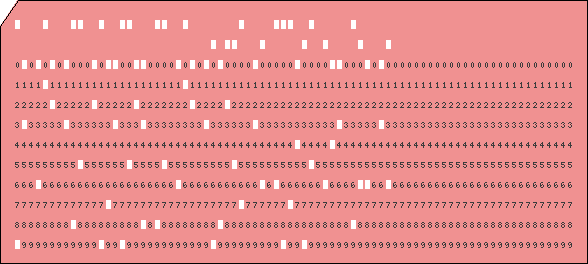

#Old but gold (misc, 250 points, solved by 76)

This chall involves parsing and decoding old recording medium - [punch cards](https://en.wikipedia.org/wiki/Punched_card)



We used pillow to detect if a given box is ticked or not:

``` python
for x in range(2, 82):
		column = ""
		for y in range(2, 25, 2):
			if(isWhite(pix[x*7 + 4, y*10 + 5])):
				column += ("O")
			else:
				column += (" ")
		sys.stdout.write(IBM_MODEL_029_KEYPUNCH[0][find(column)])
	print("")
```

The decoding part is done simply by using a template such as this one:

```
IBM_MODEL_029_KEYPUNCH = [
"    /&-0123456789ABCDEFGHIJKLMNOPQR/STUVWXYZ:#@'=x`.<(+|!$*);^~,%_>? |",
"12 / O           OOOOOOOOO                        OOOOOO             |",
"11|   O                   OOOOOOOOO                     OOOOOO       |",
" 0|    O                           OOOOOOOOO                  OOOOOO |",
" 1|     O        O        O        O                                 |",
" 2|      O        O        O        O       O     O     O     O      |",
" 3|       O        O        O        O       O     O     O     O     |",
" 4|        O        O        O        O       O     O     O     O    |",
" 5|         O        O        O        O       O     O     O     O   |",
" 6|          O        O        O        O       O     O     O     O  |",
" 7|           O        O        O        O       O     O     O     O |",
" 8|            O        O        O        O OOOOOOOOOOOOOOOOOOOOOOOO |",
" 9|             O        O        O        O                         |",
"  |__________________________________________________________________|",
]

def getRow(q):
	out = ""
	for i in range(len(IBM_MODEL_029_KEYPUNCH)):
		out += IBM_MODEL_029_KEYPUNCH[i][q]
	return out

def check(n, need):
	for i in range(len(need)):
		if(need[i] != getRow(n)[i+1]):
			return False
	return True
```

Output of the [script](punched.py):

```
ONCE UPON A TEME, THERE WAS A YOUNG HACKER CALLED MJ
IT WAS THE SIXTIES, HE WAS TRYKNG TO FIGURE OUT HOW TO
USE THOSE PONCHED CARDS, HE LIKES TO PROGRAM IN FORTRAN
AND COBOL, B(T EVEN AFTER ALL THOSE YEARS HE DOESNT KNOW
HOW TO PROPERLY MRITE SECURE CODE IN THOSE LANGUAGES
IN THOSE DAYS YOUR ONLY OPTION W4S READ LARGE BOOKS AND
MANUALS TRY1NG TO LEARN HOW TO PROGRAM AND SPEND A LOT
OF TIME PUNCHING THOSE NARDS, CAN YOU IMAGINE WHAT COULD
HAPPEN IF YOU FAKE A SMALL MISTAKE IN ON OF THOSE PUNCHED
CARDS? AFTER THOSE HOURS WAITING ROR A RESULT, THEN IT SAYS
ERROR DUE TO A SMALL AND ALMOST INSIGNIFICANT MIST4KE BUT
THAT WILL TAKE MORE TIME TO MEBUG AND FIGURE OUT WHERE WAS
THE BUG, BUT THOSE WER3 THE OLD DAYS. CAN YOU FIND THE FLAG
USING THIS OLD TECHNOLOGY? GOOD LUCK, YOU WILL NEED IT)
```

The flag is a concatenation of typos in the text:
`EKO(M41NFR4M3)`