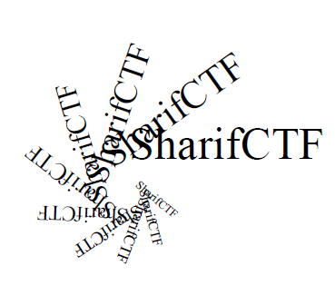
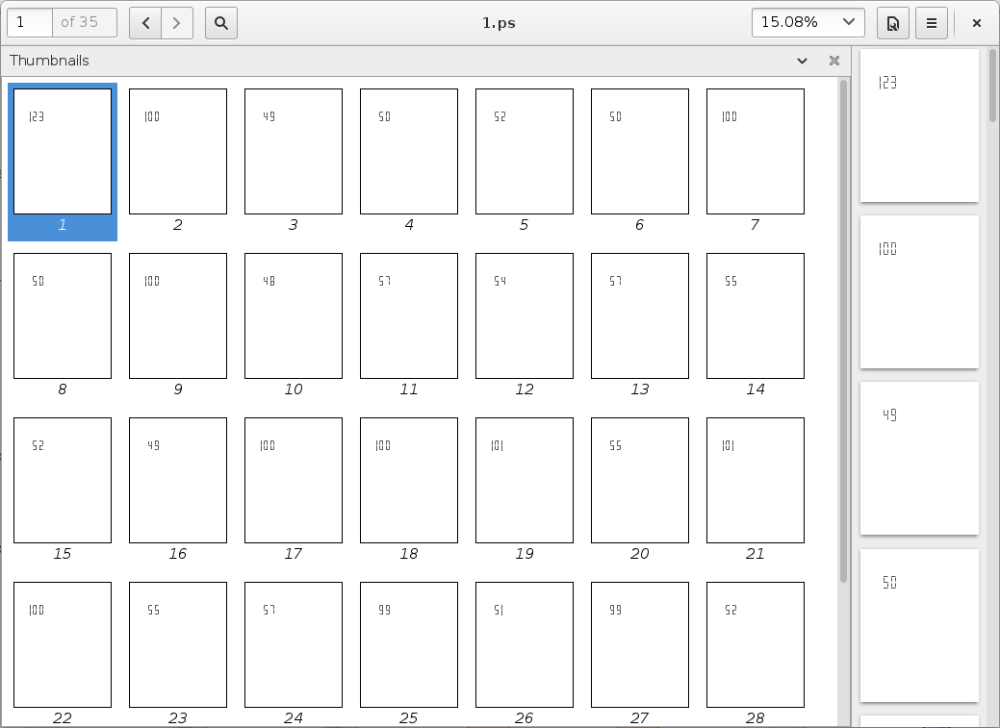

## Strange PDF(forensics, 150 points, 61 solves)




Dumping the contains of the pdf results in a set of strange streams:

```
7 0 obj
<</Length 283>>
stream
2 w 

120 650 m 140 650 l 
140 645 m 140 625 l 
120 620 m 140 620 l 
120 615 m 120 595 l 
120 590 m 140 590 l 

S
endstream
endobj
```

It turns out to that it's a list of starting and ending points of lines, if we'd want to save that as postscript:


```
%%Page: 1 1
newpath

120 650 moveto
140 650 lineto 
140 645 moveto
140 625 lineto 
120 620 moveto
140 620 lineto 
120 615 moveto
120 595 lineto 
120 590 moveto
140 590 lineto 

2 setlinewidth
stroke
fill

showpage
```

That way each stream is printed on a new page, we get:



Which decodes to:

`SharifCTF{d1242d2d0969741dde7ed79c3c409c46}`
