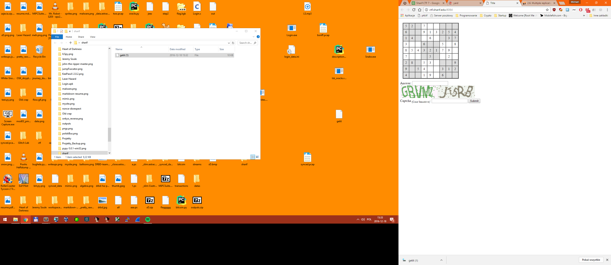

## jareCaptcha (web/ppc, 200 points, 32 solves)




After solving a sudoku and entering the correct captcha we get `You have solved 1 sudokus, just 199 to go!`

Solving sudokus is easy, ocr-ing captchas is the hard part, and with 200 puzzles, doing it manually is not a possibility.

The current captcha id is stored in our session id, and we get a new one each time the image is downloaded.

Which means that we should be able to load a starting captcha once, transcribe it manually and then send each sudoku solution with the same captcha answer.

A random sudoku solver should work, (we used https://attractivechaos.github.io/plb/kudoku.html)

``` javascript


//get the sudoku fields
tables = document.getElementsByTagName("tr")

out = ""

//parse the sudoku board
for(var i=1; i<tables.length; i++){
	rows = tables[i].children
	for(var j=0; j<9; j++){
		fields = (rows[j].innerHTML)
		if(fields != "&nbsp;&nbsp;"){
			out += (fields)
		} else {
			out += "."
		}
	}
}


function sudoku_solver() {
...
solving sudoku, boring...
...
}

//solve the sudoku 
solver = sudoku_solver()
solution = (solver(out)[0].join(''))

//fill the form
document.getElementsByName("solvedsudoku")[0].value = solution
document.getElementsByName("captcha")[1].value = "209S1 6065S" //first captcha

//submit
document.forms[0].submit.click()

```

Chrome has a setting to stop it from downloading any images, which made things a lot easier.

And after a lot of clicking, we get the flag:

`SharifCTF{431bdff2b76f2e54a2621d13d5d5fbb7} ;) `