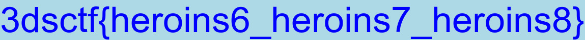

# What the hex (for 300)

###ENG
[PL](#pl-version)

In the task we get a large binary file (too large to put here, sorry).
We notice that the file is in fact a 3000 concatenated JPG files with missing headers.
We fix them and split with a script:

```python
s = open("massa.raw", "rb").read().decode("hex")
r = s.split("FIF\x00")
for i in range(1, 3001):
    open("out/" + str(i) + ".jpg", "wb").write("\xff\xd8\xff\xe0\x00\x10JFIF\x00" + r[i])
```

And this way we get 3000 files looking like this:



It's quite clear that the `flag` in the picture has incorrect format.
We assume that there is one flag with proper format somewhere, but who would look for it by hand?
Instead we used pytesseract to OCR each file and look for something more like the flag.
Tesseract had some issues with reading blue letters on blue background, so we made it black and white with Pillow first:

```python
import codecs
import io
import math
from multiprocessing import freeze_support
from PIL import Image
from pytesseract import pytesseract
from crypto_commons.brute.brute import brute


def similar(color1, color2):
    return sum([math.fabs(color1[i] - color2[i]) for i in range(3)]) < 50


def black_and_white(im, filling):
    black = (0, 0, 0)
    white = (255, 255, 255)
    pixels = im.load()
    for i in range(im.size[0]):
        for j in range(im.size[1]):
            color = pixels[i, j]
            if similar(color, filling):
                pixels[i, j] = white
            else:
                pixels[i, j] = black


def worker(i):
    with codecs.open("C:\\Users\\PC\\Desktop\\3ds\\outp\\" + str(i) + ".jpg", "rb")as f:
        image_file = io.BytesIO(f.read())
        im = Image.open(image_file)
        im = im.convert('RGB')
        black_and_white(im, (173, 217, 230))
        text = pytesseract.image_to_string(im, config="-psm 8")
        print(i, text)
        if not text.startswith("3dsctf"):
            im.show()
            print('real flag', i, text)


def main():
    brute(worker, range(1, 3001))


if __name__ == '__main__':
    freeze_support()
    main()
```

By running this in paralell with our crypto-commons multiprocessing brute we get the results pretty fast and the only result we get is:


There was a very nasty twist here, because the actual flag was supposed to contain large `O` and small `L`.
While the `L` is reasonable, since both large `i` and small `L` look alike, using large `O` where in the picture it's pretty clear that we have `0` is just a dick move.

Anyway the actual flag was `3DS{u_5hOuIdv3_7ried_tesseract}`

###PL version

W zadaniu dostajemy duży plik binarny (za dużo żeby to wrzucić, przepraszamy).
Zauważamy, ze plik to w rzeczywistości sklejone ze sobą 3000 plików JPG bez headerów.
Poprawiamy je i dzielimy za pomocą:

```python
s = open("massa.raw", "rb").read().decode("hex")
r = s.split("FIF\x00")
for i in range(1, 3001):
    open("out/" + str(i) + ".jpg", "wb").write("\xff\xd8\xff\xe0\x00\x10JFIF\x00" + r[i])
```

I tym sposobem dostajemy 3000 plików wyglądajacych tak:


Jest dość jasne, że `flaga` na obrazku ma niepoprawny format.
Zakładamy że jest tam gdzieś jedna poprawna flaga, ale kto by jej szukał ręcznie?
Zamiast tego używamy pytesseract żeby OCRować pliki i szukać czegoś co bardziej przypomina flagę.
Tesseract miał jakieś problemy z niebieskimi napisami na niebieskim tle więc zmieniliśmy obrazki na czarno-białe za pomocą Pillow:

```python
import codecs
import io
import math
from multiprocessing import freeze_support
from PIL import Image
from pytesseract import pytesseract
from crypto_commons.brute.brute import brute


def similar(color1, color2):
    return sum([math.fabs(color1[i] - color2[i]) for i in range(3)]) < 50


def black_and_white(im, filling):
    black = (0, 0, 0)
    white = (255, 255, 255)
    pixels = im.load()
    for i in range(im.size[0]):
        for j in range(im.size[1]):
            color = pixels[i, j]
            if similar(color, filling):
                pixels[i, j] = white
            else:
                pixels[i, j] = black


def worker(i):
    with codecs.open("C:\\Users\\PC\\Desktop\\3ds\\outp\\" + str(i) + ".jpg", "rb")as f:
        image_file = io.BytesIO(f.read())
        im = Image.open(image_file)
        im = im.convert('RGB')
        black_and_white(im, (173, 217, 230))
        text = pytesseract.image_to_string(im, config="-psm 8")
        print(i, text)
        if not text.startswith("3dsctf"):
            im.show()
            print('real flag', i, text)


def main():
    brute(worker, range(1, 3001))


if __name__ == '__main__':
    freeze_support()
    main()
```

Uruchamiając to równolegle z naszym brute z crypto-commons dostajemy dość szybko wyniki i jedyne trafienie to:


Było tutaj dość nieładne zagranie ze strony organizatorów, bo flaga miała zawierać duże `O` oraz małe `L`.
O ile `L` jest sensowne, bo duże `i` oraz małe `L` wyglądają tak samo, użycie dużego `O` podczas gdy na obrazku ewidentnie mamy `0` to po prostu zagranie poniżej pasa.
Tak czy siak końcowa flaga to `3DS{u_5hOuIdv3_7ried_tesseract}`
