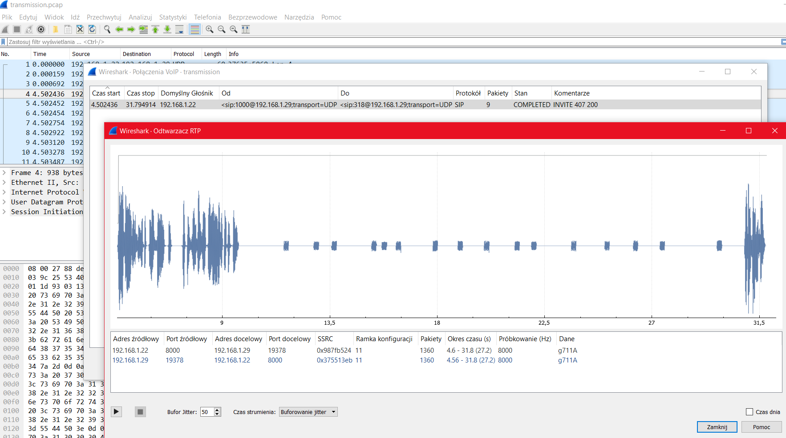
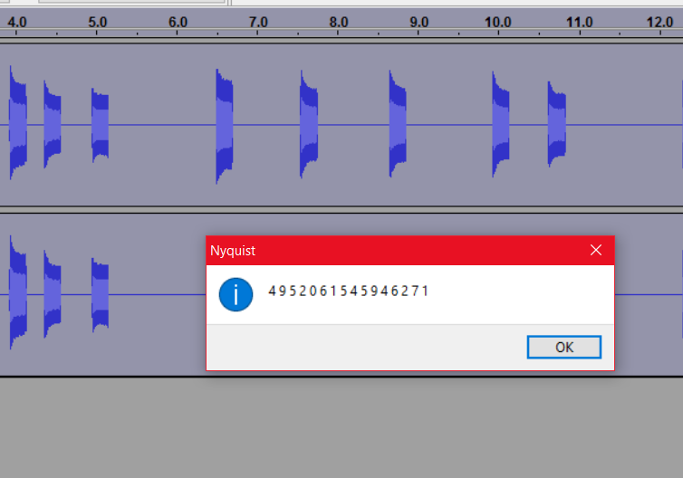

# HALP (network 300)

###ENG
[PL](#pl-version)

In the task we get a [pcap file](transmission.pcap).
The file is from some VoIP call.
If we analyse the RTP streams and use VoIP feature of Wireshark to play the streams it can find, we will hear someone connecting to an automatic response machine, and then typing a number with dial tones:

We extracted the dial-tones to a [file](dtm.flac) and then used DTMF decoder Audacity Plugin to recognize the keys:

I was confused what to do next, but my level headed friend just tried simply `3DS{4952061545946271}` as the flag, and it worked.

###PL version

W zadaniu dostajemy [plik pcap](transmission.pcap).
Jest to zapis z rozmowy VoIP.
Jeśli przeanalizujemy strumienie RTP i użyjemy później narzędzi Wiresharka do analizy VoIP, znajdziemy zapis audio z połączenia do jakiegoś automatycznego systemu odpowiedzi, a następnie wystukanie na klawiaturze tonowej jakichś cyfr:

Wyciągnęliśmy same tony do osobnego [pliku](dtm.flac) a następnie użyliśmy pluginu do Audacity DTMF decoder żeby rozpoznać klawisze:

Miałem w tej chwili zagwoztkę co zrobić dalej, ale jeden z moich kolegów spróbował wpisać po prostu `3DS{4952061545946271}` jako flagę i zadziałało.
