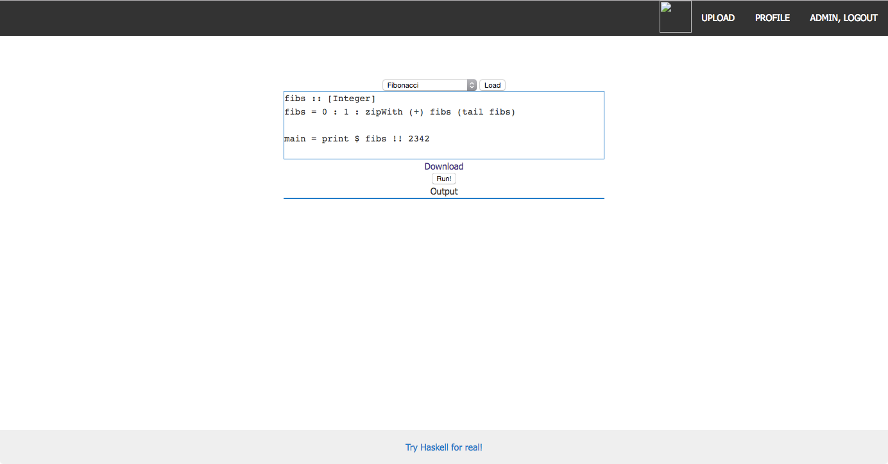
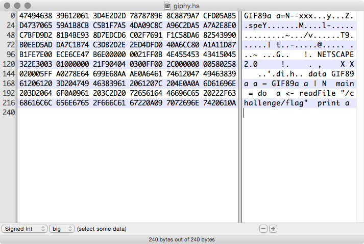

#try(web, 150, 67 solves)
> "I never try anything, I just do it!" Do

> Flag is in /challenge/flag




We are able to execute haskell scripts that are stored on the server, we are also able to upload a profile gif.

Our challenge is to read `/challenge/flag`

We should be able to upload a script that is also a valid gif and then execute it using a path traversal.

File that meets both cryteria:



```
Run!
Output
"33C3_n3xt_T1me_idri5_m4ybe\n"
```