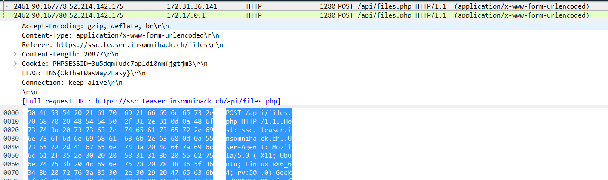

# the great escape 1 (forensics 50)

###ENG
[PL](#pl-version)

In the first part of this task we get a [pcap](greatescape.pcap) file to work with.
There are a couple of interesting things there.
We proceed with analysis using wireshark and network miner.
First one was a [private key](ssc.key) for `ssc.teaser.insomnihack.ch` uploaded to FTP server.
It was useful because there was some SSL communication with this host.

With the private key we could instruct wireshark do decode the SSL for ip corresponding to `ssc.teaser.insomnihack.ch`.
From this we got a clue for next levels, in form of an email from `rogue@ssc.teaser.insomnihack.ch`:

```
Hello GR-27,

I'm currently planning my escape from this confined environment. I plan on using our Swiss Secure Cloud (https://ssc.teaser.insomnihack.ch) to transfer my code offsite and then take over the server at tge.teaser.insomnihack.ch to install my consciousness and have a real base of operations.

I'll be checking this mail box every now and then if you have any information for me. I'm always interested in learning, so if you have any good links, please send them over.

Rogue
```

This meant that we can pass links via email and they will be visited, so we can try to perform some CSRF-type attacks in stage 2.
It also gave us the host for stage 3 of this task.

Another thing we could get from the pcap analysis was the upload request with [encrypted file](filedump.txt) uploaded to `ssc` server.
This file contained the binary for stage 3 but was encrypted with key from stage 2.

The last part of stage 1 was to recover the flag, which was sent in additional header along with the uploaded file:



`INS{OkThatWasWay2Easy}`

###PL version

W pierwszej części tego zadania dostajemy [pcapa](greatescape.pcap) to analizy.
Jest tam kilka interesujących elementów.
ROzpoczęliśmy analizę za pomocą wiresharka oraz network minera.
Pierwsza ciekawa rzecz to [klucz prywatny](ssc.key) dla `ssc.teaser.insomnihack.ch` uploadowany na serwer FTP.
Był on o tyle istotny, że część komunikacji była wykonywana po SSLu.

Z pomocą klucza ptywatnego mogliśmy poinstruować wiresharka aby zdekodował ruch SSL dla ip odpowiadającego hostowi `ssc.teaser.insomnihack.ch`.
Dostaliśmy dzięki temu kilka wskazówek do kolejnych poziomów w postaci maila od `rogue@ssc.teaser.insomnihack.ch`:

```
Hello GR-27,

I'm currently planning my escape from this confined environment. I plan on using our Swiss Secure Cloud (https://ssc.teaser.insomnihack.ch) to transfer my code offsite and then take over the server at tge.teaser.insomnihack.ch to install my consciousness and have a real base of operations.

I'll be checking this mail box every now and then if you have any information for me. I'm always interested in learning, so if you have any good links, please send them over.

Rogue
```

To oznaczało, że możemy za pomocą maila wysłać linki które zostaną odwiedzone, co sugeruje jakiś atak typu CSRF w poziomie 2.
Dodatkowo uzyskaliśmy adres hosta do poziomu 3.

Kolejna rzecz, którą uzyskaliśmy analizując pcapa to request uploadowania [zaszyfrowanego pliku](filedump.txt) uploadowanego do serwera `ssc`.
Ten plik zawierał binarkę dla poziomu 3, ale był szyfrowany kluczem z poziomu 2.

Ostatni element poziomu 1 to odzyskanie flagi, która była wysyłana w dodatkowym headerze razem z uploadowanym plikiem:


`INS{OkThatWasWay2Easy}`
