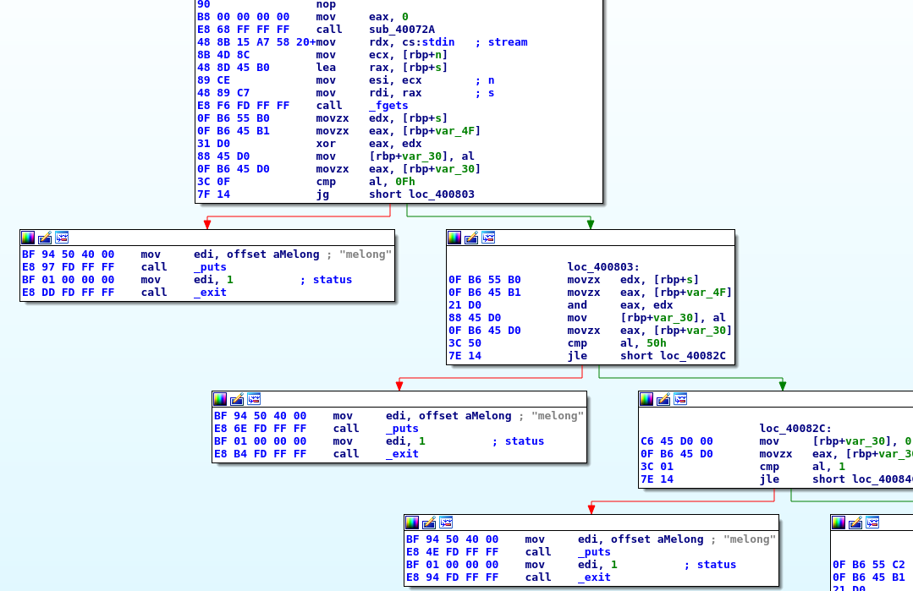
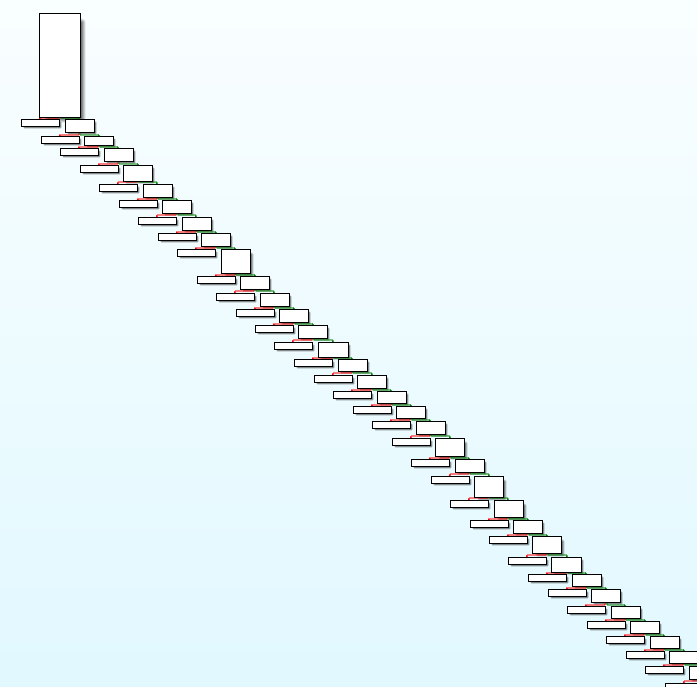
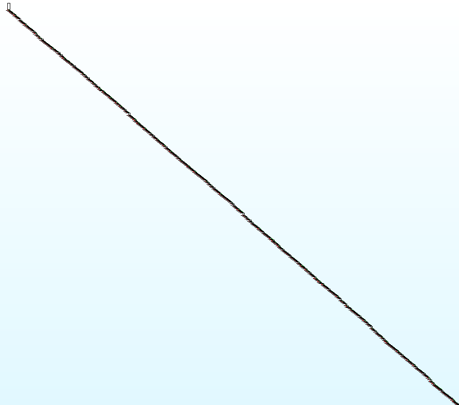

# angrybird (RE 125)

###ENG

We are faced with x64 ELF binary.

Binary is obviously corrupted - it exits right at the beginning. Unfortunatelly I don't have non-patched binary anymore,
but I had to NOP a lot of code at the beginning:

```asm
55                push    rbp
48 89 E5          mov     rbp, rsp
48 83 C4 80       add     rsp, 0FFFFFFFFFFFFFF80h
64 48 8B 04 25 28+mov     rax, fs:28h
48 89 45 F8       mov     [rbp+var_8], rax
90                nop
90                nop
90                nop
90                nop
90                nop
90                nop
90                nop
90                nop
90                nop
90                nop
90                nop
48 C7 45 90 18 60+mov     [rbp+var_70], offset strncmpp
48 C7 45 98 20 60+mov     [rbp+var_68], offset putsp
48 C7 45 A0 28 60+mov     [rbp+var_60], offset stack_chk_fail
48 C7 45 A8 38 60+mov     [rbp+var_58], offset startmain
B8 00 00 00 00    mov     eax, 0
E8 4B FF FF FF    call    should_return_21
89 45 8C          mov     [rbp+n], eax
B8 00 00 00 00    mov     eax, 0
90                nop
90                nop
90                nop
90                nop
90                nop
B8 00 00 00 00    mov     eax, 0
```

And patch function `should return 21` (because according to debug string, it should return 21):

```asm
                  should_return_21 proc near
55                push    rbp
48 89 E5          mov     rbp, rsp
BF 64 50 40 00    mov     edi, offset s   ; "you should return 21 not 1 :("
E8 8C FE FF FF    call    _puts
8B 05 56 59 20 00 mov     eax, cs:const_1
5D                pop     rbp
C3                retn
                  should_return_21 endp
```

Now binary is working correctly: it reads flag, and does a lot of checks, one char at a time:



This looks easy enough, right?
Well, let's zoom out:



Wait, what? Let's zoom out even more:



`O_o`.

Ok, we might need to do this more intelligently.

Turns out that if you think hard enough, everything is trivial. Or maybe just angr creators are genius, I don't know.
Anyway, I created this very basic angr script (my second angr experience ever):

```python
import angr

main = 0x4007DA
find = 0x404FAB
find = 0x404FC1
avoid = [0x400590]

p = angr.Project('./angrybird2')
init = p.factory.blank_state(addr=main)
pg = p.factory.path_group(init, threads=8)
ex = pg.explore(find=find, avoid=avoid)

final = ex.found[0].state
flag = final.posix.dumps(0)

print("Flag: {0}".format(final.posix.dumps(1)))
```

And, just like that, it worked (almost) first time and shown the flag:

```
╭─msm@mercury /home/msm/codegate2017  ‹system›
╰─$ python angrdo.py
WARNING | 2017-02-13 19:40:46,155 | simuvex.plugins.symbolic_memory | Concretizing symbolic length. Much sad; think about implementing.
Flag: you typed : Im_so_cute&pretty_:) @  @@
```
