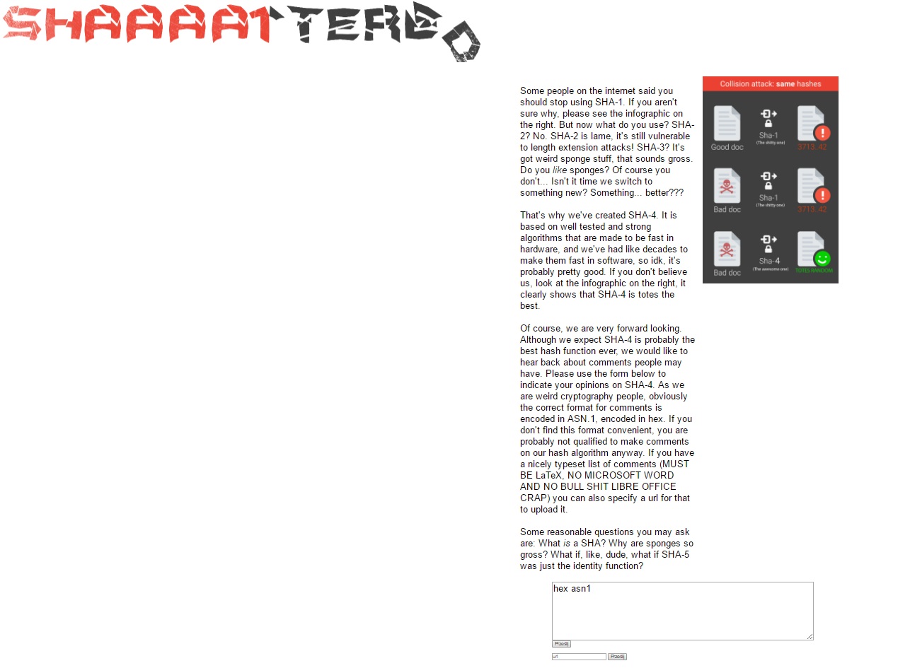
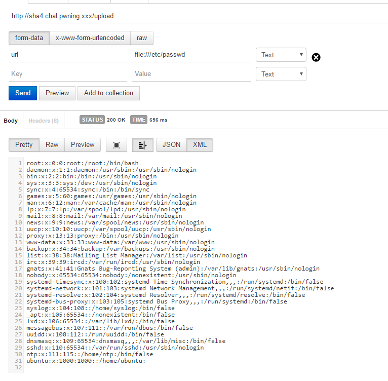
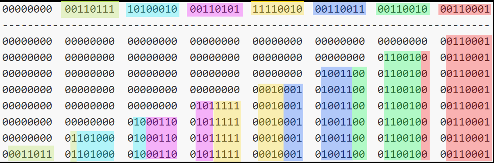

# Sha4 (web, 300pts, 16 solves)

> tl;dr
> local file read, race condition, hash collision, template injection




Start off by noticing that we have a local file read via the second form:



Lets find out where the application root is: `etc/apache2/sites-enabled/000-default.conf`

```
<VirtualHost *:80>
	ServerName sha4

	WSGIDaemonProcess sha4 user=www-data group=www-data threads=8 request-timeout=10
	WSGIScriptAlias / /var/www/sha4/sha4.wsgi

	
    <directory /var/www/sha4>
		WSGIProcessGroup sha4
		WSGIApplicationGroup %{GLOBAL}
		WSGIScriptReloading On
		Order deny,allow
		Allow from all
	</directory>

	ErrorLog ${APACHE_LOG_DIR}/error.log
	CustomLog ${APACHE_LOG_DIR}/access.log combined


</VirtualHost>
```

Great!


[file:////var/www/sha4/server.py](server.py)

[file:////var/www/sha4/sha4.py](sha4.py)


``` python
  out_text = str(decode(ber))
  open(f, "w").write(out_text)

  if is_unsafe(out_text):
    return render_template_string(unsafe)

  commentt = comment % open(f).read()
  return render_template_string(commentt, comment=out_text.replace("\n","<br/>"))
```

Is vulnerable to race condition and template injection.
We can first send a valid input that passes the `is_unsafe` check and then a malicious input that injects the template.
The contents of the file will be overwritten for the first execution so it will actually evaluate the malicious payload.

But in order to do that we need 2 different inputs that produce the same `hash`:

``` python
def hash(x):
  h0 = "SHA4_IS_"
  h1 = "DA_BEST!"
  keys = unpad(x)
  for key in keys:
    h0 = DES.new(key).encrypt(h0)
    h1 = DES.new(key).encrypt(h1)
  return h0+h1
```


`unpad` function works as expected, it takes 7 8-bit bytes and output 8 7-bit bytes, pic rel:



DES.encrypt was the problem. 
DES, although takes 8 bytes as key, is not using all 64 bits, but only 56.
It ignores lsb of each byte.
This means we can actually get identical encryption results as long as the key differs only on lsb.
So we could perform bitflips to bypass the whitelist with one of the payloads, while the other payload with malicious injection would have the same hash.


After generating a valid input pair we simply smash them agains the server and hope to get the flag via usual template injection:

```python
{{3*3*3*3}}

 
	
	
		{{ os.check_output("cat sha4/flag_bilaabluagbiluariglublaireugrpoop".strip(), shell=True) }}
	

```

[full script](script.py)

Which gives `PCTF{th3 security aspect of cyber is very very tough}`
