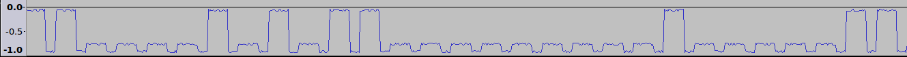
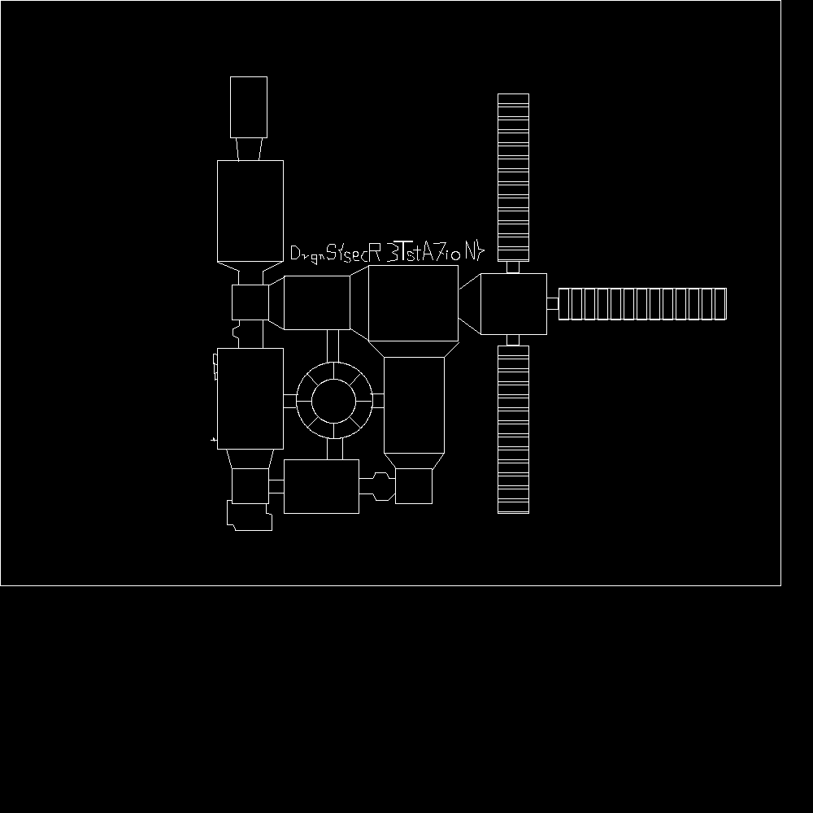

# Starbyte (misc, 200p)

This challenge was supposed to be misc, but we all agreed that this is more like stegano. "Better kind" of stegano (as always from gynvael!) but still.

So we were given strange sound file - [starbyte](starbyte). You can easily see "bits" in the transmission:



My teammate quickly wrote parser for this, and converted it to bytes. Unfortunatelly, we became stuck at this point for some time - for some reason we thought that data was in 5-bit-chunks, when in fact we should look at data in 10-bit-chunks. After acknowledging that, parsing was easy:


```python
import wave, array

f = wave.open('starbyte')

new_wave = True

sum = 0
num = 0

tmp_out = ""
out = ""

f_out = ""

binary = open("binary", "w")

tot = 0
out = []
NNN = 10
for s in array.array('h', f.readframes(f.getnframes())):
    if s < 5000:
        if not new_wave:

            if sum/num > 20000:
                tmp_out += "1"
                binary.write("1")
            else:
                tmp_out += "0"
                binary.write("0")

            #if len(tmp_out) == 5:
            #    f_out += chr(int(tmp_out, 2))
            #    tmp_out = ""

            tot += 1
            if len(tmp_out) == NNN:
                #f_out += chr(int(tmp_out, 2))
                out.append(int(tmp_out, 2))
                tmp_out = ""

        sum = 0
        num = 0
        new_wave = True
    else:
        sum += s
        num += 1
        new_wave = False

import string
charset = string.digits + string.lowercase
x = ''
outd = out
K = ''
for o in out:
    kek = ('000000000000000' + bin(o)[2:])[-10:][:-2]
    i = kek[::-1]
    i = int(i, 2)
    K += chr(i)

print K
```

Data was just ASCII, but in 10-bit-chunks and reversed. You could guess that, because 3 last bits of every chunk was always zero. If you assume that these are in fact wrapped bytes, then you have bytes with last bit always equal to zero - and this strongly suggests reversed ascii characters.


But this was only stage 1. After that we get a long text file - [cmds.txt](cmds.txt). Snippet:

```
LINE 612 437 612 425
LINE 650 211 650 223
CRCL 437 312 3
LINE 779 355 779 393
LINE 783 355 795 355
LINE 612 501 612 489
LINE 454 308 454 299
LINE 589 311 587 320
LINE 811 393 799 393
LINE 472 501 456 501
LINE 612 441 650 441
LINE 612 629 612 617
LINE 960 720 0 720
LINE 368 314 368 308
LINE 650 243 650 255
```

It was quite obvious what to do with this (just draw), but coding python script took dozen of precious minutes (google found nothing, so I guess this was custom format?):

```python
from PIL import Image, ImageDraw

im = Image.new("RGB", (1000, 1000), "black")
draw = ImageDraw.Draw(im)

data = open('cmds.txt').read()
data = data.split('\n')

for l in data:
    print l
    cmd = l.split(' ')
    if cmd[0] == 'LINE':
        a, b, c, d = cmd[1:]
        a, b, c, d = int(a), int(b), int(c), int(d)
        draw.line([(a, b), (c, d)], 'white')
    elif cmd[0] == 'CRCL':
        a, b, c = cmd[1:]
        a, b, c = int(a), int(b), int(c)
        draw.arc([(a-c, b-c), (a+c, b+c)], 0, 360, 'white')
    elif cmd[0] == 'RECT':
        a, b, c, d = cmd[1:]
        a, b, c, d = int(a), int(b), int(c), int(d)
        draw.rectangle([(a, b), (c, d)], 'white')

im.save('out.png')
```

After that, we were quite pleased with the result:


