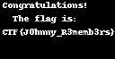

# JohnnyBoy (re, 223p)

> This looks retro but somewhat futuristic! I always lose though, can you win? My friends solved this without IDA! https://youtu.be/Dem8Fq6hkAw

> chall.ino.hex

Well, this challenge was very frustrating to me. We were given a compiled AVR code,
which meant we were not able to use IDA's decompiler or anything similar.

I spent hours reversing the actual logic in the code, only to notice that the game win
screen function is called with a specific argument. At the address pointed by that argument,
there was a mysterious buffer of random-looking bytes. Interpreting them as black&white image
gives us flag:

