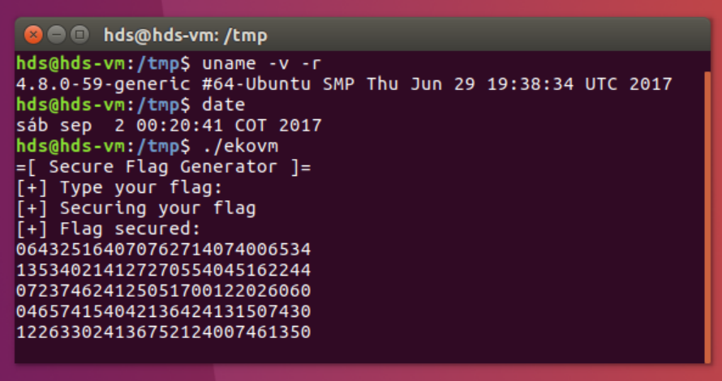

# EKOVM (vm, 465 points, 22 solves)

Lets try to solve another challenge blackbox-ish-ly.



Upon inspecting the binary we discover two important facts:

The random generator inside the cipher is seeded with time:

``` c++
__int64 (__fastcall *__fastcall sub_48A0(__int64 a1))()
{
  unsigned int v1; // eax@1
  _QWORD *v2; // rax@1
  __int64 (__fastcall *result)(); // rax@3

  v1 = time(0LL);
  srand(v1);
  v2 = (_QWORD *)(a1 + 272);
  do
  {
    *v2 = sub_1450;
    ++v2;
  }
  while ( v2 != (_QWORD *)(a1 + 2320) );
...
```

If we now "freeze" the time and execute the program with a constant seed, another thing becomes obvious:

```
INPUT	OUTPUT
A 	062540210007630520
AB 	062540210063357420007630520
ABC 	062540210063357420064176630007630520
ABCD 	062540210063357420064176630065016040007630520
ABCDE 	062540210063357420064176630065016040065635250007630520
```

The encryption happens only one byte at a time, which means that we can easily bruteforce the flag byte by byte.


Let's start off by brute-forcing the seed, as we can see in the screenshot the time is probably equal to a few seconds after 1504329641.

We're going to use a cool LD_PRELOAD trick to set the returned time to whatever we want. Ideally this would be done by returning a environmental value instead of compiling the library each time, but this works too:

``` python

required = "064325164070762714074006534135340214127270554045162244072374624125051700122026060046574154042136424131507430122633024136752124007461350"
			
for i in range(100):

	patched = """#include <time.h>

	time_t time(time_t *t){
		return %d;
	}""" % (1504329641 + i)

	f = open("time.c","wb")
	f.write(patched)
	f.close()

	flag = "E"
	f = open("/tmp/b", "wb")
	f.write(flag)
	f.close()

	os.system("gcc -fPIC -c time.c -o time.o; gcc -shared -o time.so time.o")
	os.system("LD_PRELOAD=\"./time.so\" ./ekovm < /tmp/b > /tmp/a")

	out = open("/tmp/a").read()
	output = ''.join(out.split("\n")[4:])

	if required.startswith(output):
		print("Correct seed %d" % (1504329641 + i))
		break
```

`Correct seed: 1504329734`

Using that value we can write a simple script to solve the rest of the challenge:

``` python


password = "EKO"
while True:
	for i in string.printable:

		flag = password + i
		f = open("/tmp/b", "wb")
		f.write(flag)
		f.close()

		os.system("LD_PRELOAD=\"./time.so\" ./ekovm < /tmp/b > /tmp/a")

		out = open("/tmp/a").read()
		output = ''.join(out.split("\n")[4:])
		if output in required:
			password += i
			print(password)
			break
```

And get the flag without reversing the vm at all: `EKO{s1Mpl3-vm}`


