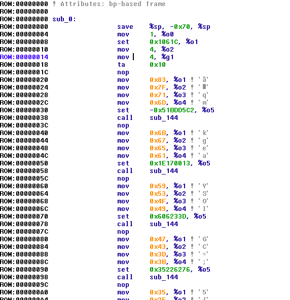
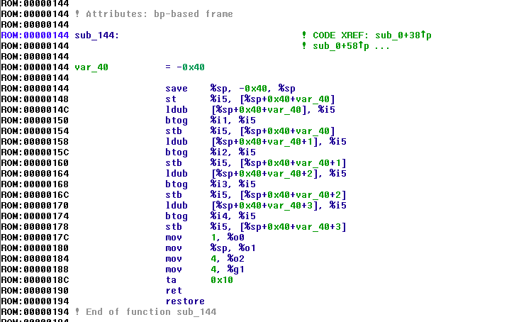

# OldPC (misc, 478 points, 14 solves)

In the task we get [machine code dump](oldpc.hex).
A bit of googling for byte sequencec got us to http://www.xgc-tek.com/manuals/erc32-ada-gs/x286.html where we could see assembly listing with similar machine code to what we had (at least the stack frame creation and ret/leave).
Now we just had to check what is this ERC32 and/or what assembly was in the listing.

In th end the main difficulty of this challenge was noticing that the given binary file contained sparc assembly.

After getting through that difficulty all we need to do is load the file in a disassembler and select `sparc big endian`:





The code may seem simple and well, it is. All it does is xors a bunch of values and prints them out. 

A quick script gave us back a flag in no time:


``` python
import struct
import sys

a = [
(0x837F716D, -0x51BDD5C2),
(0x6B676561, 0x1E170013),
(0x59534F49, 0x606233D),
(0x47433D3B, 0x35226276),
(0x352F2B29, 0x6481F76),
(0x251F1D17, 0x655F4E47),
(0x13110D0B, 0x52434E4B),
(0x07050302, 0x47583e2f),
]


for i in a:

	a = struct.pack(">q", i[0])[4:]
	b = struct.pack(">q", i[1])[4:]
	for aa, bb in zip(a, b):
	    sys.stdout.write(chr(ord(aa) ^ ord(bb)))


print
```

`-=[Super_Ultra_M3g4_@@SPARC@@]=-`