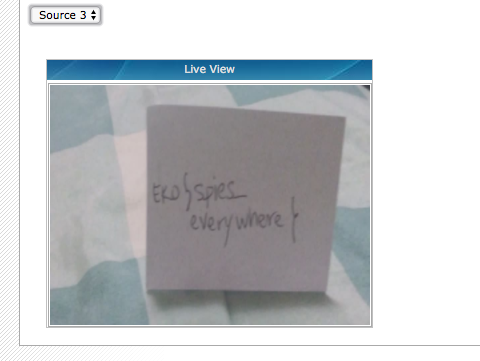

# Spies (DNS, 466p, 21 solved)

```
Watch out from those prying eyes! 
It seems someone is opening everything to the world, find that webcam and you will see for yourself!

https://mydns.webcam/
```

Task suggests there is some webcam registered as subdomain of `mydns.webcam` where we can find the flag.
The hard part is that there are already plenty of domains registered and also players can register new domains at will.

In this task we first collected all subdomains of `mydns.webcam` and simply checked what is there.
We knew that all the user-registered domains without external server show some message about "billing issues" and we knew that `crazy.mydomain.webcam` is for a different task, so we're interested only in the remaining domains:

```python
    for host in host_list:
        if host != "crazy.mydns.webcam":
            try:
                result = requests.get("http://" + host, timeout=1)
                if "billing" not in result.text:
                    print(host, result.text)
            except:
                pass
    pass
```

After we pass through those domains we get only a few hits, and only two are webcams.

Out of those two only `greenhouse.mydns.webcam` shows us:



So the flag is `EKO{spies_everywhere}

The other webcam `supercam.mydns.webcam` was showing stuff like for example Rickroll.
