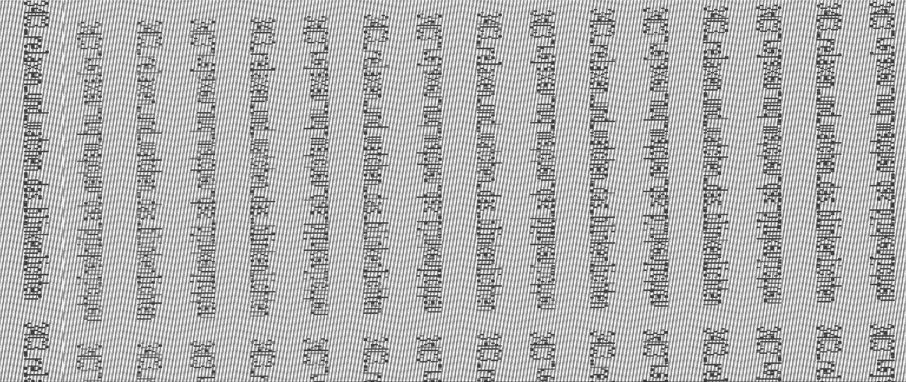

# Blinkenlights (rev, 242p, 15 solves)

> I built something that prints the flag. But I lost the flag :(
> Difficulty: medium

In this task we got a binary firmware for ARM architecture, and a 400MB CSV containing oscilloscope traces
of a channel. Initially I wasted a couple hours trying to reverse engineer the binary, but it turned out that
I was able to solve the challenge using just the CSV, i.e. in a black box way.

The CSV had two integer columns: `sample` and `channel 1`, but the second column seemed to alternate between 0 and 1,
so it did not contain any information for us.
Probably it's because the oscilloscope was compressing the signal using algorithm similar to run length encoding.
This means we are only interested in the first column. I've preprocessed it to calculate the difference between two
consecutive times and noticed that the times corresponding to "1" state are always quite short compared to
the other ones - and the "0" times are varying in length. So there's probably some kind of message encoded in 
time between pulses.

After excluding several very long (~100 times longer than average) times - they seem to be some kind of synchronization,
not needed for us - I've multiplied every sample by ten and stored as greyscale imaage, hoping to notice some pattern.
It turned out that setting width to 6144 (guessed) we can notice some barely readable text - a flag!

