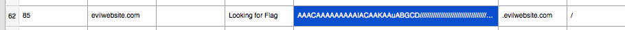

# Evil Website (forensics)

We're given a directory containing lots of interesting firefox stuff.

```
┌[michal@Bobik] [/dev/ttys002] [master ⚡] 
└[~/Downloads/Chall]> ls
AlternateServices.txt              containers.json                    firebug                            modifyheaders.conf                 serviceworker.txt
SecurityPreloadState.txt           content-prefs.sqlite               formhistory.sqlite                 notificationstore.json             sessionCheckpoints.json
SiteSecurityServiceState.txt       cookies.sqlite                     gmp                                permissions.sqlite                 sessionstore-backups
addonStartup.json.lz4              cookies.sqlite-shm                 gmp-gmpopenh264                    pkcs11.txt                         shield-preference-experiments.json
addons.json                        cookies.sqlite-wal                 gmp-widevinecdm                    places.sqlite                      storage
blocklist.xml                      crashes                            handlers.json                      places.sqlite-shm                  storage.sqlite
blocklists                         datareporting                      key3.db                            places.sqlite-wal                  times.json
bookmarkbackups                    extensions                         key4.db                            pluginreg.dat                      weave
browser-extension-data             extensions.json                    kinto.sqlite                       prefs.js                           webapps
cert8.db                           favicons.sqlite                    lock                               revocations.txt                    webappsstore.sqlite
cert9.db                           favicons.sqlite-shm                logins.json                        saved-telemetry-pings              webappsstore.sqlite-shm
cert_override.txt                  favicons.sqlite-wal                mimeTypes.rdf                      search.json.mozlz4                 webappsstore.sqlite-wal
compatibility.ini                  features                           minidumps                          secmod.db                          xulstore.json
```

Unfortunately, all we had to do is notice a pretty suspicious cookie:



Decoding the base64 gave us a weird `Targa image data` file.
You might be tempted to look for some weird ancient software just to view it, but as it turned out that the best way was to actually just import it into gimp as raw data:


