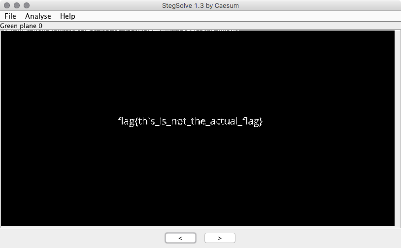
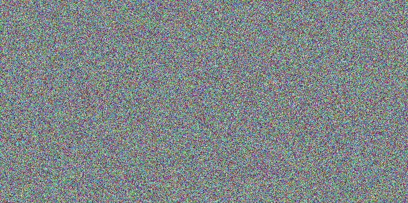
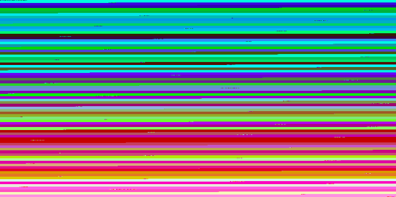
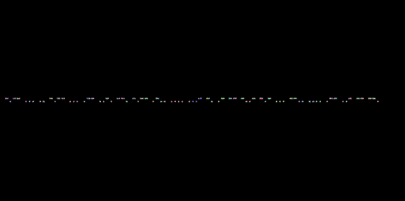

# Random Noise (staganography)

In this challenge, we're given a file that is in fact 2 pngs:

```
┌[michal@Bobik] [/dev/ttys004] 
└[~/Desktop]> binwalk final.png 

DECIMAL       HEXADECIMAL     DESCRIPTION
--------------------------------------------------------------------------------
0             0x0             PNG image, 799 x 397, 8-bit colormap, non-interlaced
821           0x335           Zlib compressed data, default compression
3360          0xD20           PNG image, 799 x 397, 8-bit/color RGBA, non-interlaced
3401          0xD49           Zlib compressed data, default compression
```


They both contain clues essential to the solution of the challange:


The first image contains some data on the lowest bits of each color of the upper row:




Which we can extract using a simple python script:

``` python
def chunks(l, n):
    """Yield successive n-sized chunks from l."""
    for i in range(0, len(l), n):
        yield l[i:i + n]

with open("lsb.pnm") as f:
	dots = f.read().split("\n")

pixels = chunks(dots, 3)
data = ""

for pix in list(pixels)[:-1]:
	pix = map(int, pix)
	r, g, b = pix
	data += str(r&1)

data = map(lambda x:chr(int(x,2)), chunks(data, 8))
print(''.join(data))
```

```
┌[michal@Bobik] [/dev/ttys004] 
└[~/Desktop]> python parse_lsb.py
key for vigenere cipher: THISKEYCANTBEGUESSED (not the flag) 
```

Let's move on to the second picture:



We actually spent quite a while on this stage but finally came up with a good guess: let's sort the pixels by colors, if they in fact random the distribution should be quite equal, right?





Some weird anomalies, let's filter theese out in the original image:



Bingo!, it's [a morse](https://i.pinimg.com/originals/f8/9d/35/f89d3592cc9c024df2e003f0468e5c85.jpg)

`WSIYSWFGYLHVNAMXKSZHWUMG`

If we now decipher it using the vigenre password we get: `HEYYOUJUSTSAVEDNEO`