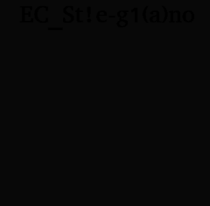

# Improve the quality (Crypto)

In the task we get a [lengthly description](description.txt).
Short version is:

1. We have ECC encryption.
2. The curve is `y^2 = x^3 + 658974*x + B` with most significat decimal digit of `B` being `6`
3. Prime field is based on `p = 962280654317`
4. We get generator point `P = (518459267012, 339109212996)`
5. We get a set of points `Qi` where `Qi = ki * P`
6. The final secret value is a combination of `ki` values (this was very unclear, but in the end it was just concatenation of `ki` values treated as decimal strings and this converted to bytes).

We start-off by recovering the missing `B` parameter of the curve.
This is trivial, since we've got points on the curve and we can just solve the equation `y^2 = x^3 + 658974*x + B`.
We transform this to:

`B = (y^2 - x^3 - 658974*x) mod p`

And apply this to `P = (518459267012, 339109212996)` which gives us `618`, and it fits the hint from the description that `6` is the most significant digit of `B`.

```python
prime = 962280654317
x = 518459267012
y = 339109212996
A = 658974
B = (y^2 - x^3 - A*x) %prime
```

Now we need to recover the `ki` values.
The prime field is very small, so we can efficiently calculate so-called `discrete logarithm` over the elliptic curve.
Fortunately `sage` has all of this already implemented so we just need to do:

```python
K.<z> = GF(prime)
E = EllipticCurve(K,[A,B])
P = E([x,y]) # generator point

solutions = []
for px,py in data:
    Q = E([px,py])
    solution = P.discrete_log(Q)
    print(px,py, solution)
    solutions.append(solution)
print(solutions)
```

And from this we recover the `ki` values.
We combine them to get the secret `K`:

```python
large_string = "".join([str(ki) for ki in solutions])
print("".join(map(lambda x: chr(int(x)), chunk(large_string, 2))))
```

This gives:

```
CONVERT THIS TO LOWER CASE FIRST :
THIS IMAGE CONTAINS THE FLAG, TRY TO GET IT
THE SUBMITTED FLAG MUST BE IN THIS FORMAT: 
FLAG-EC[WHAT YOU'LL FIND IN THE IMAGE]
IMAGE URL:
HTTP://CRYPTO.CTFSECURINETS.COM/1/STEG-PART.PNG
```

Fortunately there is not much of a stegano there really.
The picture is:



And can be easily read to get the final flag: `flag-ec[EC_St!e-g1(a)no]`
