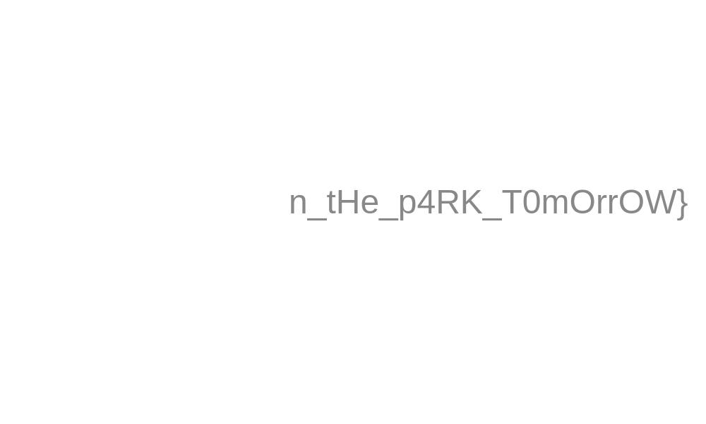

# Lone authot (forensics)

In the task we get a [zip file](lone_author.zip) which seems corrupted.
We notice that the PK headers are not right.
It should always be `04034b50` and in our case the 3rd byte is wrong.
We also notice that it's not any accidental flip.
Once we extract all wrong headers we can see a pattern:

```
PKF
PKl
PKa
PKg
PK{
PKM
PK3
PK3
PKt
PK_M
PK3
PK_1
```

So we've got a flag prefix -> `Flag{M33t_M3_1`

Once we fix those headers, we can finally extract the archive and we get [password protected zip](secret.zip) and [a piece of qr code](qr_ps.tif).
We initially thought we have to somehow fix the QR, but it turned out that in metadata there is:

`<pdf:Author>Password to the second part is 0xNOX**</pdf:Author>`

We used this password on the zip archive we got, and we managed to extract the file:



This makes up the whole flag: `Flag{M33t_M3_1n_tHe_p4RK_T0mOrrOW}`
