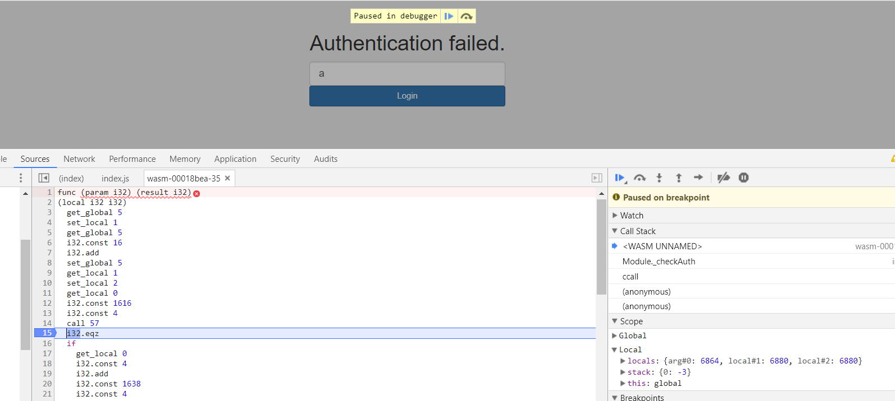

# Assembly Me (Re)

In the task we get a simple webpage with a single textbox and button.
There is javascript and [webassembly](wasm.txt) code which validates password we input on the page.

There is quite a lot of this webasm, and reversing it is quite hard, but already initial reading shows:

```javascript
	var button = document.getElementById('check');

	button.addEventListener('click', function(){

	u = document.getElementById("i").value;
	var a = Module.cwrap('checkAuth', 'string', ['string']);
	var b = a(u);
	document.getElementById("x").innerHTML = b;
	});
```

So we know that entry point is `checkAuth` function, and we can see that:

```
  (export "_checkAuth" (func $func35))
```

So let's focus on this single function:

```
  (func $func35 (param $var0 i32) (result i32)
    (local $var1 i32) (local $var2 i32)
    get_global $global5
    set_local $var1
    get_global $global5
    i32.const 16
    i32.add
    set_global $global5
    get_local $var1
    set_local $var2
    get_local $var0
    i32.const 1616
    i32.const 4
    call $func57
    i32.eqz
    if
      get_local $var0
      i32.const 4
      i32.add
      i32.const 1638
      i32.const 4
      call $func57
      i32.eqz
      if
        get_local $var0
        i32.const 8
        i32.add
        i32.const 1610
        i32.const 5
        call $func57
        i32.eqz
        if
          get_local $var0
          i32.const 13
          i32.add
          i32.const 1598
          i32.const 4
          call $func57
          i32.eqz
          if
            get_local $var0
            i32.const 17
            i32.add
            i32.const 1681
            i32.const 3
            call $func57
            i32.eqz
            if
              get_local $var0
              i32.const 20
              i32.add
              i32.const 1654
              i32.const 9
              call $func57
              i32.eqz
              if
                get_local $var1
                set_global $global5
                i32.const 1690
                return
              end
            end
          end
        end
      end
    end
    i32.const 1396
    get_local $var0
    get_local $var0
    call $func45
    call $func57
    i32.eqz
    if
      get_local $var1
      set_global $global5
      i32.const 1761
      return
    end
    i32.const 1747
    get_local $var2
    call $func77
    drop
    get_local $var1
    set_global $global5
    i32.const 1761
  )
```

Main part of the code is a cascade of conditions and calls to `$func57`.
Once we pass a single condition we can enter another one, so it's safe to assume we need to pass all of them.

Reversing webasm is hard, so first we tried to work with this as some kind of blackbox.
It's clear that before calling function 57 there is some address put on the stack (1616, 1638... are addresses of some strings in the code) and some small number.
We can also see that we want the return value to be 0, so we can pass the condition.
By seding some random values for the first condition we can notice a very interesting characteristic of the return value - it's not random at all.
In fact it's monotonous!
If we send `a` we get value `X`, if we send `b` we get `X+1` etc.
So it's trivial to calculate which character we need to send in order to get `0`.
But once we do this, the value instead of 0 becomes some larger number.
Our guess was that the function checks multiple characters, so once we get a "valid" first character, it checks another one and thus we get a large number again.

With those assumptions the solution seems quite straightforward:

1. We put breakpoint on `i32.eqz` 
2. We send random letter as password, let's say `a`.
3. We send next letter in alphabet, to make sure we didn't actually get the right one on first try.
4. Now we know how far `a` is from the expected letter, so we can calculate a real password character by `chr(ord('a')-X)`

We can repeat this with second letter of the password, and so on, until we actually pass the condition.
Once we pass the check (after a few letters), we can place another breakpoint on the next condition and repeat the same procedure.

So for example when we send `a` we get return value (top of the stack) `-3` which means the real character is `chr(ord('a')-(-3) == 'd'`:



We follow this approach to get whole password: `d51XPox)1S0xk5S11W_eKXK,,,xie` and we get `Authentication is successful. The flag is NDH{password}`
