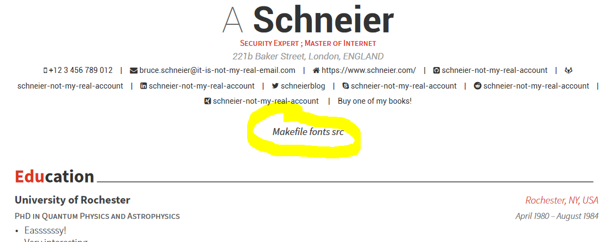
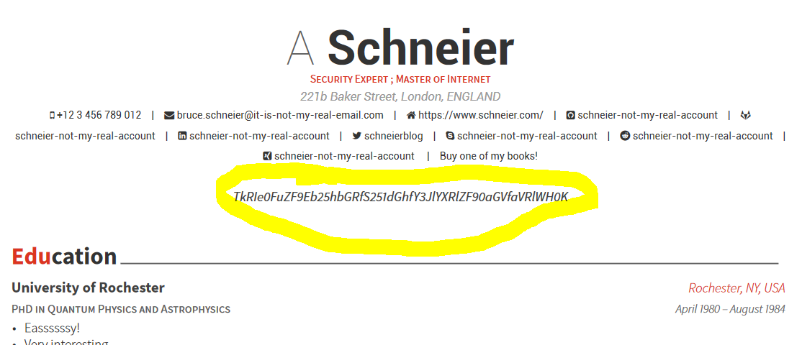

# Linked Out (Web)

In the task we get access to a webpage for generating CVs.
We are supposed to upload a YAML input file, and the page generates a PDF with a nice CV theme.
We get an example input file so we can test the platform.

There is a link to the github with style configuration of the theme, so we learn that this is all done with TeX.

This points into the direction of injecting some malicious TeX directives inside the YAML payload in order to exploit the server.

As one of the fields we can send for example '\input|ls ' and we get:

So we can list files on the server.
With this we can try to browse a bit to look for the flag.
We find the `flag` file in root `/` directory and we can send another payload `'\input|"cat /flag"|base64 '` to get:

So the flag is: `NDH{And_Donald_Knuth_created_the_iTeX}`

Final payload [here](inject.yml)
