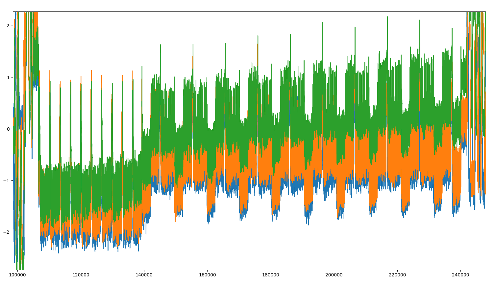
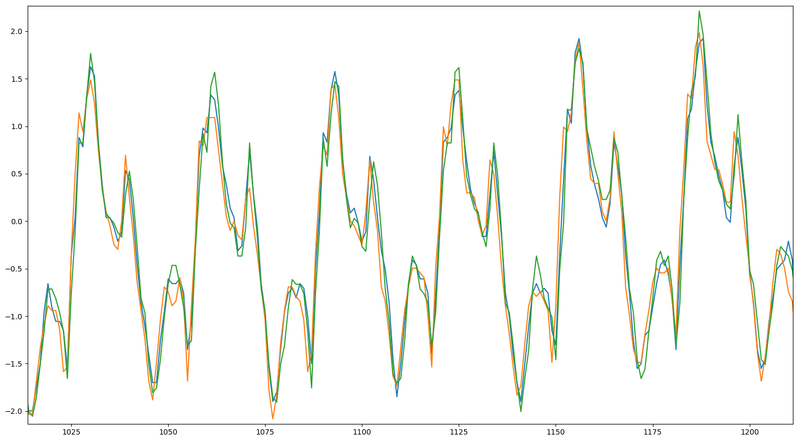
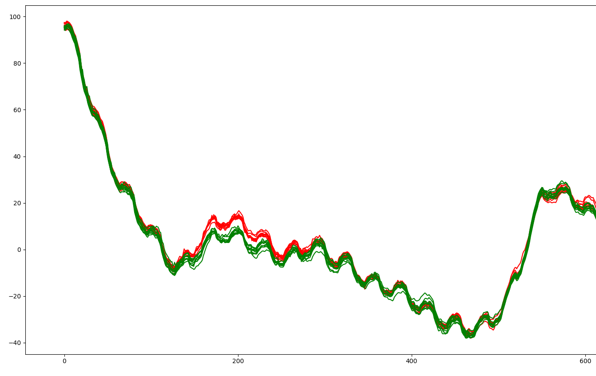

# It's a kind of magic, SCA, 200pts

> You managed to get a spare key fob for the car you like. However you want to duplicate it so that you can maintain your access to it. Through extensive reverse engineering, you figure out that the device accepts an input challenge performs AES-128 encryption (or decryption) and returns the response. It is also identified that the device operates on masked input and returns masked output. Extract the key so you can get free rides!

> The device expects 18 bytes of input: the first byte should be either 0xAE (for encryption) or 0xAD (for decryption) followed by 16 bytes of data, followed by a newline.

Ok, first SCA challenge. Having no experience in it, it was much harder
than I thought. Especially that there is this "masking" twist.

I desoldered all the capacitors from the board. I also powered it with
AA batteries, positive connected to `Vin` pin, and negative to `GND`
through a resistor (I think it was a 100Ohm one). Using RIGOL DS1052E
and its USB interface, I collected a couple hundreds of power traces
of the board encrypting random plaintexts. DS1052E can be setup
to collect about one million of samples each time, with each sample
being recorded every couple of nanoseconds (exact values depend
on various circumstances). UART itself was set as trigger for the
recording.

The results looked promising:
 
 

The ten rounds of AES are clearly visible, so that's good.
I also collected ten traces of one plaintext, followed by ten traces of 
a second one. I found a certain place in the traces, in which
the difference between both sets is clearly visible:

 

This effect was visible only after smoothing and aligning of the traces.

Using CPA attack on the first round's S-box, we were able to recover
the value xored with plaintext before that Sub, that is `inmask ^ key`.

Using this value to simulate the first round, we performed the same
attack on the second round, this time recovering the second round's
key. Reversing the key schedule was then just a formality.

The full code of the attack is in the folder `CPA` (and some code 
for `The Imposters`, not finished). Note that the traces
themselves are not included - they are about 2 gigabytes large.
