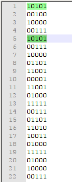
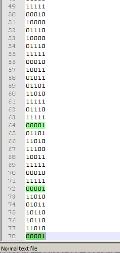

# The osiris, misc
The only thing in this task we had was this youtube link `https://www.youtube.com/watch?v=Je5E4jqEE_s`.
It seems like the `Osiris device` is transmitting some sort of a message.
The first step was to extract each of the 6bit words. I got a little bit too fancy with that, wanted to automate this task. It turned out not to be worth it, due to being error-prone and the fact that you could just write it all down in around 5 minutes. 

But I managed to create some pretty images from trying automated approach, so that's cool :D

After writing down everything manually, looking at the data, I realised that every other 6bit word has first bit set, the rest just repeats from the last word. I assumed that first bit is just to signal the next message incoming.

`data.txt` contains data after removing first bit, resulting in 5bit words.

Now all I had to do was to figure out what is the format of this data. At this time there were no solves to the challenge, so I knew it's not trivial, but on the other hand it shouldn't be really complicated, if it was some sort of a cipher then the category would be crypto.

Things I tried or thought about:
- decoding as ASCII (with 5bit words, it doesnt make much sense because all the printable characters are in the 32-128 range)
- [Baudot code](https://en.wikipedia.org/wiki/Baudot_code)
- [4B5B](https://en.wikipedia.org/wiki/4B5B)
- reading them in 6,7,8 bit words instead of 5bit
- indexing english alphabet with those values

During the time that I was trying random stuff, some admin on IRC said that the flag is in "STCF{flag}" format. Using that information we can try to figure out the format of the data. If one 5bit word maps to one character, then 5th `{` and last characters `}` should only occur once(It's very unlikely those characters are in the flag).

This doesn't seem to be the case. One thing to notice here is that all the words have odd number of bits set. Having this constraint in mind, in those 5bits, you can only encode 4bit worth of information(16 different values).
Knowing that every 5bit word maps to 4bits, which turned out to be equal to `x >> 1` operation, I started looking at pairs of numbers, 8bit or 1byte of information looks promising.

We can try the `{` and `}` test again, taking pairs of 5bit words, 5th value is `11001 00001`, last one is `11010 00001`, both are unique, and even more than that, they are almost equal, they differ by just 1 at first word. We have to be on the right track. After transforming them to 4bits, we have `1100 0000` and `1101 0000`, which in ASCII does not make any sense.

Given the main theme of the ctf to be Matrix related, through the challenge I thought about matrix encodings multiple times(don't know if it was made on purpose tho :P), one of such encodings is [EBCDIC](https://en.wikipedia.org/wiki/EBCDIC), I've tried those values in the CCSID 500 variant and both characters matched. It turned out to be the solution.

Final script is in `decode.py`, and the flag it printed was `sctf{D3_m4ch1n35_4r3_4_d1gg1n_70_Z10N|}`, which is almost correct. Organizers used some other standard of EBCDIC, but it's easy to guess that `|` should be `!`, so the final flag was `sctf{D3_m4ch1n35_4r3_4_d1gg1n_70_Z10N!}`, we did get first blood and 495points at the end of the CTF.

Even though final script is really simple, challenge involved a lot of guessing, data could be interpreted in a lot of ways.
