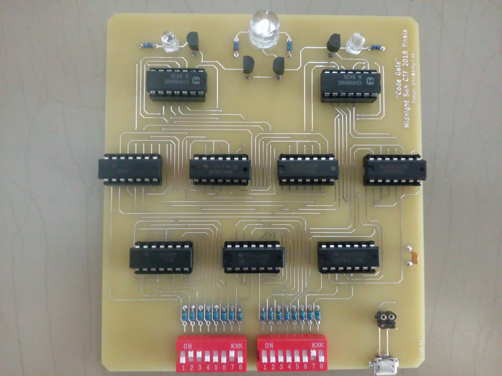
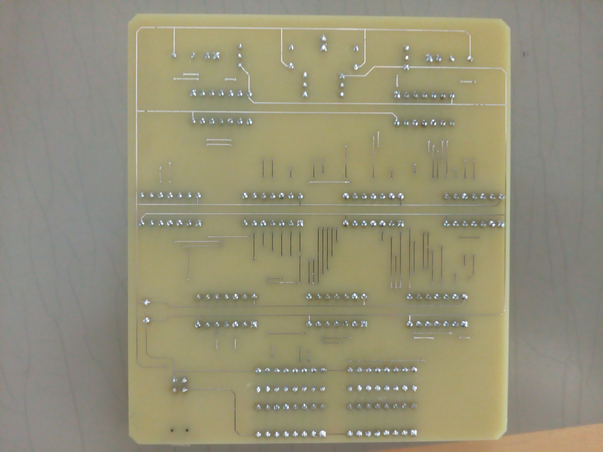
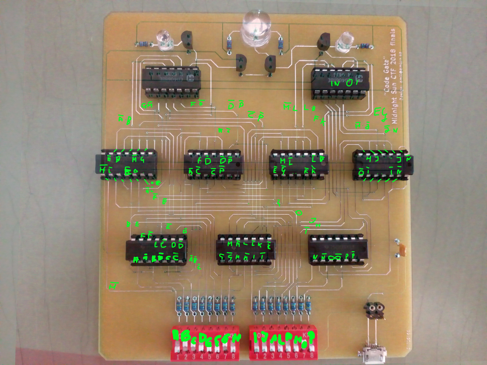

# Crazy Circuit Conundrum, re, 161p

> We are trying to break into their safe storage. We have exposed the panel of the lock mechanism and revealed a circuit. Go to the organizers table and see if you can unlock the entry to the storage.

Organizers supplied us with a circuit board. It had 16 DIP switches, some discrete logic chips, and a few
LEDs. Apparently after finding right combination, the light would switch on. We took a photo of both sides of
the board, aligned them in GIMP, then manually traced and named each signal.

