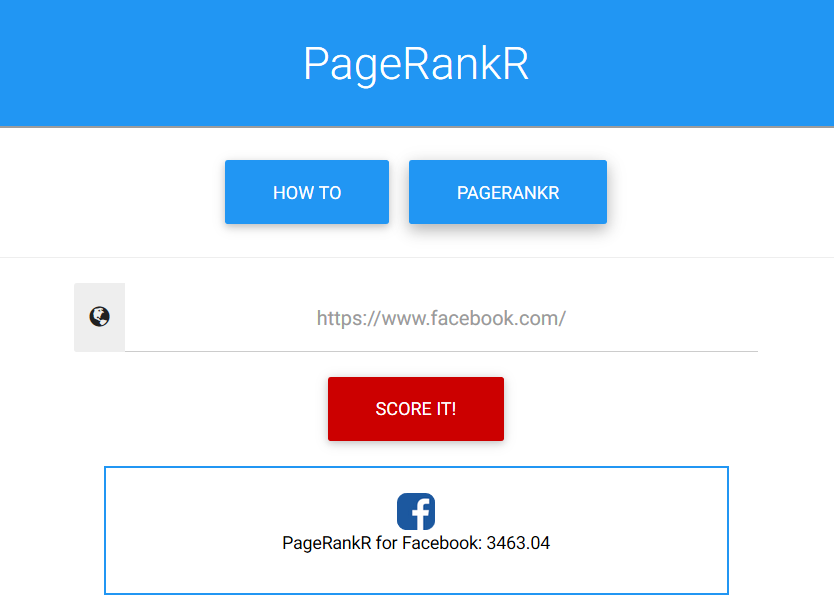

# Pagerank (web)

In the task we can submit a link to a webpage, and the website will calculate some "rank" value for this page.
If we provide a link to the default suggested page `https://www.facebook.com/` we get an interesting result - instead of just the link and score we get back a picture of facebook logo and the name `Facebook`.



It's clear that those data have to be collected from somewhere.
By examining a couple of pages we figure out that those data come from meta `og` tags, specifically for the picture it's:

`<meta property="og:image" content="some_link.png"/>`

The server fetches the picture we provide, but on the page it's resized to 50x50.
This means not only that we can upload some picture of our choosing, but also that the picture is somehow edited.

We tried to do some command injection in the name, but it didn't give any results.
We figured that maybe the conversion is done by, known for many vulnerabilities, imagemagic, and we were right.

We send some strange files with formats supported by imagemagic and it worked fine.
Finally we found an ideal format - MVG.
From imagetragic vulnerabilities list we get an example:

```
push graphic-context
viewbox 0 0 640 480
image over 0,0 0,0 'label:@/etc/passwd'
pop graphic-context
```

And sending such file gives us back a tiny picture of `/etc/passwd` file.
We tried some obvious locations for the flag file, and found that there is a `flag` file in the CWD.
The file had a lot of blank lines and also we're not very good ad CSI work with zoom-and-enhance, so we checked that we can zoom-in and move the perspective using MVG instructions.

After a while of moving around the file we managed to get the flag: `midnight{h0w_d1d_u_r3@d_th1z?!_y0u_@r3_da_r3al_MVG}`
