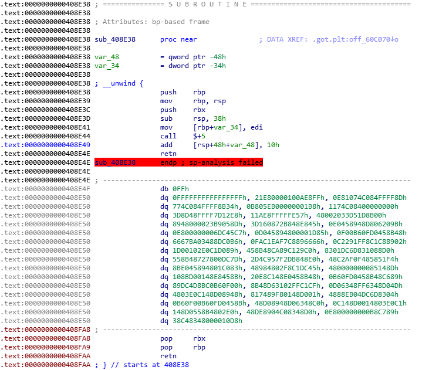
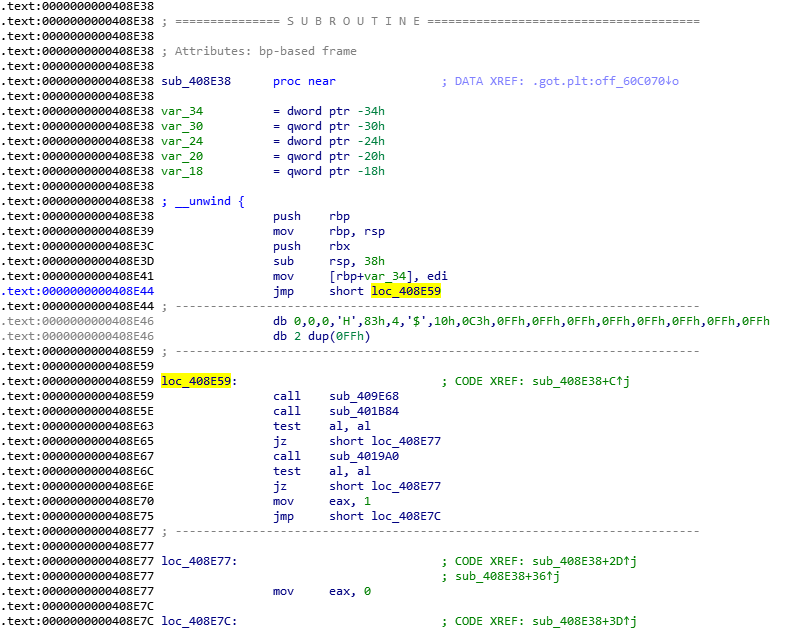
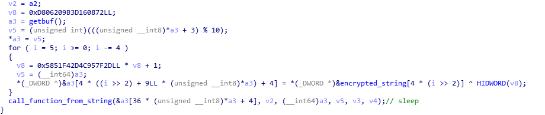
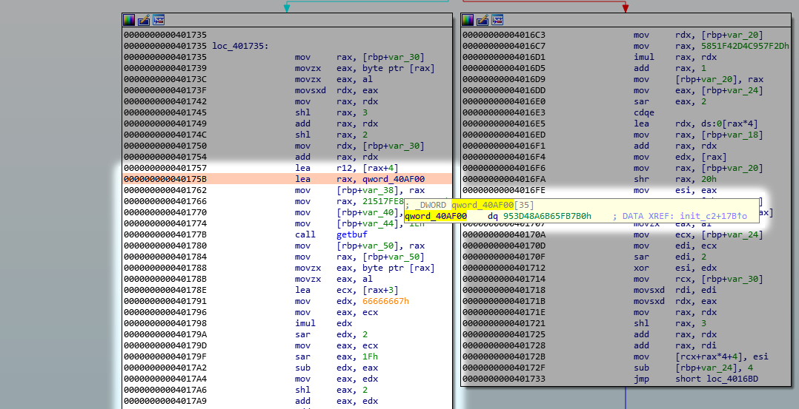
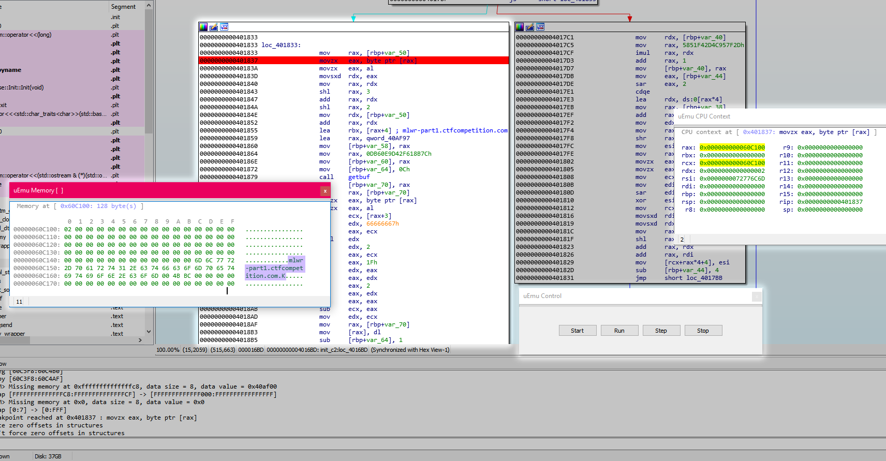
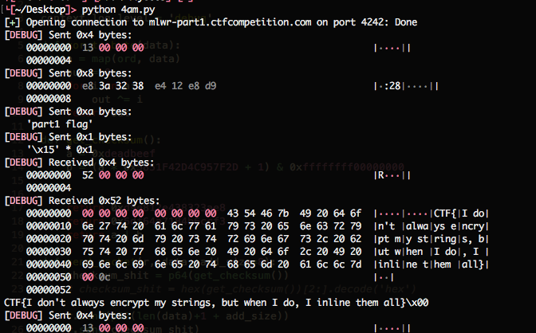

# APT42 - Part 1 (re, 288 pts, 22 solves)

> We have detected weird traffic on our network and we cannot figure out the source. Forensics didn't find anything besides maybe the NTP service binaries which have been modified recently on some hosts. We ran them through the sandboxes and they seem to work as intended, can you do a quick manual pass?

[ntpdate](ntpdate)


We're given a binary that is supposed to be creating some weird network traffic, let's open it up in IDA. 

At a first glance the binary looks quite normal but after some investigation, the deeper functions turn out to be pretty interesting:



The trick here is quite easy though:

* `call    $+5` pushes the next instructions address onto stack
* `add     [rsp+48h+var_48], 10h` adds 16 bytes to the pushed address
* `retn` pops the address from top of the stack and jumps to it (in this case 0x408E59)

The binary works fine in practice but reverse analysing it becomes a bit tiresome, so what we're gonna do is patch the binary to skip the [position-independent code](https://en.wikipedia.org/wiki/Position-independent_code) tricks and jumps straight to the code:



As you can see, after correcting the code, IDA has automatically noticed the changes and even correctly recognized a function. Cool!

Next problem we're gonna tackle is string and api function encryption:



It might look intimidating at first but if we break it down, we end up with just a bunch of mathematical operations.

Of course we could try [implementing the decryption](https://pastebin.com/raw/2uX6vwSf) in python but this is a CTF and every last minute counts!

So instead of that we're goonna use a smart little IDA emulator called [uEmu](https://github.com/alexhude/uEmu) 

All we have to do now is:

Find the beginning of the encryption:



Set a breakpoint at the end and let the emulator do its thing:



Success, we (probably) got the cnc address!

If we now apply these deobfuscation methods to the whole binary we should get a good set of not-so-ugly functions.

Becase the challanges description talked about network traffic this is what we're gonna focus on.

Now that we have the cnc address we're also going to need the port, we could try reversing it just like we did with the host. But let's be honest, running a nmap scan in the background while we work on other stuff will be much quicker:

```
michal@vps266773:~$ nmap -Pn mlwr-part1.ctfcompetition.com

Starting Nmap 7.40 ( https://nmap.org ) at 2018-06-24 23:58 CEST

Completed Connect Scan at 00:02, 189.48s elapsed (1000 total ports)
Nmap scan report for mlwr-part1.ctfcompetition.com (35.233.98.21)
Host is up (0.012s latency).
rDNS record for 35.233.98.21: 21.98.233.35.bc.googleusercontent.com
Scanned at 2018-06-24 23:58:53 CEST for 189s
Not shown: 999 filtered ports
PORT     STATE SERVICE
4242/tcp open  vrml-multi-use
```
Looks good!

Data is exchanged using chunks that can be represented as a following c structure:

``` c
struct {
	DWORD length,
	QWORD bot_id,
	BYTE[n] data,
	BYTE checksum
}
```

There are 2 functions where the chunk packing method is used. 

One looks like a back-connecting shell that accepts commands and returns the output.

The second one is a lot smaller with a `part1 flag` string passed to our chunk packing function at the beginning, let's try that maybe?

We're gonna implement our chunk communication using python with pwntools:

``` python
from pwn import *

context.log_level = 'debug'

def xor_to_byte(data):
	return reduce(lambda x,y: x ^ y, map(ord, data), 0)

def get_bot_id():
	a = 0xdeadbeef
	b = (a * 0x5851F42D4C957F2D + 1) & 0xffffffff00000000
	return a | b

def send_packet(r, data):
	bot_id = p64(get_bot_id())

	r.send(p32(len(data) + 1 + 8)) # 4 bytes for bot_id and 1 byte for checksum
	r.send(bot_id)
	r.send(data)
	r.send(chr(xor_to_byte(bot_id) ^ xor_to_byte(data)))

def receive_packet(r):
	size = u32(r.recv(4))
	bot_id = u64(r.recv(8))
	data = r.recv(size - 1 - 8)
	xored = ord(r.recv(1))
	return data

r = remote('mlwr-part1.ctfcompetition.com', 4242)

send_packet(r, 'part1 flag')
r.interactive()
```

Let's run it?




That wasn't so bad!