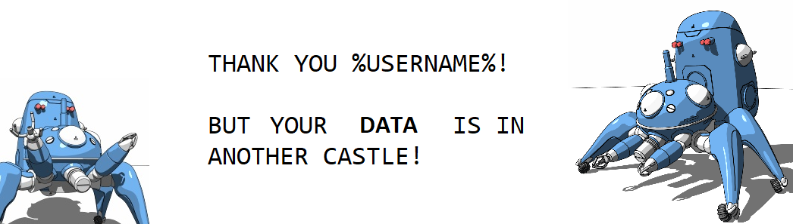
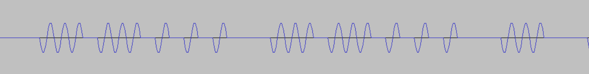
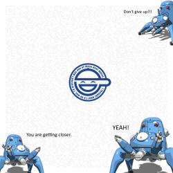
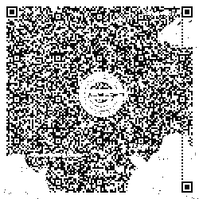

# Ghost in the flash (forensics/stegano, 4 solved, 416p)

```
Alice sent Bob a package with a flash drive.
Bob thinks there is a message hidden on it but he couldn't find it.
The only clue is the mysterious inscription on the envelope:
"Hear the voice of the future and remember: there are shadows because there are hills."
Help Bob read the message!
```

We didn't manage to solve this task, but we got pretty far ahead, and it was fun, so we will share what we managed to find.

In the task you get a large flashdrive dump.
Apart from some random garbage-overwritten files there are 2 files of interest.
First one seems to be a red-herring plng file:



However it actually hints at a certain thing at later stage.

The second thing we can find on the drive is a video, pretty much this one: https://www.youtube.com/watch?v=gXTnl1FVFBw
The interesting thing about the video was the fact that the length was over 1h, instead of slighly over 8 minutes.
Upon further inspection we found out that there are 2 audio tracks in the video.
First one is the original one, as far as we could tell, but the other one was over 1h long beeps.

We had to extract the sound file for further analysis. Doing this requires two steps:

First, we had to find track numbers in the MKV file:
```
$ mkvinfo /media/GHOST_FLASH/Ghost_In_The_Shell_-_ Identity_in_Space.mkv
[...]
| + Track
|  + Track number: 3 (track ID for mkvmerge & mkvextract: 2)
|  + Track UID: 3
|  + Lacing flag: 0
|  + Language: und
|  + Default track flag: 0
|  + Codec ID: A_PCM/INT/LIT
|  + Track type: audio
|  + Audio track
|   + Channels: 1
|   + Sampling frequency: 2000
|   + Bit depth: 16
[...]
```
And then use the `mkvextract` to export the track:
```
$ mkvextract /media/GHOST_FLASH/Ghost_In_The_Shell_-_\ Identity_in_Space.mkv tracks 2:./track_2.wav
```

Once you look into [second track](track_2.wav) with Audacity you can see an interesting regularity in the wave shape:



The entire file consists of either 1 or 3 sinusoids, and there is a long or short gap between them.
Our best guess was Morse code, and we were right.
Once you decode the Morse, you get a nice base32 string, which in turn decodes to another png file:



In the background of this picture you can see a shade of QR code, and if you extract red/blue/green plane 3 using stegsolve, you can clearly see the QR code.
It's broken, but you can just draw the missing anchor points and timings and you get:



This scans to a base64 encoded string:

```
UEsDBDMAAQBjAAUcrUwAAAAAzgAAANoAAAASAAsAYW5vdGhlcl9jYXN0bGUudHh0AZkHAAIAQUUDDADtiBBDwn9aPh4PGNA5rPdc/hzpopn5YZ9wTG/+H1D/9PBlIYqQWVHs5DgCtgBVTsDIpK73Lw3QhJygDbqd0pkXPTjxKS7Vo8vUuIMyQddXnxFBe31X4dhRW+rIqQANSS24UtXsMYryWVCVBT+0A5qrfv87f+6afcN+zpmtLdlJ9Kep1ps7TfBEFSwyuVXxJjfYMwc27e4S+EoGkDjoSxc/32B9QG74mylR6bhyLJ/wexxSfBGXEL1V7bE+DccMGrBpdzZ6S+QLTWhf0tIuzVBLAQI/ADMAAQBjAAUcrUwAAAAAzgAAANoAAAASAC8AAAAAAAAAICAAAAAAAABhbm90aGVyX2Nhc3RsZS50eHQKACAAAAAAAAEAGAAF64PTUerTAede9Vk+6tMB5171WT7q0wEBmQcAAgBBRQMMAFBLBQYAAAAAAQABAG8AAAAJAQAAAAA=
```

Which is an encrypted ZIP with `another_castle.txt` file inside.
We cracked the password using rockyou database and with `Sector9` password we extracted the contents:

```
7h47'5_411_i7_i5:_inf0rm47i0n._3v3n_4_5imu1473d_3xp3ri3nc3_0r_4_dr34m;_5imu174n30u5_r341i7y_4nd_f4n745y._4ny_w4y_y0u_100k_47_i7,_411_7h3_inf0rm47i0n_7h47_4_p3r50n_4ccumu14735_in_4_1if37im3_i5_ju57_4_dr0p_in_7h3_buck37.
```

And this is as far as we managed to get.
