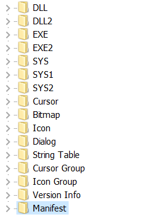

# re1 (re, 100pts)

List of executable resources viewed in Resource Hacker:



The most interesting function is 0x40111D:

```c++
signed int __stdcall sub_40111D(int a1)
{
  HGLOBAL v1; // eax
  HRSRC v2; // eax
  HRSRC v3; // esi
  HGLOBAL v4; // eax
  const void *v5; // edi
  HANDLE v6; // esi
  signed int v7; // ecx
  signed int v8; // eax
  struct _STARTUPINFOA StartupInfo; // [esp+Ch] [ebp-80h]
  DWORD v11; // [esp+50h] [ebp-3Ch]
  DWORD NumberOfBytesWritten; // [esp+54h] [ebp-38h]
  struct _PROCESS_INFORMATION ProcessInformation; // [esp+58h] [ebp-34h]
  LPCVOID lpBuffer; // [esp+68h] [ebp-24h]
  HANDLE hObject; // [esp+6Ch] [ebp-20h]
  HRSRC hResInfo; // [esp+70h] [ebp-1Ch]
  char v17; // [esp+74h] [ebp-18h]
  char v18; // [esp+75h] [ebp-17h]
  CHAR b_dll; // [esp+178h] [ebp+ECh]
  char v20; // [esp+179h] [ebp+EDh]
  CHAR FileName; // [esp+27Ch] [ebp+1F0h]
  char v22; // [esp+27Dh] [ebp+1F1h]
  CHAR CommandLine; // [esp+380h] [ebp+2F4h]
  char v24; // [esp+381h] [ebp+2F5h]
  char v25[12]; // [esp+3E4h] [ebp+358h]

  b_dll = 0;
  memset(&v20, 0, 0x103u);
  FileName = 0;
  memset(&v22, 0, 0x103u);
  memset(&v18, 0, 0x103u);
  GetTempPathA(0x104u, &b_dll);
  GetTempPathA(0x104u, &FileName);
  strcat_s(&b_dll, 0x104u, "b.dll");
  strcat_s(&FileName, 0x104u, "2.exe");
  hResInfo = FindResourceA(0, (LPCSTR)0x8D, "SYS");
  GetLastError();
  v1 = LoadResource(0, hResInfo);
  lpBuffer = LockResource(v1);
  hResInfo = (HRSRC)SizeofResource(0, hResInfo);
  hObject = CreateFileA(&FileName, 0x10000000u, 1u, 0, 2u, 0x80u, 0);
  WriteFile(hObject, lpBuffer, (DWORD)hResInfo, &NumberOfBytesWritten, 0);
  CloseHandle(hObject);
  v2 = FindResourceA(0, (LPCSTR)0x8E, "SYS");
  v3 = v2;
  v4 = LoadResource(0, v2);
  v5 = LockResource(v4);
  hObject = (HANDLE)SizeofResource(0, v3);
  v6 = CreateFileA(&b_dll, 0x10000000u, 1u, 0, 2u, 0x80u, 0);
  WriteFile(v6, v5, (DWORD)hObject, &v11, 0);
  CloseHandle(v6);
  strcpy(&v17, "qa\"apgcvg\"Rv\"v{rg?\"dkngq{q\"`klRcvj?\"");
  v7 = 0;
  do
  {
    *(&v17 + v7) ^= a1 - 48;
    ++v7;
  }
  while ( v7 < 36 );
  strcpy(v25, "p`#pwbqw#Sw");
  v8 = 0;
  do
  {
    v25[v8] ^= a1 - 47;
    ++v8;
  }
  while ( v8 < 11 );
  CommandLine = 0;
  memset(&v24, 0, 0x63u);
  sprintf(&CommandLine, "%d", a1);
  memset(&StartupInfo, 0, 0x44u);
  StartupInfo.cb = 68;
  if ( !CreateProcessA(&FileName, &CommandLine, 0, 0, 0, 0, 0, 0, &StartupInfo, &ProcessInformation) )
    return 1;
  WaitForSingleObject(ProcessInformation.hProcess, 0xFFFFFFFF);
  CloseHandle(ProcessInformation.hThread);
  CloseHandle(ProcessInformation.hProcess);
  DeleteFileA(&b_dll);
  DeleteFileA(&FileName);
  return 1;
}
```

It loads the `SYS1` resource and saves it into `b.dll` and stores `SYS2` in `2.exe` and executes it.

`2.exe` loads data from `b.dll` again, xors it with a certain byte and stores it as `flag.dll`:

```c++
signed int __stdcall sub_40111D(int a1)
{
  HGLOBAL v1; // eax
  HRSRC v2; // eax
  HRSRC v3; // esi
  HGLOBAL v4; // eax
  const void *v5; // edi
  HANDLE v6; // esi
  signed int v7; // ecx
  signed int v8; // eax
  struct _STARTUPINFOA StartupInfo; // [esp+Ch] [ebp-80h]
  DWORD v11; // [esp+50h] [ebp-3Ch]
  DWORD NumberOfBytesWritten; // [esp+54h] [ebp-38h]
  struct _PROCESS_INFORMATION ProcessInformation; // [esp+58h] [ebp-34h]
  LPCVOID lpBuffer; // [esp+68h] [ebp-24h]
  HANDLE hObject; // [esp+6Ch] [ebp-20h]
  HRSRC hResInfo; // [esp+70h] [ebp-1Ch]
  char v17; // [esp+74h] [ebp-18h]
  char v18; // [esp+75h] [ebp-17h]
  CHAR b_dll; // [esp+178h] [ebp+ECh]
  char v20; // [esp+179h] [ebp+EDh]
  CHAR FileName; // [esp+27Ch] [ebp+1F0h]
  char v22; // [esp+27Dh] [ebp+1F1h]
  CHAR CommandLine; // [esp+380h] [ebp+2F4h]
  char v24; // [esp+381h] [ebp+2F5h]
  char v25[12]; // [esp+3E4h] [ebp+358h]

  b_dll = 0;
  memset(&v20, 0, 0x103u);
  FileName = 0;
  memset(&v22, 0, 0x103u);
  memset(&v18, 0, 0x103u);
  GetTempPathA(0x104u, &b_dll);
  GetTempPathA(0x104u, &FileName);
  strcat_s(&b_dll, 0x104u, "b.dll");
  strcat_s(&FileName, 0x104u, "2.exe");
  hResInfo = FindResourceA(0, (LPCSTR)141, "SYS");
  GetLastError();
  v1 = LoadResource(0, hResInfo);
  lpBuffer = LockResource(v1);
  hResInfo = (HRSRC)SizeofResource(0, hResInfo);
  hObject = CreateFileA(&FileName, 0x10000000u, 1u, 0, 2u, 0x80u, 0);
  WriteFile(hObject, lpBuffer, (DWORD)hResInfo, &NumberOfBytesWritten, 0);
  CloseHandle(hObject);
  v2 = FindResourceA(0, (LPCSTR)142, "SYS");
  v3 = v2;
  v4 = LoadResource(0, v2);
  v5 = LockResource(v4);
  hObject = (HANDLE)SizeofResource(0, v3);
  v6 = CreateFileA(&b_dll, 0x10000000u, 1u, 0, 2u, 0x80u, 0);
  WriteFile(v6, v5, (DWORD)hObject, &v11, 0);
  CloseHandle(v6);
  strcpy(&v17, "qa\"apgcvg\"Rv\"v{rg?\"dkngq{q\"`klRcvj?\"");// sc create Pt type= filesys binPath=
  v7 = 0;
  do
  {
    *(&v17 + v7) ^= a1 - 48;
    ++v7;
  }
  while ( v7 < 36 );
  strcpy(v25, "p`#pwbqw#Sw");                   // sc start Pt
  v8 = 0;
  do
  {
    v25[v8] ^= a1 - 47;
    ++v8;
  }
  while ( v8 < 11 );
  CommandLine = 0;
  memset(&v24, 0, 0x63u);
  sprintf(&CommandLine, "%d", a1);
  memset(&StartupInfo, 0, 'D');
  StartupInfo.cb = 'D';
  if ( !CreateProcessA(&FileName, &CommandLine, 0, 0, 0, 0, 0, 0, &StartupInfo, &ProcessInformation) )
    return 1;
  WaitForSingleObject(ProcessInformation.hProcess, 0xFFFFFFFF);
  CloseHandle(ProcessInformation.hThread);
  CloseHandle(ProcessInformation.hProcess);
  DeleteFileA(&b_dll);
  DeleteFileA(&FileName);
  return 1;
}
```

Xoring the entire resource with 0x36 yields a following result:


