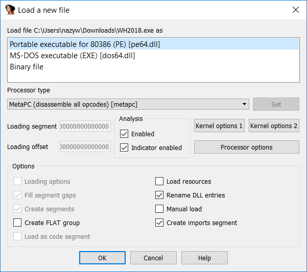
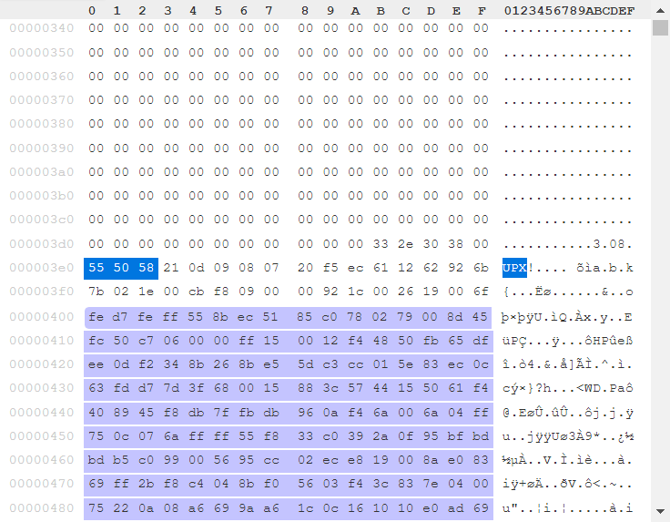
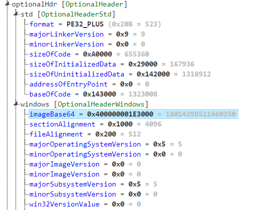
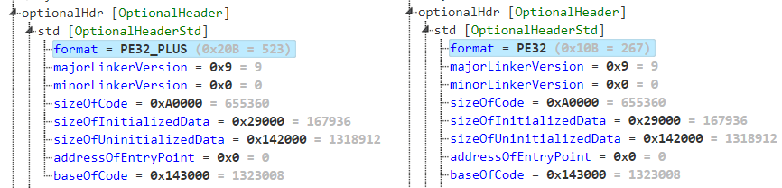
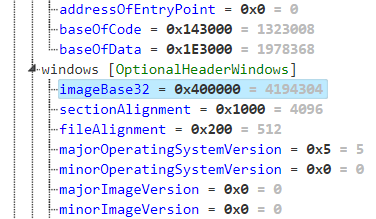
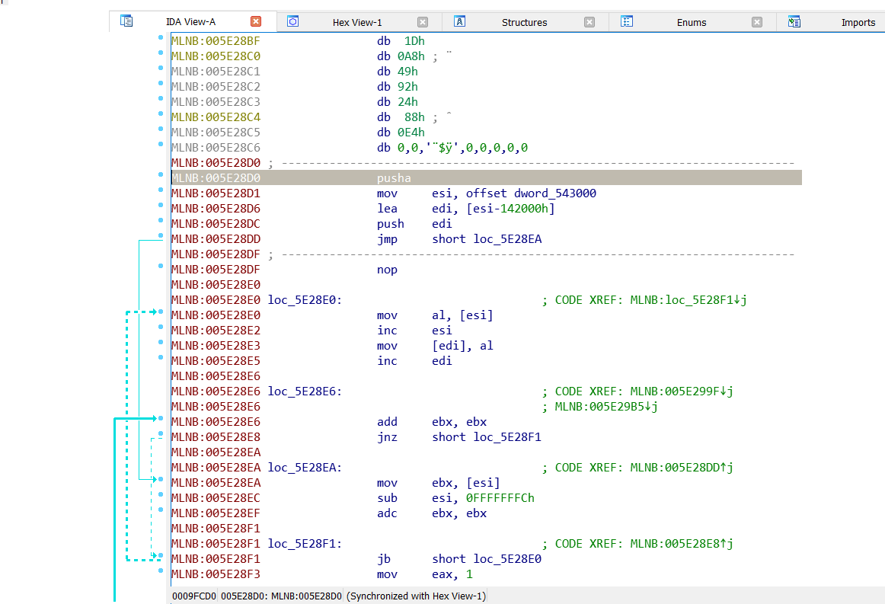
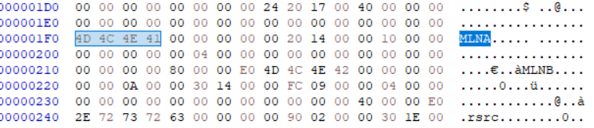
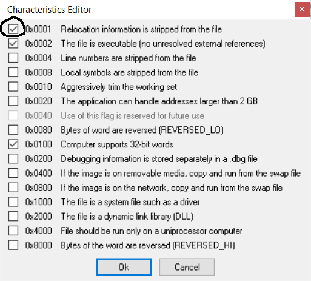

# re4 (re, 390pts)

```
michal@DESKTOP-U3SJ9VI:/mnt/c/Users/nazyw/Downloads$ file WH2018.exe
WH2018.exe: PE32+ executable (GUI) Intel 80386 Mono/.Net assembly, for MS Windows
```

Hm, another .Net binary?



🤔


Okay, something is definietly off here...

# Repairing the binary

Throughout this wirteup we'll use the [kaitai parser](https://ide.kaitai.io/]), it's been a massive help in this challange.



So this is probably a upx-packed binary...

Let's take a look at the booched entry point:



So the address of EntryPoint is set to 0, that's kinda odd.
What's weirder, the imageBase is set to 0x400000001E300, that value actually looks like 2 32-bit addresses concatenated.
Could the binary be in fact 32-bit? Let's find out!
All we have to do is move a one bit to the right:




How about the addresses?



That looks better, but the entry point is still messed up and decompressing the binary using upx fails.

But since we know a upx-ed file structure we can just find it manually and set the entry point offset to a correct value.

The unpacking procedure:



Since the entry point is relative to the image base address we'll have to set it to `0x005E28D0 - 0x00400000 = 0x001e28d0`.

upx is still not happy about the binary though:
```bash
michal@debian:/media/sf_nazyw/Downloads$ upx -d WH2018_32
                       Ultimate Packer for eXecutables
                          Copyright (C) 1996 - 2013
UPX 3.91        Markus Oberhumer, Laszlo Molnar & John Reiser   Sep 30th 2013

        File size         Ratio      Format      Name
   --------------------   ------   -----------   -----------
upx: WH2018_32: CantUnpackException: file is modified/hacked/protected; take care!!!

Unpacked 0 files.
```

Well, it turns out the section names have correct as well:



```bash
michal@debian:/media/sf_nazyw/Downloads$ upx -d WH2018_32
                       Ultimate Packer for eXecutables
                          Copyright (C) 1996 - 2013
UPX 3.91        Markus Oberhumer, Laszlo Molnar & John Reiser   Sep 30th 2013

        File size         Ratio      Format      Name
   --------------------   ------   -----------   -----------
   1872384 <-    823296   43.97%    win32/pe     WH2018_32

Unpacked 1 file.
```
Success!

# Core analysis

The binary is crashing because of memory misaligment issues, to solve that we have to turn on the `Relocation information is stripped from the file` bit:



Since the analysis of the decompressed binary is pretty straigh forward, we'll describe just the checks that are performed.

There are 2 functions for handling 2 different button presses.

## First function

The first thing it check is that wheter it was run with 5 argv parameters:
```c++
  v9 = CommandLineToArgvW(v8, &pNumArgs);
  if ( pNumArgs != 5 )
  {
    LOBYTE(v85) = 0;
    if ( _InterlockedDecrement((volatile signed __int32 *)(v7 - 16 + 12)) <= 0 )
      (*(void (__stdcall **)(int))(**(_DWORD **)(v7 - 16) + 4))(v7 - 16);
    v85 = -1;
    v10 = (volatile signed __int32 *)(v4 - 16);
LABEL_9:
    if ( _InterlockedDecrement(v10 + 3) <= 0 )
      (*(void (__stdcall **)(volatile signed __int32 *))(**(_DWORD **)v10 + 4))(v10);
    return;
  }
```

It checks if the third's argument length is equal to 35:
```c++
  v15 = v12[2];
  v16 = (int)(v15 + 1);
  do
  {
    v17 = *v15;
    ++v15;
  }
  while ( v17 );
  if ( ((signed int)v15 - v16) >> 1 != 35 )
  {
    LOBYTE(v88) = 0;
    v18 = v42 - 16;
    v19 = _InterlockedDecrement((volatile signed __int32 *)(v42 - 16 + 12));
    v20 = v19 == 0;
    v21 = v19 < 0;
LABEL_17:
    if ( v21 || v20 )
      (*(void (__stdcall **)(int))(**(_DWORD **)v18 + 4))(v18);
    v88 = -1;
    v13 = (volatile signed __int32 *)(v41 - 16);
    goto LABEL_9;
  }
```

Xors it with 0x66:
```c++
  do
  {
    *(&v45 + v31) ^= 0x66u;
    ++v31;
  }
```

Does a bunch of static comparasions:

```
if ( v45 != '_' )
...
if ( v46 != '$' || v47 != '^' || v48 != 'W' || v49 != '_' || v50 != 35 || v51 != '%' || v52 != 'W' )
...
if ( v53 == 'S'
    && v54 == '$'
    && v55 == 'R'
    && v56 == '#'
    && v57 == '$'
    && v58 == '^'
    && v59 == '\''
    && v60 == 'W'
    && v61 == '%'
    && v62 == 'S'
    && v63 == '%'
    && v64 == '\''
    && v65 == 'T'
    && v66 == 'U'
    && v67 == '_'
    && v68 == 'V'
    && v69 == '\''
    && v70 == '#'
    && v71 == 'W'
    && v72 == 'R'
    && v73 == '#'
    && v74 == 'T'
    && v75 == '^'
    && v76 == '_'
    && v77 == '^'
    && v78 == 'Q'
    && v79 == '\'' )
```

From which we get, the value '9B819SC15B4EB8A1C5CA2390AE14E28987A', so from now on we have to launch the binary with that string as the third argument.

## Second function

### First check:

The string is grabbed, md5-ed using the imported functions and then compared to a static value:

```c++
BOOL __stdcall sub_407040(int a1)
{
  int v1; // esi
  int v3; // [esp+8h] [ebp-80h]
  int v4; // [esp+Ch] [ebp-7Ch]
  int v5; // [esp+10h] [ebp-78h]
  int v6; // [esp+14h] [ebp-74h]
  int v7; // [esp+18h] [ebp-70h]
  int v8; // [esp+1Ch] [ebp-6Ch]
  int v9; // [esp+20h] [ebp-68h]
  int v10; // [esp+24h] [ebp-64h]
  int v11; // [esp+28h] [ebp-60h]
  int v12; // [esp+2Ch] [ebp-5Ch]
  int v13; // [esp+30h] [ebp-58h]
  int v14; // [esp+34h] [ebp-54h]
  int v15; // [esp+38h] [ebp-50h]
  int v16; // [esp+3Ch] [ebp-4Ch]
  int v17; // [esp+40h] [ebp-48h]
  int v18; // [esp+44h] [ebp-44h]
  int v19; // [esp+48h] [ebp-40h]
  int v20; // [esp+4Ch] [ebp-3Ch]
  int v21; // [esp+50h] [ebp-38h]
  int v22; // [esp+54h] [ebp-34h]
  int v23; // [esp+58h] [ebp-30h]
  int v24; // [esp+5Ch] [ebp-2Ch]
  int v25; // [esp+60h] [ebp-28h]
  int v26; // [esp+64h] [ebp-24h]
  int v27; // [esp+68h] [ebp-20h]
  int v28; // [esp+6Ch] [ebp-1Ch]
  int v29; // [esp+70h] [ebp-18h]
  int v30; // [esp+74h] [ebp-14h]
  int v31; // [esp+78h] [ebp-10h]
  int v32; // [esp+7Ch] [ebp-Ch]
  int v33; // [esp+80h] [ebp-8h]
  int v34; // [esp+84h] [ebp-4h]

  v7 = '7';
  v8 = '2';
  v13 = '7';
  v15 = '2';
  v3 = '3';
  v4 = 'A';
  v5 = 'B';
  v6 = '4';
  v9 = '8';
  v10 = '4';
  v11 = 'C';
  v12 = 'F';
  v14 = 'E';
  v16 = '6';
  v17 = '0';
  v18 = '5';
  v19 = '4';
  v20 = '1';
  v21 = 'D';
  v22 = '8';
  v23 = '1';
  v24 = '0';
  v25 = 'B';
  v26 = 'E';
  v27 = 'B';
  v28 = '5';
  v29 = '4';
  v30 = 'D';
  v31 = '3';
  v32 = '4';
  v33 = '0';
  v34 = '5';
  v1 = 0;
  while ( !IsDebuggerPresent() && *(char *)(v1 + a1) == *(&v3 + v1) )
  {
    if ( ++v1 >= 32 )
      return IsDebuggerPresent() == 0;
  }
  return 0;
}
```
Looking up the hardcoded md5 hash we get `whitehat`

### Second check

The second checks actually consists of 3 checks, with each one checking 24 bytes of the input.
The first and third one are based on finding a set of integers that match a certain set of formulas:

```c++
signed int __stdcall sub_4013B0(const void *a1)
{
  int v1; // ecx
  int v3; // [esp+84h] [ebp-Ch]
  int v4; // [esp+88h] [ebp-8h]
  int v5; // [esp+8Ch] [ebp-4h]
  int v6; // [esp+90h] [ebp+0h]
  int v7; // [esp+94h] [ebp+4h]
  int v8; // [esp+98h] [ebp+8h]
  int v9; // [esp+9Ch] [ebp+Ch]
  int v10; // [esp+A0h] [ebp+10h]
  int v11; // [esp+A4h] [ebp+14h]
  int v12; // [esp+A8h] [ebp+18h]
  int v13; // [esp+ACh] [ebp+1Ch]
  int v14; // [esp+B0h] [ebp+20h]
  int v15; // [esp+B4h] [ebp+24h]
  int v16; // [esp+B8h] [ebp+28h]
  int v17; // [esp+BCh] [ebp+2Ch]
  int v18; // [esp+C0h] [ebp+30h]
  int v19; // [esp+C4h] [ebp+34h]
  int v20; // [esp+C8h] [ebp+38h]
  int v21; // [esp+CCh] [ebp+3Ch]
  int v22; // [esp+D0h] [ebp+40h]
  int v23; // [esp+D4h] [ebp+44h]
  int v24; // [esp+D8h] [ebp+48h]
  int v25; // [esp+DCh] [ebp+4Ch]
  int v26; // [esp+E0h] [ebp+50h]
  int v27; // [esp+E4h] [ebp+54h]
  int v28; // [esp+E8h] [ebp+58h]
  int v29; // [esp+ECh] [ebp+5Ch]
  int v30; // [esp+F0h] [ebp+60h]
  int v31; // [esp+F4h] [ebp+64h]
  int v32; // [esp+F8h] [ebp+68h]
  int v33; // [esp+FCh] [ebp+6Ch]
  int v34; // [esp+100h] [ebp+70h]

  qmemcpy(&v3, a1, 0x80u);
  v1 = 0;
  while ( 1467 * v4+ 1464 * v12+ 1491 * v18+ 1961 * v17+ 2169 * v7+ 2145 * v14+ 3358 * v10+ 3281 * v15+ 3500 * v6+ 3478 * v9+ 3391 * v23+ 3436 * v22+ 3705 * v13+ 3604 * v24+ 1153 * v26+ 3962 * v11+ 3942 * v20+ 1292 * v27+ 3995 * v19+ 1382 * v28+ 1716 * v30+ 1726 * v34+ 1902 * v25+ 2718 * v31+ 2895 * v32+ 3421 * v29+ 3447 * v33+ 2827 * (v21 + v16)+ 1724 * v8+ 1334 * v5+ 1041 * v3 == 6528434
       && 1644 * v22+ 1894 * v10+ 1868 * v20+ 2253 * v19+ 2667 * v7+ 2703 * v11+ 2547 * v21+ 2664 * v16+ 2869 * v5+ 2711 * v18+ 2912 * v6+ 3035 * v9+ 3299 * v8+ 3538 * v4+ 3771 * v3+ 3673 * v15+ 3811 * v12+ 3662 * v23+ 1035 * v32+ 3757 * v24+ 1316 * v31+ 1529 * v29+ 1741 * v28+ 1778 * v30+ 1859 * v26+ 2190 * v33+ 2842 * v34+ 3037 * v25+ 3723 * v27+ 2322 * v13+ 1333 * v14+ 1141 * v17 == 6484666
       && (_UNKNOWN *)(1040 * v5+ 1106 * v4+ 1006 * v15+ 1288 * v3+ 1084 * v21+ 1350 * v14+ 1370 * v13+ 1446 * v9+ 1393 * v17+ 1548 * v18+ 1729 * v12+ 1623 * v20+ 1890 * v11+ 1756 * v23+ 2101 * v16+ 2264 * v7+ 2648 * v8+ 2629 * v19+ 2954 * v22+ 3805 * v10+ 3942 * v6+ 3840 * v24+ 1538 * v34+ 1626 * v31+ 2376 * v26+ 2931 * v27+ 2966 * v25+ 2944 * v29+ 3308 * v28+ 3323 * v32+ 3439 * v30+ 3537 * v33) == &unk_5535D1
       && 1270 * v21+ 1573 * v24+ 2118 * v3+ 1930 * v12+ 2115 * v8+ 2072 * v20+ 2541 * v6+ 2386 * v16+ 2639 * v9+ 2704 * v11+ 2673 * v15+ 2833 * v7+ 2929 * v5+ 2745 * v18+ 3082 * v4+ 2977 * v13+ 3021 * v17+ 3306 * v14+ 3658 * v10+ 3777 * v23+ 3829 * v22+ 1161 * v29+ 3924 * v19+ 1636 * v30+ 1574 * v34+ 1767 * v32+ 2290 * v28+ 2355 * v31+ 2512 * v26+ 3097 * v25+ 3655 * v33+ 3986 * v27 == 6823719
       && (_UNKNOWN *)(1724 * v8+ 1191 * v12+ 1350 * v5+ 1287 * v16+ 1430 * v10+ 1457 * v15+ 1588 * v24+ 2031 * v3+ 1753 * v17+ 1758 * v22+ 2150 * v6+ 2107 * v11+ 2383 * v18+ 2941 * v7+ 2966 * v9+ 3209 * v21+ 3337 * v14+ 3909 * v20+ 3945 * v19+ 1422 * v25+ 1506 * v27+ 1762 * v33+ 1946 * v26+ 1900 * v31+ 2030 * v28+ 2413 * v29+ 2655 * v34+ 3168 * v30+ 3591 * v32+ 1221 * v23+ 1007 * v13+ 1052 * v4) == &unk_559DDE
       && 1021 * v18+ 1359 * v4+ 1350 * v12+ 1483 * v8+ 1374 * v15+ 1348 * v19+ 1548 * v7+ 1624 * v5+ 1595 * v9+ 1602 * v11+ 1484 * v22+ 1836 * v14+ 2041 * v10+ 2291 * v13+ 2596 * v17+ 2668 * v21+ 2734 * v24+ 3020 * v16+ 3410 * v3+ 3199 * v20+ 3537 * v6+ 3281 * v23+ 1053 * v25+ 1127 * v31+ 1467 * v32+ 1728 * v33+ 1788 * v30+ 1900 * v29+ 1938 * v28+ 2999 * v26+ 3418 * v27+ 3893 * v34 == 5330889
       && 1224 * v21+ 1648 * v3+ 1303 * v20+ 1514 * v10+ 1617 * v8+ 1935 * v13+ 2483 * v4+ 2519 * v17+ 2616 * v12+ 2556 * v18+ 2813 * v9+ 2798 * v19+ 3008 * v22+ 3310 * v7+ 3309 * v11+ 3249 * v16+ 3421 * v6+ 3451 * v14+ 3600 * v15+ 3807 * v5+ 3609 * v24+ 1093 * v29+ 1195 * v27+ 3844 * v23+ 1523 * v31+ 1503 * v34+ 2587 * v32+ 3343 * v30+ 3314 * v33+ 3485 * v28+ 3702 * v26+ 3989 * v25 == 6888831
       && 1038 * v19+ 1157 * v14+ 1281 * v10+ 1179 * v20+ 1190 * v21+ 1191 * v24+ 1292 * v18+ 1618 * v6+ 1538 * v17+ 2009 * v13+ 2200 * v4+ 2448 * v3+ 2458 * v5+ 2589 * v11+ 2796 * v8+ 2958 * v23+ 3580 * v7+ 3472 * v15+ 3622 * v16+ 3657 * v22+ 1272 * v31+ 2156 * v27+ 2202 * v29+ 2646 * v34+ 2815 * v25+ 2888 * v26+ 3055 * v32+ 3328 * v33+ 3511 * v28+ 3634 * v30+ 3798 * (v9 + v12) == 6321788
       && 1651 * v14+ 1875 * v5+ 1881 * v11+ 1892 * v19+ 2021 * v15+ 2433 * v6+ 2416 * v10+ 2476 * v18+ 2886 * v4+ 2712 * v22+ 2998 * v12+ 3142 * v8+ 3362 * v3+ 3075 * v21+ 3510 * v24+ 3699 * v16+ 1003 * v25+ 3600 * v23+ 3844 * v9+ 1255 * v31+ 1789 * v30+ 2401 * v29+ 2423 * v32+ 2585 * v34+ 3002 * v33+ 3688 * v28+ 3861 * v27+ 3869 * (v26 + v7)+ 2322 * v13+ 1557 * v17+ 1389 * v20 == 6796074
       && 1182 * v3+ 1088 * v5+ 1425 * v19+ 1434 * v21+ 1512 * v24+ 1832 * v9+ 1932 * v10+ 2169 * v11+ 2285 * v4+ 2426 * v6+ 2329 * v16+ 2617 * v7+ 2441 * v23+ 2555 * v20+ 2549 * v22+ 2721 * v13+ 2692 * v18+ 2976 * v15+ 3154 * v12+ 3189 * v14+ 3368 * v17+ 3757 * v8+ 1060 * v26+ 1145 * v25+ 1423 * v30+ 1529 * v34+ 1718 * v27+ 1753 * v28+ 2139 * v29+ 2279 * v31+ 2687 * v33+ 2996 * v32 == 5803503
       && 1193 * v7+ 1114 * v17+ 1297 * v9+ 1263 * v22+ 1455 * v15+ 1488 * v13+ 1355 * v24+ 1949 * v6+ 2105 * v12+ 2286 * v11+ 2282 * v14+ 2549 * v3+ 2316 * v19+ 2866 * v5+ 2734 * v16+ 3195 * v8+ 3437 * v4+ 3416 * v10+ 3701 * v18+ 3671 * v20+ 3786 * v21+ 1756 * v32+ 1912 * v27+ 2185 * v25+ 2321 * v33+ 2558 * v34+ 2808 * v28+ 2832 * v29+ 3053 * v26+ 3945 * v30+ 2313 * (v31 + v23) == 6283755
       && 1044 * v15+ 1481 * v5+ 1659 * v16+ 1982 * v4+ 2144 * v6+ 2129 * v9+ 2466 * v14+ 2745 * v23+ 3196 * v7+ 3161 * v10+ 3024 * v20+ 3222 * v8+ 3173 * v13+ 3154 * v21+ 3253 * v19+ 3292 * v17+ 3646 * v3+ 3450 * v12+ 3535 * v11+ 3439 * v18+ 3510 * v22+ 3649 * v24+ 1787 * v31+ 1905 * v32+ 2022 * v28+ 2186 * v25+ 2474 * v27+ 2391 * v34+ 3018 * v30+ 3168 * v29+ 3313 * v26+ 3958 * v33 == 7038880
       && 1314 * v7+ 1372 * v11+ 1625 * v4+ 2202 * v3+ 2070 * v14+ 2414 * v6+ 2297 * v16+ 2487 * v15+ 2518 * v17+ 2824 * v8+ 2874 * v10+ 2763 * v21+ 3159 * v12+ 2985 * v24+ 3177 * v18+ 3334 * v9+ 3477 * v5+ 3192 * v23+ 3270 * v20+ 3668 * v22+ 3833 * v13+ 1102 * v25+ 3773 * v19+ 1527 * v31+ 2099 * v30+ 2543 * v33+ 2627 * v28+ 2802 * v29+ 2924 * v34+ 3213 * v27+ 3480 * v26+ 3625 * v32 == 6980452
       && 1142 * v14+ 1432 * v8+ 1593 * v10+ 2003 * v7+ 2061 * v5+ 2031 * v12+ 1974 * v22+ 2064 * v17+ 2187 * v19+ 2286 * v16+ 2413 * v21+ 2725 * v11+ 3023 * v3+ 2900 * v18+ 3181 * v6+ 3222 * v15+ 3170 * v24+ 3270 * v23+ 3505 * v9+ 3360 * v20+ 3492 * v13+ 3972 * v4+ 1235 * v25+ 1140 * v33+ 1550 * v32+ 1833 * v26+ 1896 * v29+ 2285 * v31+ 2711 * v27+ 2667 * v30+ 2760 * v28+ 2694 * v34 == 6213703
       && 1119 * v19+ 1087 * v22+ 1624 * v4+ 1694 * v8+ 2019 * v5+ 2018 * v17+ 2060 * v23+ 2466 * v12+ 2484 * v16+ 2464 * v18+ 2658 * v9+ 2593 * v14+ 2678 * v13+ 3125 * v6+ 2926 * v24+ 3302 * v10+ 3371 * v11+ 3695 * v3+ 3576 * v7+ 1010 * v25+ 3851 * v15+ 1043 * v31+ 3800 * v21+ 1227 * v30+ 2164 * v33+ 2757 * v26+ 2758 * v32+ 3170 * v27+ 3109 * v34+ 3315 * v28+ 1576 * (v29 + 2 * v20) == 6470003
       && 1123 * v17+ 1487 * v6+ 1596 * v18+ 1902 * v15+ 2195 * v21+ 2261 * v20+ 2423 * v13+ 2264 * v23+ 2520 * v14+ 2627 * v10+ 2882 * v3+ 2928 * v12+ 3086 * v4+ 3260 * v24+ 3565 * v5+ 3577 * v7+ 3625 * v9+ 3629 * v11+ 3525 * v22+ 1202 * v25+ 3962 * v16+ 1153 * v33+ 1411 * v31+ 1520 * v34+ 1771 * v30+ 2547 * v32+ 3030 * v27+ 3011 * v29+ 3116 * v26+ 3326 * v28+ 1737 * (v19 + 2 * v8) == 6591297
       && 1188 * v5+ 1439 * v20+ 1763 * v6+ 1900 * v11+ 1760 * v22+ 1958 * v13+ 2007 * v16+ 2200 * v18+ 2357 * v23+ 2829 * v10+ 2940 * v7+ 3058 * v19+ 3365 * v15+ 3303 * v21+ 3477 * v17+ 3790 * v3+ 3578 * v14+ 3713 * v12+ 3851 * v8+ 3924 * v4+ 1113 * v27+ 1477 * v25+ 1384 * v34+ 1993 * v33+ 2428 * v32+ 2801 * v29+ 2850 * v30+ 3108 * v26+ 3460 * v31+ 3887 * v28+ 1662 * (v9 + 2 * v24) == 6764513
       && 1540 * v4+ 1357 * v16+ 1835 * v7+ 1823 * v11+ 2111 * v5+ 1896 * v23+ 2405 * v3+ 2022 * v24+ 2357 * v18+ 2704 * v6+ 2626 * v15+ 3356 * v8+ 3350 * v10+ 3271 * v20+ 3337 * v19+ 3485 * v12+ 3361 * v22+ 3556 * v13+ 3526 * v17+ 1041 * v30+ 1129 * v32+ 3869 * v21+ 1229 * v33+ 1423 * v31+ 1696 * v28+ 1717 * v27+ 2112 * v26+ 2565 * v34+ 3617 * v25+ 3585 * v29+ 1072 * (v14 + v9 + 2 * v14) == 6224197
       && 1457 * v13+ 1584 * v9+ 1654 * v11+ 1911 * v19+ 1938 * v24+ 2296 * v5+ 2067 * v21+ 2532 * v15+ 2675 * v23+ 2962 * v8+ 2972 * v12+ 2848 * v22+ 3369 * v14+ 3483 * v18+ 3607 * v17+ 3734 * v10+ 3855 * v6+ 3635 * v20+ 3932 * v4+ 3963 * v16+ 1221 * v33+ 1459 * v31+ 1511 * v28+ 2142 * v26+ 2741 * v29+ 3223 * v25+ 3175 * v30+ 3754 * v27+ 3870 * v34+ 3825 * v32+ 1559 * v3+ 1053 * v7 == 7018874
       && 1205 * v5+ 1193 * v11+ 1300 * v22+ 1734 * v12+ 1881 * v21+ 1962 * v19+ 2279 * v9+ 2176 * v17+ 2626 * v3+ 2637 * v13+ 2701 * v10+ 2548 * v20+ 2783 * v6+ 2705 * v18+ 2934 * v4+ 2641 * v24+ 2993 * v16+ 3398 * v8+ 3534 * v14+ 3413 * v23+ 3556 * v15+ 3850 * v7+ 1443 * v34+ 1611 * v29+ 1855 * v26+ 1877 * v30+ 2142 * v27+ 2855 * v25+ 2752 * v33+ 3462 * v28+ 3424 * v31+ 3678 * v32 == 6717789
       && 1313 * v6+ 1145 * v24+ 1673 * v4+ 1610 * v10+ 1695 * v14+ 1818 * v9+ 1875 * v7+ 2040 * v5+ 2017 * v11+ 2296 * v3+ 2112 * v13+ 2169 * v15+ 2090 * v20+ 2497 * v21+ 2685 * v19+ 3072 * v8+ 3040 * v17+ 2990 * v23+ 3488 * v18+ 3589 * v22+ 3831 * v16+ 3932 * v12+ 1335 * v31+ 1651 * v27+ 2044 * v29+ 2314 * v26+ 2353 * v25+ 2605 * v34+ 3192 * v33+ 3258 * v30+ 3740 * v28+ 3759 * v32 == 6502052
       && 1181 * v4+ 1077 * v22+ 1467 * v15+ 1829 * v6+ 1813 * v19+ 2264 * v3+ 2240 * v18+ 2503 * v5+ 2561 * v13+ 2627 * v14+ 3129 * v17+ 3292 * v9+ 3174 * v20+ 3215 * v23+ 3549 * v11+ 3608 * v8+ 3556 * v12+ 3541 * v16+ 3775 * v7+ 3683 * v24+ 3997 * v10+ 1759 * v30+ 2027 * v33+ 2084 * v34+ 2824 * v27+ 3213 * v25+ 3392 * v29+ 3428 * v32+ 3670 * v31+ 3992 * v26+ 3601 * (v21 + v28) == 7439610
       && 1010 * v15+ 1221 * v11+ 1287 * v7+ 1164 * v19+ 1240 * v18+ 1498 * v5+ 1503 * v10+ 1489 * v17+ 1786 * v4+ 2075 * v3+ 1970 * v6+ 1704 * v24+ 2171 * v16+ 2663 * v12+ 2542 * v20+ 2619 * v21+ 2591 * v23+ 3363 * v14+ 3604 * v9+ 3706 * v13+ 3847 * v8+ 1098 * v33+ 1232 * v26+ 3913 * v22+ 1303 * v31+ 1750 * v27+ 2205 * v28+ 2539 * v30+ 2818 * v25+ 2975 * v29+ 3247 * v34+ 3422 * v32 == 5861762
       && 1262 * v14+ 1545 * v9+ 1540 * v20+ 1678 * v12+ 1944 * v18+ 1870 * v24+ 2584 * v3+ 2289 * v17+ 2318 * v23+ 2648 * v4+ 2508 * v22+ 2712 * v10+ 2769 * v13+ 2913 * v7+ 3075 * v8+ 2985 * v16+ 3245 * v21+ 3546 * v11+ 3519 * v15+ 3864 * v6+ 3971 * v5+ 1132 * v27+ 3865 * v19+ 1152 * v29+ 1472 * v28+ 1601 * v25+ 2087 * v30+ 2323 * v26+ 2570 * v31+ 3103 * v34+ 3763 * v32+ 3901 * v33 == 6606266
       && 1543 * v10+ 1637 * v14+ 1608 * v21+ 2347 * v11+ 2409 * v15+ 2588 * v19+ 2681 * v18+ 3015 * v7+ 2758 * v24+ 3088 * v12+ 3049 * v17+ 3423 * v3+ 3060 * v22+ 3342 * v20+ 3600 * v5+ 3565 * v8+ 3463 * v16+ 3969 * v6+ 3943 * v13+ 1067 * v34+ 1430 * v31+ 1690 * v28+ 1748 * v33+ 1843 * v30+ 2620 * v32+ 2949 * v29+ 3146 * v27+ 3888 * v26+ 3954 * v25+ 1221 * v23+ 1527 * v4+ 1028 * v9 == 6637643
       && 1035 * v5+ 1185 * v7+ 1359 * v14+ 1748 * v12+ 1853 * v9+ 1766 * v16+ 2038 * v8+ 2001 * v24+ 2536 * v3+ 2411 * v21+ 2629 * v10+ 2923 * v13+ 2944 * v17+ 3226 * v6+ 3224 * v11+ 3257 * v15+ 3318 * v19+ 3355 * v23+ 3783 * v4+ 3726 * v20+ 3955 * v18+ 1496 * v26+ 1515 * v28+ 1584 * v27+ 2142 * v33+ 2196 * v34+ 2549 * v25+ 3342 * v30+ 3913 * v32+ 3964 * v29+ 1025 * (v31 + v22 + 2 * v31) == 6620539
       && 1429 * v8+ 1705 * v10+ 1948 * v3+ 1652 * v22+ 1814 * v19+ 2072 * v4+ 1838 * v24+ 2036 * v16+ 2375 * v13+ 2565 * v15+ 3173 * v7+ 3141 * v18+ 3426 * v5+ 3404 * v9+ 3256 * v21+ 3606 * v6+ 3626 * v11+ 3812 * v12+ 1015 * v27+ 3736 * v17+ 1230 * v29+ 3936 * v23+ 3994 * v20+ 2131 * v28+ 2355 * v26+ 3011 * v32+ 3482 * v25+ 3625 * v31+ 3637 * v33+ 3841 * v30+ 1093 * (v14 + 2 * v34) == 6958794
       && 1028 * v24+ 1148 * v19+ 1109 * v23+ 1416 * v9+ 1634 * v6+ 2233 * v13+ 2262 * v12+ 2353 * v8+ 2303 * v15+ 2213 * v22+ 2452 * v10+ 2690 * v3+ 2650 * v4+ 2893 * v7+ 3008 * v11+ 3124 * v20+ 3256 * v18+ 3303 * v17+ 3454 * v14+ 3662 * v5+ 1080 * v26+ 1050 * v29+ 1155 * v30+ 1318 * v27+ 1264 * v32+ 1676 * v34+ 2361 * v31+ 2858 * v28+ 3200 * v25+ 3903 * v33+ 1317 * (v21 + 2 * v16) == 5945386
       && 1003 * v22+ 1561 * v6+ 1674 * v11+ 1831 * v15+ 1948 * v8+ 1923 * v14+ 1878 * v17+ 1781 * v24+ 2008 * v19+ 1945 * v23+ 2282 * v9+ 2489 * v7+ 2369 * v16+ 2653 * v10+ 2619 * v20+ 3220 * v12+ 3259 * v18+ 3402 * v13+ 3643 * v3+ 3909 * v4+ 3902 * v5+ 3971 * v21+ 1392 * v26+ 1410 * v34+ 1698 * v29+ 1722 * v31+ 2037 * v33+ 2313 * v28+ 3504 * v25+ 3589 * v30+ 3685 * v27+ 3938 * v32 == 6697494
       && 1058 * v13+ 1234 * v4+ 1117 * v17+ 1039 * v22+ 1212 * v23+ 1508 * v5+ 1493 * v8+ 1330 * v21+ 1555 * v19+ 1961 * v6+ 1959 * v7+ 1937 * v11+ 2269 * v10+ 2461 * v3+ 2215 * v18+ 2515 * v9+ 2869 * v12+ 2815 * v20+ 2971 * v15+ 3264 * v16+ 3288 * v24+ 3700 * v14+ 1484 * v29+ 1541 * v34+ 1774 * v30+ 2082 * v25+ 2085 * v27+ 2954 * v26+ 2951 * v33+ 3380 * v31+ 3710 * v28+ 3815 * v32 == 5896567
       && 1028 * v19+ 1363 * v18+ 1788 * v8+ 1790 * v16+ 1778 * v21+ 1941 * v15+ 2008 * v14+ 2184 * v20+ 2200 * v22+ 2679 * v4+ 2689 * v12+ 2898 * v6+ 2723 * v17+ 3073 * v7+ 3110 * v5+ 2885 * v24+ 3113 * v13+ 3071 * v23+ 3977 * v9+ 3956 * v11+ 1629 * v34+ 1676 * v33+ 1974 * v25+ 2071 * v26+ 2867 * v28+ 3153 * v29+ 3168 * v31+ 3333 * v27+ 3295 * v30+ 3825 * v32+ 1132 * v10+ 1115 * v3 == 6410858
       && 1080 * v8+ 1309 * v5+ 1249 * v10+ 1726 * v20+ 1681 * v23+ 1816 * v18+ 2116 * v9+ 2650 * v3+ 2528 * v12+ 2693 * v6+ 2686 * v7+ 2516 * v19+ 2666 * v21+ 2864 * v14+ 2964 * v24+ 3087 * v22+ 3405 * v16+ 3421 * v15+ 3598 * v4+ 3667 * v11+ 3679 * v13+ 1021 * v27+ 3826 * v17+ 1064 * v30+ 2340 * v25+ 3309 * v31+ 3415 * v32+ 3686 * v26+ 3662 * v28+ 3721 * v29+ 3873 * v34+ 3902 * v33 == 7041898 )
  {
    if ( ++v1 >= 10 )
      return 1;
  }
  return 0;
}
```

Which is pretty easily z3-able:

```python
import z3

def main():
    s = z3.Solver()
    v3 = z3.Int('v3')
    v4 = z3.Int('v4')
    v5 = z3.Int('v5')
    v6 = z3.Int('v6')
    v7 = z3.Int('v7')
    v8 = z3.Int('v8')
    v9 = z3.Int('v9')
    v10 = z3.Int('v10')
    v11 = z3.Int('v11')
    v12 = z3.Int('v12')
    v13 = z3.Int('v13')
    v14 = z3.Int('v14')
    v15 = z3.Int('v15')
    v16 = z3.Int('v16')
    v17 = z3.Int('v17')
    v18 = z3.Int('v18')
    v19 = z3.Int('v19')
    v20 = z3.Int('v20')
    v21 = z3.Int('v21')
    v22 = z3.Int('v22')
    v23 = z3.Int('v23')
    v24 = z3.Int('v24')
    v25 = z3.Int('v25')
    v26 = z3.Int('v26')
    v27 = z3.Int('v27')
    v28 = z3.Int('v28')
    v29 = z3.Int('v29')
    v30 = z3.Int('v30')
    v31 = z3.Int('v31')
    v32 = z3.Int('v32')
    v33 = z3.Int('v33')
    v34 = z3.Int('v34')

    s.add(1040 * v5 + 1106 * v4 + 1006 * v15 + 1288 * v3 + 1084 * v21 + 1350 * v14 + 1370 * v13 + 1446 * v9 + 1393 * v17 + 1548 * v18 + 1729 * v12 + 1623 * v20 + 1890 * v11 + 1756 * v23 + 2101 * v16 + 2264 * v7 + 2648 * v8 + 2629 * v19 + 2954 * v22 + 3805 * v10 + 3942 * v6 + 3840 * v24 + 1538 * v34 + 1626 * v31 + 2376 * v26 + 2931 * v27 + 2966 * v25 + 2944 * v29 + 3308 * v28 + 3323 * v32 + 3439 * v30 + 3537 * v33 == 5584337)
    s.add(1724 * v8 + 1191 * v12 + 1350 * v5 + 1287 * v16 + 1430 * v10 + 1457 * v15 + 1588 * v24 + 2031 * v3 + 1753 * v17 + 1758 * v22 + 2150 * v6 + 2107 * v11 + 2383 * v18 + 2941 * v7 + 2966 * v9 + 3209 * v21 + 3337 * v14 + 3909 * v20 + 3945 * v19 + 1422 * v25 + 1506 * v27 + 1762 * v33 + 1946 * v26 + 1900 * v31 + 2030 * v28 + 2413 * v29 + 2655 * v34 + 3168 * v30 + 3591 * v32 + 1221 * v23 + 1007 * v13 + 1052 * v4 == 5610974)
    s.add(1467 * v4 + 1464 * v12 + 1491 * v18 + 1961 * v17 + 2169 * v7 + 2145 * v14 + 3358 * v10 + 3281 * v15 + 3500 * v6 + 3478 * v9 + 3391 * v23 + 3436 * v22 + 3705 * v13 + 3604 * v24 + 1153 * v26 + 3962 * v11 + 3942 * v20 + 1292 * v27 + 3995 * v19 + 1382 * v28 + 1716 * v30 + 1726 * v34 + 1902 * v25 + 2718 * v31 + 2895 * v32 + 3421 * v29 + 3447 * v33 + 2827 * (v21 + v16) + 1724 * v8 + 1334 * v5 + 1041 * v3 == 6528434)
    s.add(1644 * v22 + 1894 * v10 + 1868 * v20 + 2253 * v19 + 2667 * v7 + 2703 * v11 + 2547 * v21 + 2664 * v16 + 2869 * v5 + 2711 * v18 + 2912 * v6 + 3035 * v9 + 3299 * v8 + 3538 * v4 + 3771 * v3 + 3673 * v15 + 3811 * v12 + 3662 * v23 + 1035 * v32 + 3757 * v24 + 1316 * v31 + 1529 * v29 + 1741 * v28 + 1778 * v30 + 1859 * v26 + 2190 * v33 + 2842 * v34 + 3037 * v25 + 3723 * v27 + 2322 * v13 + 1333 * v14 + 1141 * v17 == 6484666)
    s.add(1270 * v21 + 1573 * v24 + 2118 * v3 + 1930 * v12 + 2115 * v8 + 2072 * v20 + 2541 * v6 + 2386 * v16 + 2639 * v9 + 2704 * v11 + 2673 * v15 + 2833 * v7 + 2929 * v5 + 2745 * v18 + 3082 * v4 + 2977 * v13 + 3021 * v17 + 3306 * v14 + 3658 * v10 + 3777 * v23 + 3829 * v22 + 1161 * v29 + 3924 * v19 + 1636 * v30 + 1574 * v34 + 1767 * v32 + 2290 * v28 + 2355 * v31 + 2512 * v26 + 3097 * v25 + 3655 * v33 + 3986 * v27 == 6823719)
    s.add(1021 * v18 + 1359 * v4 + 1350 * v12 + 1483 * v8 + 1374 * v15 + 1348 * v19 + 1548 * v7 + 1624 * v5 + 1595 * v9 + 1602 * v11 + 1484 * v22 + 1836 * v14 + 2041 * v10 + 2291 * v13 + 2596 * v17 + 2668 * v21 + 2734 * v24 + 3020 * v16 + 3410 * v3 + 3199 * v20 + 3537 * v6 + 3281 * v23 + 1053 * v25 + 1127 * v31 + 1467 * v32 + 1728 * v33 + 1788 * v30 + 1900 * v29 + 1938 * v28 + 2999 * v26 + 3418 * v27 + 3893 * v34 == 5330889)
    s.add(1224 * v21 + 1648 * v3 + 1303 * v20 + 1514 * v10 + 1617 * v8 + 1935 * v13 + 2483 * v4 + 2519 * v17 + 2616 * v12 + 2556 * v18 + 2813 * v9 + 2798 * v19 + 3008 * v22 + 3310 * v7 + 3309 * v11 + 3249 * v16 + 3421 * v6 + 3451 * v14 + 3600 * v15 + 3807 * v5 + 3609 * v24 + 1093 * v29 + 1195 * v27 + 3844 * v23 + 1523 * v31 + 1503 * v34 + 2587 * v32 + 3343 * v30 + 3314 * v33 + 3485 * v28 + 3702 * v26 + 3989 * v25 == 6888831)
    s.add(1038 * v19 + 1157 * v14 + 1281 * v10 + 1179 * v20 + 1190 * v21 + 1191 * v24 + 1292 * v18 + 1618 * v6 + 1538 * v17 + 2009 * v13 + 2200 * v4 + 2448 * v3 + 2458 * v5 + 2589 * v11 + 2796 * v8 + 2958 * v23 + 3580 * v7 + 3472 * v15 + 3622 * v16 + 3657 * v22 + 1272 * v31 + 2156 * v27 + 2202 * v29 + 2646 * v34 + 2815 * v25 + 2888 * v26 + 3055 * v32 + 3328 * v33 + 3511 * v28 + 3634 * v30 + 3798 * (v9 + v12) == 6321788)
    s.add(1651 * v14 + 1875 * v5 + 1881 * v11 + 1892 * v19 + 2021 * v15 + 2433 * v6 + 2416 * v10 + 2476 * v18 + 2886 * v4 + 2712 * v22 + 2998 * v12 + 3142 * v8 + 3362 * v3 + 3075 * v21 + 3510 * v24 + 3699 * v16 + 1003 * v25 + 3600 * v23 + 3844 * v9 + 1255 * v31 + 1789 * v30 + 2401 * v29 + 2423 * v32 + 2585 * v34 + 3002 * v33 + 3688 * v28 + 3861 * v27 + 3869 * (v26 + v7) + 2322 * v13 + 1557 * v17 + 1389 * v20 == 6796074)
    s.add(1182 * v3 + 1088 * v5 + 1425 * v19 + 1434 * v21 + 1512 * v24 + 1832 * v9 + 1932 * v10 + 2169 * v11 + 2285 * v4 + 2426 * v6 + 2329 * v16 + 2617 * v7 + 2441 * v23 + 2555 * v20 + 2549 * v22 + 2721 * v13 + 2692 * v18 + 2976 * v15 + 3154 * v12 + 3189 * v14 + 3368 * v17 + 3757 * v8 + 1060 * v26 + 1145 * v25 + 1423 * v30 + 1529 * v34 + 1718 * v27 + 1753 * v28 + 2139 * v29 + 2279 * v31 + 2687 * v33 + 2996 * v32 == 5803503)
    s.add(1193 * v7 + 1114 * v17 + 1297 * v9 + 1263 * v22 + 1455 * v15 + 1488 * v13 + 1355 * v24 + 1949 * v6 + 2105 * v12 + 2286 * v11 + 2282 * v14 + 2549 * v3 + 2316 * v19 + 2866 * v5 + 2734 * v16 + 3195 * v8 + 3437 * v4 + 3416 * v10 + 3701 * v18 + 3671 * v20 + 3786 * v21 + 1756 * v32 + 1912 * v27 + 2185 * v25 + 2321 * v33 + 2558 * v34 + 2808 * v28 + 2832 * v29 + 3053 * v26 + 3945 * v30 + 2313 * (v31 + v23) == 6283755)
    s.add(1044 * v15 + 1481 * v5 + 1659 * v16 + 1982 * v4 + 2144 * v6 + 2129 * v9 + 2466 * v14 + 2745 * v23 + 3196 * v7 + 3161 * v10 + 3024 * v20 + 3222 * v8 + 3173 * v13 + 3154 * v21 + 3253 * v19 + 3292 * v17 + 3646 * v3 + 3450 * v12 + 3535 * v11 + 3439 * v18 + 3510 * v22 + 3649 * v24 + 1787 * v31 + 1905 * v32 + 2022 * v28 + 2186 * v25 + 2474 * v27 + 2391 * v34 + 3018 * v30 + 3168 * v29 + 3313 * v26 + 3958 * v33 == 7038880)
    s.add(1314 * v7 + 1372 * v11 + 1625 * v4 + 2202 * v3 + 2070 * v14 + 2414 * v6 + 2297 * v16 + 2487 * v15 + 2518 * v17 + 2824 * v8 + 2874 * v10 + 2763 * v21 + 3159 * v12 + 2985 * v24 + 3177 * v18 + 3334 * v9 + 3477 * v5 + 3192 * v23 + 3270 * v20 + 3668 * v22 + 3833 * v13 + 1102 * v25 + 3773 * v19 + 1527 * v31 + 2099 * v30 + 2543 * v33 + 2627 * v28 + 2802 * v29 + 2924 * v34 + 3213 * v27 + 3480 * v26 + 3625 * v32 == 6980452)
    s.add(1142 * v14 + 1432 * v8 + 1593 * v10 + 2003 * v7 + 2061 * v5 + 2031 * v12 + 1974 * v22 + 2064 * v17 + 2187 * v19 + 2286 * v16 + 2413 * v21 + 2725 * v11 + 3023 * v3 + 2900 * v18 + 3181 * v6 + 3222 * v15 + 3170 * v24 + 3270 * v23 + 3505 * v9 + 3360 * v20 + 3492 * v13 + 3972 * v4 + 1235 * v25 + 1140 * v33 + 1550 * v32 + 1833 * v26 + 1896 * v29 + 2285 * v31 + 2711 * v27 + 2667 * v30 + 2760 * v28 + 2694 * v34 == 6213703)
    s.add(1119 * v19 + 1087 * v22 + 1624 * v4 + 1694 * v8 + 2019 * v5 + 2018 * v17 + 2060 * v23 + 2466 * v12 + 2484 * v16 + 2464 * v18 + 2658 * v9 + 2593 * v14 + 2678 * v13 + 3125 * v6 + 2926 * v24 + 3302 * v10 + 3371 * v11 + 3695 * v3 + 3576 * v7 + 1010 * v25 + 3851 * v15 + 1043 * v31 + 3800 * v21 + 1227 * v30 + 2164 * v33 + 2757 * v26 + 2758 * v32 + 3170 * v27 + 3109 * v34 + 3315 * v28 + 1576 * (v29 + 2 * v20) == 6470003)
    s.add(1123 * v17 + 1487 * v6 + 1596 * v18 + 1902 * v15 + 2195 * v21 + 2261 * v20 + 2423 * v13 + 2264 * v23 + 2520 * v14 + 2627 * v10 + 2882 * v3 + 2928 * v12 + 3086 * v4 + 3260 * v24 + 3565 * v5 + 3577 * v7 + 3625 * v9 + 3629 * v11 + 3525 * v22 + 1202 * v25 + 3962 * v16 + 1153 * v33 + 1411 * v31 + 1520 * v34 + 1771 * v30 + 2547 * v32 + 3030 * v27 + 3011 * v29 + 3116 * v26 + 3326 * v28 + 1737 * (v19 + 2 * v8) == 6591297)
    s.add(1188 * v5 + 1439 * v20 + 1763 * v6 + 1900 * v11 + 1760 * v22 + 1958 * v13 + 2007 * v16 + 2200 * v18 + 2357 * v23 + 2829 * v10 + 2940 * v7 + 3058 * v19 + 3365 * v15 + 3303 * v21 + 3477 * v17 + 3790 * v3 + 3578 * v14 + 3713 * v12 + 3851 * v8 + 3924 * v4 + 1113 * v27 + 1477 * v25 + 1384 * v34 + 1993 * v33 + 2428 * v32 + 2801 * v29 + 2850 * v30 + 3108 * v26 + 3460 * v31 + 3887 * v28 + 1662 * (v9 + 2 * v24) == 6764513)
    s.add(1540 * v4 + 1357 * v16 + 1835 * v7 + 1823 * v11 + 2111 * v5 + 1896 * v23 + 2405 * v3 + 2022 * v24 + 2357 * v18 + 2704 * v6 + 2626 * v15 + 3356 * v8 + 3350 * v10 + 3271 * v20 + 3337 * v19 + 3485 * v12 + 3361 * v22 + 3556 * v13 + 3526 * v17 + 1041 * v30 + 1129 * v32 + 3869 * v21 + 1229 * v33 + 1423 * v31 + 1696 * v28 + 1717 * v27 + 2112 * v26 + 2565 * v34 + 3617 * v25 + 3585 * v29 + 1072 * (v14 + v9 + 2 * v14) == 6224197)
    s.add(1457 * v13 + 1584 * v9 + 1654 * v11 + 1911 * v19 + 1938 * v24 + 2296 * v5 + 2067 * v21 + 2532 * v15 + 2675 * v23 + 2962 * v8 + 2972 * v12 + 2848 * v22 + 3369 * v14 + 3483 * v18 + 3607 * v17 + 3734 * v10 + 3855 * v6 + 3635 * v20 + 3932 * v4 + 3963 * v16 + 1221 * v33 + 1459 * v31 + 1511 * v28 + 2142 * v26 + 2741 * v29 + 3223 * v25 + 3175 * v30 + 3754 * v27 + 3870 * v34 + 3825 * v32 + 1559 * v3 + 1053 * v7 == 7018874)
    s.add(1205 * v5 + 1193 * v11 + 1300 * v22 + 1734 * v12 + 1881 * v21 + 1962 * v19 + 2279 * v9 + 2176 * v17 + 2626 * v3 + 2637 * v13 + 2701 * v10 + 2548 * v20 + 2783 * v6 + 2705 * v18 + 2934 * v4 + 2641 * v24 + 2993 * v16 + 3398 * v8 + 3534 * v14 + 3413 * v23 + 3556 * v15 + 3850 * v7 + 1443 * v34 + 1611 * v29 + 1855 * v26 + 1877 * v30 + 2142 * v27 + 2855 * v25 + 2752 * v33 + 3462 * v28 + 3424 * v31 + 3678 * v32 == 6717789)
    s.add(1313 * v6 + 1145 * v24 + 1673 * v4 + 1610 * v10 + 1695 * v14 + 1818 * v9 + 1875 * v7 + 2040 * v5 + 2017 * v11 + 2296 * v3 + 2112 * v13 + 2169 * v15 + 2090 * v20 + 2497 * v21 + 2685 * v19 + 3072 * v8 + 3040 * v17 + 2990 * v23 + 3488 * v18 + 3589 * v22 + 3831 * v16 + 3932 * v12 + 1335 * v31 + 1651 * v27 + 2044 * v29 + 2314 * v26 + 2353 * v25 + 2605 * v34 + 3192 * v33 + 3258 * v30 + 3740 * v28 + 3759 * v32 == 6502052)
    s.add(1181 * v4 + 1077 * v22 + 1467 * v15 + 1829 * v6 + 1813 * v19 + 2264 * v3 + 2240 * v18 + 2503 * v5 + 2561 * v13 + 2627 * v14 + 3129 * v17 + 3292 * v9 + 3174 * v20 + 3215 * v23 + 3549 * v11 + 3608 * v8 + 3556 * v12 + 3541 * v16 + 3775 * v7 + 3683 * v24 + 3997 * v10 + 1759 * v30 + 2027 * v33 + 2084 * v34 + 2824 * v27 + 3213 * v25 + 3392 * v29 + 3428 * v32 + 3670 * v31 + 3992 * v26 + 3601 * (v21 + v28) == 7439610)
    s.add(1010 * v15 + 1221 * v11 + 1287 * v7 + 1164 * v19 + 1240 * v18 + 1498 * v5 + 1503 * v10 + 1489 * v17 + 1786 * v4 + 2075 * v3 + 1970 * v6 + 1704 * v24 + 2171 * v16 + 2663 * v12 + 2542 * v20 + 2619 * v21 + 2591 * v23 + 3363 * v14 + 3604 * v9 + 3706 * v13 + 3847 * v8 + 1098 * v33 + 1232 * v26 + 3913 * v22 + 1303 * v31 + 1750 * v27 + 2205 * v28 + 2539 * v30 + 2818 * v25 + 2975 * v29 + 3247 * v34 + 3422 * v32 == 5861762)
    s.add(1262 * v14 + 1545 * v9 + 1540 * v20 + 1678 * v12 + 1944 * v18 + 1870 * v24 + 2584 * v3 + 2289 * v17 + 2318 * v23 + 2648 * v4 + 2508 * v22 + 2712 * v10 + 2769 * v13 + 2913 * v7 + 3075 * v8 + 2985 * v16 + 3245 * v21 + 3546 * v11 + 3519 * v15 + 3864 * v6 + 3971 * v5 + 1132 * v27 + 3865 * v19 + 1152 * v29 + 1472 * v28 + 1601 * v25 + 2087 * v30 + 2323 * v26 + 2570 * v31 + 3103 * v34 + 3763 * v32 + 3901 * v33 == 6606266)
    s.add(1543 * v10 + 1637 * v14 + 1608 * v21 + 2347 * v11 + 2409 * v15 + 2588 * v19 + 2681 * v18 + 3015 * v7 + 2758 * v24 + 3088 * v12 + 3049 * v17 + 3423 * v3 + 3060 * v22 + 3342 * v20 + 3600 * v5 + 3565 * v8 + 3463 * v16 + 3969 * v6 + 3943 * v13 + 1067 * v34 + 1430 * v31 + 1690 * v28 + 1748 * v33 + 1843 * v30 + 2620 * v32 + 2949 * v29 + 3146 * v27 + 3888 * v26 + 3954 * v25 + 1221 * v23 + 1527 * v4 + 1028 * v9 == 6637643)
    s.add(1035 * v5 + 1185 * v7 + 1359 * v14 + 1748 * v12 + 1853 * v9 + 1766 * v16 + 2038 * v8 + 2001 * v24 + 2536 * v3 + 2411 * v21 + 2629 * v10 + 2923 * v13 + 2944 * v17 + 3226 * v6 + 3224 * v11 + 3257 * v15 + 3318 * v19 + 3355 * v23 + 3783 * v4 + 3726 * v20 + 3955 * v18 + 1496 * v26 + 1515 * v28 + 1584 * v27 + 2142 * v33 + 2196 * v34 + 2549 * v25 + 3342 * v30 + 3913 * v32 + 3964 * v29 + 1025 * (v31 + v22 + 2 * v31) == 6620539)
    s.add(1429 * v8 + 1705 * v10 + 1948 * v3 + 1652 * v22 + 1814 * v19 + 2072 * v4 + 1838 * v24 + 2036 * v16 + 2375 * v13 + 2565 * v15 + 3173 * v7 + 3141 * v18 + 3426 * v5 + 3404 * v9 + 3256 * v21 + 3606 * v6 + 3626 * v11 + 3812 * v12 + 1015 * v27 + 3736 * v17 + 1230 * v29 + 3936 * v23 + 3994 * v20 + 2131 * v28 + 2355 * v26 + 3011 * v32 + 3482 * v25 + 3625 * v31 + 3637 * v33 + 3841 * v30 + 1093 * (v14 + 2 * v34) == 6958794)
    s.add(1028 * v24 + 1148 * v19 + 1109 * v23 + 1416 * v9 + 1634 * v6 + 2233 * v13 + 2262 * v12 + 2353 * v8 + 2303 * v15 + 2213 * v22 + 2452 * v10 + 2690 * v3 + 2650 * v4 + 2893 * v7 + 3008 * v11 + 3124 * v20 + 3256 * v18 + 3303 * v17 + 3454 * v14 + 3662 * v5 + 1080 * v26 + 1050 * v29 + 1155 * v30 + 1318 * v27 + 1264 * v32 + 1676 * v34 + 2361 * v31 + 2858 * v28 + 3200 * v25 + 3903 * v33 + 1317 * (v21 + 2 * v16) == 5945386)
    s.add(1003 * v22 + 1561 * v6 + 1674 * v11 + 1831 * v15 + 1948 * v8 + 1923 * v14 + 1878 * v17 + 1781 * v24 + 2008 * v19 + 1945 * v23 + 2282 * v9 + 2489 * v7 + 2369 * v16 + 2653 * v10 + 2619 * v20 + 3220 * v12 + 3259 * v18 + 3402 * v13 + 3643 * v3 + 3909 * v4 + 3902 * v5 + 3971 * v21 + 1392 * v26 + 1410 * v34 + 1698 * v29 + 1722 * v31 + 2037 * v33 + 2313 * v28 + 3504 * v25 + 3589 * v30 + 3685 * v27 + 3938 * v32 == 6697494)
    s.add(1058 * v13 + 1234 * v4 + 1117 * v17 + 1039 * v22 + 1212 * v23 + 1508 * v5 + 1493 * v8 + 1330 * v21 + 1555 * v19 + 1961 * v6 + 1959 * v7 + 1937 * v11 + 2269 * v10 + 2461 * v3 + 2215 * v18 + 2515 * v9 + 2869 * v12 + 2815 * v20 + 2971 * v15 + 3264 * v16 + 3288 * v24 + 3700 * v14 + 1484 * v29 + 1541 * v34 + 1774 * v30 + 2082 * v25 + 2085 * v27 + 2954 * v26 + 2951 * v33 + 3380 * v31 + 3710 * v28 + 3815 * v32 == 5896567)
    s.add(1028 * v19 + 1363 * v18 + 1788 * v8 + 1790 * v16 + 1778 * v21 + 1941 * v15 + 2008 * v14 + 2184 * v20 + 2200 * v22 + 2679 * v4 + 2689 * v12 + 2898 * v6 + 2723 * v17 + 3073 * v7 + 3110 * v5 + 2885 * v24 + 3113 * v13 + 3071 * v23 + 3977 * v9 + 3956 * v11 + 1629 * v34 + 1676 * v33 + 1974 * v25 + 2071 * v26 + 2867 * v28 + 3153 * v29 + 3168 * v31 + 3333 * v27 + 3295 * v30 + 3825 * v32 + 1132 * v10 + 1115 * v3 == 6410858)
    s.add(1080 * v8 + 1309 * v5 + 1249 * v10 + 1726 * v20 + 1681 * v23 + 1816 * v18 + 2116 * v9 + 2650 * v3 + 2528 * v12 + 2693 * v6 + 2686 * v7 + 2516 * v19 + 2666 * v21 + 2864 * v14 + 2964 * v24 + 3087 * v22 + 3405 * v16 + 3421 * v15 + 3598 * v4 + 3667 * v11 + 3679 * v13 + 1021 * v27 + 3826 * v17 + 1064 * v30 + 2340 * v25 + 3309 * v31 + 3415 * v32 + 3686 * v26 + 3662 * v28 + 3721 * v29 + 3873 * v34 + 3902 * v33 == 0x6B736A)

    print(s.check())
    print(s.model())
    vars = [v3, v4, v5, v6, v7, v8, v9, v10, v11, v12, v13, v14, v15, v16, v17, v18, v19, v20, v21, v22, v23, v24, v25, v26, v27, v28, v29, v30, v31, v32, v33,
            v34]
    print("".join([chr(int(str(s.model()[var]))) for var in vars]))

main()
```

```
λ c:\Python27\python.exe  solve.py    
sat                                   
[v28 = 69, v12 = 69, v14 = 120,v21 = 89, v10 = 69, v20 = 69, v3 = 81,  v29 = 70, v15 = 81, v30 = 66, v23 = 81, v32 = 122,v19 = 77, v7 = 79,  v4 = 85,  v11 = 78, v9 = 104, v5 = 81,  v16 = 106,v24 = 48, v34 = 70, v26 = 67, v18 = 120,v33 = 82, v6 = 53,  v25 = 86, v31 = 78, v22 = 52, v8 = 84,  v17 = 81, v27 = 78, v13 = 89]                            
QUQ5OThENEYxQjQxMEY4Q0VCNEFBNzRF      
```

The second one contains a heavily obfuscated implementation of the rc4 encryption algorithm and a hardcoded encrypted output and key.

```c++
signed int __stdcall sub_4040D0(int a1)
{
  signed int v1; // eax
  _BYTE *v2; // esi
  signed int result; // eax
  int v4; // [esp+8h] [ebp-278h]
  int v5; // [esp+Ch] [ebp-274h]
  int v6; // [esp+10h] [ebp-270h]
  int v7; // [esp+14h] [ebp-26Ch]
  int v8; // [esp+18h] [ebp-268h]
  int v9; // [esp+1Ch] [ebp-264h]
  int v10; // [esp+20h] [ebp-260h]
  int v11; // [esp+24h] [ebp-25Ch]
  int v12; // [esp+28h] [ebp-258h]
  int v13; // [esp+2Ch] [ebp-254h]
  int v14; // [esp+30h] [ebp-250h]
  int v15; // [esp+34h] [ebp-24Ch]
  int v16; // [esp+38h] [ebp-248h]
  int (__thiscall **v17)(void *, char); // [esp+3Ch] [ebp-244h]
  char v18; // [esp+40h] [ebp-240h]
  char v19; // [esp+140h] [ebp-140h]
  char v20; // [esp+258h] [ebp-28h]
  int v21; // [esp+259h] [ebp-27h]
  int v22; // [esp+25Dh] [ebp-23h]
  int v23; // [esp+261h] [ebp-1Fh]
  int v24; // [esp+265h] [ebp-1Bh]
  int v25; // [esp+269h] [ebp-17h]
  int v26; // [esp+26Dh] [ebp-13h]
  int v27; // [esp+271h] [ebp-Fh]
  int v28; // [esp+275h] [ebp-Bh]

  v1 = 0;
  v20 = 0;
  v21 = 0;
  v22 = 0;
  v23 = 0;
  v24 = 0;
  v25 = 0;
  v26 = 0;
  v27 = 0;
  v28 = 0;
  do
  {
    *(&v20 + v1) = *(_BYTE *)(a1 + 4 * v1);
    ++v1;
  }
  while ( v1 < 32 );
  v4 = 102;
  v5 = 104;
  v6 = 110;
  v7 = 106;
  v8 = 117;
  v9 = 99;
  v10 = 118;
  v11 = 98;
  v12 = 110;
  v13 = 106;
  v14 = 117;
  v15 = 116;
  v16 = 114;
  v2 = operator new[](0xEu);
  result = 0;
  if ( !v2 )
    return result;
  do
  {
    v2[result] = *((_BYTE *)&v4 + 4 * result) + 1;
    ++result;
  }
  while ( result < 13 );
  v2[13] = 0;
  v17 = &off_559B00;
  memset(&v18, 0, 0x100u);
  memset(&v19, 0, 0x100u);
  sub_401160(v2);
  do
  {
    while ( v20 != -57 )
      ;
  }
  while ( (_BYTE)v21 != 0x3C
       || BYTE1(v21) != 0x12
       || BYTE2(v21) != 9
       || HIBYTE(v21) != 7
       || (_BYTE)v22 != 0x8Eu
       || BYTE1(v22) != 0x88u
       || BYTE2(v22) != 0xB9u
       || HIBYTE(v22) != 0x18
       || (_BYTE)v23 != 0x94u
       || BYTE1(v23) != 0x4B
       || BYTE2(v23) != 0x6D
       || HIBYTE(v23) != 0x13
       || (_BYTE)v24 != 0x15
       || BYTE1(v24) != 0x81u
       || BYTE2(v24) != 0x5C
       || HIBYTE(v24) != 0xA5u
       || (_BYTE)v25 != 0xC7u
       || BYTE1(v25) != 0xD
       || BYTE2(v25) != 0x23
       || HIBYTE(v25) != 0xEFu
       || (_BYTE)v26 != 0x45
       || BYTE1(v26) != 0xECu
       || BYTE2(v26) != 0xC9u
       || HIBYTE(v26) != 0xB1u
       || (_BYTE)v27 != 5
       || BYTE1(v27) != 0xB6u
       || BYTE2(v27) != 0x84u
       || HIBYTE(v27) != 0x37
       || (_BYTE)v28 != 0x63
       || BYTE1(v28) != 0xDEu
       || BYTE2(v28) != 0xA5u );
  result = 1;
  return result;
}
```

Piece of cake: `MTQ0RDIxOUVGNUI5NDU5REE4RTFEMDNC`

All of this **finally** gave us the flag `9B819EC15B4EB8A1C5CA2390AE14E28987A+whitehat+AD998D4F1B410F8CEB4AA74E144D219EF5B9459DA8E1D03B268E25A14FB1DCC923870C05`
