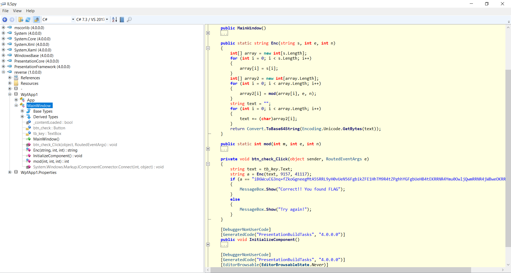

# re5 (re, 100pts)

```
michal@DESKTOP-U3SJ9VI:/mnt/c/Users/nazyw/Downloads$ file reverse.exe
reverse.exe: PE32 executable (GUI) Intel 80386 Mono/.Net assembly, for MS Windows
```

A .Net executable, should be fun!

Let's use ILSpy:



The decompilation is pretty clear:

Our input is firstly encrypted using the `Enc` function:

```c++
string text = tb_key.Text;
string a = Enc(text, 9157, 41117);
```

If the output matches the hardcoded string, we win:
```c++
if (a == "iB6WcuCG3nq+fZkoGgneegMtA5SRRL9yH0vUeN56FgbikZFE1HhTM9R4tZPghhYGFgbUeHB4tEKRRNR4Ymu0OwljQwmRRNR4jWBweOKRRyCRRAljLGQ=")
{
	MessageBox.Show("Correct!! You found FLAG");
}
else
{
	MessageBox.Show("Try again!");
}
```

```c++
public static string Enc(string s, int e, int n)
{
	int[] array = new int[s.Length];
	for (int i = 0; i < s.Length; i++)
	{
		array[i] = s[i];
	}
	int[] array2 = new int[array.Length];
	for (int i = 0; i < array.Length; i++)
	{
		array2[i] = mod(array[i], e, n);
	}
	string text = "";
	for (int i = 0; i < array.Length; i++)
	{
		text += (char)array2[i];
	}
	return Convert.ToBase64String(Encoding.Unicode.GetBytes(text));
}

public static int mod(int m, int e, int n)
{
	int[] array = new int[100];
	int num = 0;
	do
	{
		array[num] = e % 2;
		num++;
		e /= 2;
	}
	while (e != 0);
	int num2 = 1;
	for (int num3 = num - 1; num3 >= 0; num3--)
	{
		num2 = num2 * num2 % n;
		if (array[num3] == 1)
		{
			num2 = num2 * m % n;
		}
	}
	return num2;
}
```

The `Enc` function iterates over every letter and performs the following operation on it: `array2[i] = mod(array[i], e, n);`
Since `mod` is just modular exponentiation, the encryption boils down to encrypting each letter using rsa with e=`9157` and n=`41117` we can just decrypt it using the calculated private key:

```python
from base64 import b64decode

def egcd(a, b):
    if a == 0:
        return (b, 0, 1)
    else:
        g, y, x = egcd(b % a, a)
        return (g, x - (b // a) * y, y)

def modinv(a, m):
    g, x, y = egcd(a, m)
    if g != 1:
        raise Exception('modular inverse does not exist')
    else:
        return x % m

data = "iB6WcuCG3nq+fZkoGgneegMtA5SRRL9yH0vUeN56FgbikZFE1HhTM9R4tZPghhYGFgbUeHB4tEKRRNR4Ymu0OwljQwmRRNR4jWBweOKRRyCRRAljLGQ="
data = b64decode(data)
data = map(ord, data)

e = 9157
n = 41117

# since the modulus is just a prime
phi = n - 1
d = modinv(e, phi)

def decrypt(c):
    return pow(c, d, n)

flag = ''
for pos in range(0, len(data), 2):
    
    # strings in .Net are stored as UTF-16
    x = data[pos] + data[pos+1] * 256
    flag += chr(decrypt(x))

print(flag)
```

`WhiteHat{N3xT_t1m3_I_wi11_Us3_l4rg3_nUmb3r}` 

Cool!