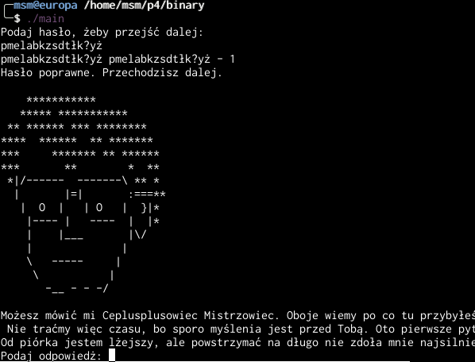

# Binary (RE)

I think that the challenge was supposed to be more difficult, but due to
implementation problems it was trivial for us.

We are given a crackme and we are supposed to extract flag from it. We start
by running the challenge (hopefully, in a safe environment):

```
╭─msm@europa /home/msm/p4/binary
╰─$ ./main
Podaj hasło, żeby przejść dalej:
```

The binary  [asked us for a password (in Polish)](https://translate.google.com/#auto/en/Podaj%20hasło%2C%20żeby%20przejść%20dalej). We provided a random one, just to see the error message:

```
╭─msm@europa /home/msm/p4/binary
╰─$ ./main
Podaj hasło, żeby przejść dalej:
password123
password123 pmelabkzsdtłk?yż - 0
Hasło błędne. Spróbuj ponownie.
```

We have a (relatively standard) error message, but also a strange random-looking string. Can it be a password?

```
╭─msm@europa /home/msm/p4/binary
╰─$ ./main
Podaj hasło, żeby przejść dalej:
pmelabkzsdtłk?yż
pmelabkzsdtłk?yż pmelabkzsdtłk?yż - 1
Hasło poprawne. Przechodzisz dalej.
```

Apparently yes:



This looks like an oversight of the author - decrypted password probably shouldn't be printed to the stdout.

The tasks became even weirder from now on. The binary asked us a riddle [(terrible translation by Google Translate for curious)](https://translate.google.com/#auto/en/Od%20pi%C3%B3rka%20jestem%20l%C5%BCejszy%2C%20ale%20powstrzyma%C4%87%20na%20d%C5%82ugo%20nie%20zdo%C5%82a%20mnie%20najsilniejszy.%20Czym%20jestem%3F). We could just guess the solution or find it on the Internet, but reversing the binary turned out to be even easier.

All the answers are in the binary in plain text and are compared with input using standard string comparison. There are two problems though:

- Strings are obfuscated. Not intentionally - but Polish characters confuse IDA and GNU strings and not all the answers were immediately visible.
- The binary is written in C++ and compiled without optimization.


But it's nothing that we can't deal with in a few minutes. Strings are initialized globally, so first, we had to find the static initialization routine in the codebase (easy with find-xref function in IDA. One could also search for the name  `__static_initialization_and_destruction`, because symbols were not stripped).

All the answers can be easily found by looking at that function in disassembly:


Now we just copied them all in the binary and got the flag:


Confusingly, the crackme shows two different pieces of information: the flag,
and a final message "Och nie! Jakiś bug się wkradł! To jednak nie flaga, a jakiś klucz! Myślisz, że uda Ci się go pokonać i znaleźć flagę?" [(translation: Oh no, that's not a flag after all. Looks like some kind of a key, can crack it?)](https://translate.google.com/#auto/en/Och%20nie!%20Jaki%C5%9B%20bug%20si%C4%99%20wkrad%C5%82!%20To%20jednak%20nie%20flaga%2C%20a%20jaki%C5%9B%20klucz!%20My%C5%9Blisz%2C%20%C5%BCe%20uda%20Ci%20si%C4%99%20go%20pokona%C4%87%20i%20znale%C5%BA%C4%87%20flag%C4%99%3F).

We're not sure if it's another mistake or intentional deception. The scoring system confirmed that we did, in fact, have recovered a correct flag.

`scsctf_2018{rwGfZsFbe1g@sgV%Xf!tDV#sE@rsAD}`