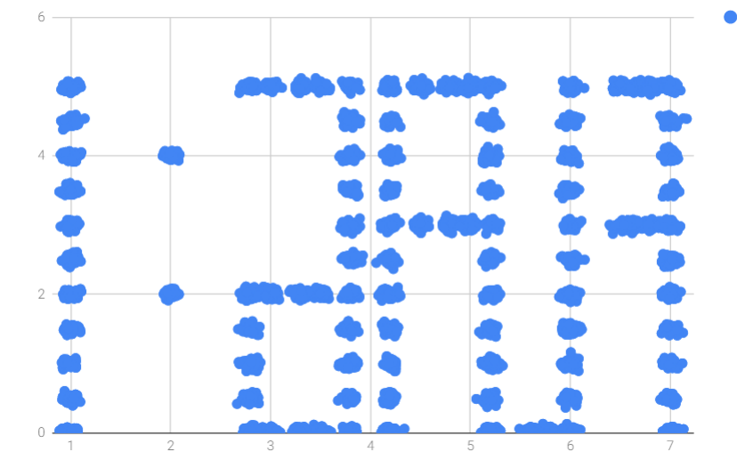

# Constellation (misc, 200p)

In the task we get a [pcap](traffic.pcap) and some [python code](proc.py).
In the traffic dump we can notice that ICMP packets carry some data which look like points coordinates so we dump [them](points.txt).

The python code performs some clustering of the points and draws a chart.
But the clustering makes little sense, since the points are quite close to one another, and DBSCAN parameters are set so high that all points would fall into the same cluster anyway.

Therefore we simply plotted the points directly, to get:

The task said something about doing "the opposite", and using what we see as contents of the flag.

The picture clearly shows `FLAG:1` in reverse, and the final flag was `TMCTF{flag:1}`
