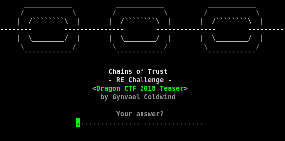

# Chains of Trust, RE, 391p, 10 solves

> Yet another reverse engineering challenge.

In this task we got a rather small binary and a bunch of libraries. When ran as-is, it seems to perform some
checks, including library versions, to finally ask for a password, then tell if it's correct:

After reversing the main binary, we notice it connects to a certain server, downloads a blob of data,
mmaps it and runs it. This happens in a loop, executing different chunks each time. I wrote a simple (for now!)
script to do the same communication and dumped the chunk.

The chunk was self-modifying - the first 100 bytes or so were bootstrap code to decrypt the rest. I emulated
it with Unicorn engine and analyzed the rest of the code. It was a simple check whether libraries were 
there, using dlopen and similar functions. There was also a "proof of work", or rather "proof of having-ran" - 
the chunk performed some simple arithmetic and reported the result to server. I had to emulate these too,
and hooked dlopen calls to return dummy values.

The following chunks were anti-debug. There was ptracing, checking errno, checking /proc/self/maps,
some environment checks and others. At first I implemented all of them one by one, but eventually I got
fed up and simply skipped the whole anti-debug check, jumping straight to proof-of-work code when one of
forbidden functions were called. The code isn't too beautiful as it now consists of strange mix of both
approaches, but seems to work.

Finally, there were some chunks that mmapped themselves a second time, and run a thread there. There was
about fifteen of those. They usually contained some structure as argument; its address was reported to server.
I reversed all of them - long story short, there were 7 types of threads:
- 0, "input" thread - the first thread we receive, shows the main screen and waits for input
- 3, 4, 5, 6 - "database" threads, they seemed to have four connections and wait for data on all
of them; depending on that, either saved data: `arr[addr] = data` or send it back: `send(arr[addr])`.
- 7, 8, 9, A - "HSM" threads, connected one-to-one to db threads, performed a simple encryption of db
contents
- B - "distributer", read input from thread 0 and divided bytes equally into each db
- C - "reducer", runs over all db's, encrypts all bytes, saves them all to db #3
- E - "hasher" - downloads all data from db #3, hashes it and compares to hardcoded data
- 1, 2, D - "dummies" - do nothing but sleep forever.

By "encrypt" here I mean very simple reversible arithmetic, like xoring with constant.
The exact order of servers seemed to vary between runs, but that's the basic idea. 
During reversing I even made a simple chart to help me keep track of everything:

What remained was to brute force the "hasher" preimages, invert "reducer" and "HSM"
operations and print the resulting flag. See `enc.py` and `solve.py` for details.

Check out [author's website](https://gynvael.coldwind.pl/?id=688) too, he posted challenge sources with
some comments on architecture. Seems the chunks were not supposed to mimic database and servers, but FPGA
with RAM modules - the general idea remained the same though. The expected solution was somewhat simpler,
as it involved dumping chunks using original binary and snapshotting memory or recording traffic. This
would work, and definitely save time I spent on writing emulator, but you would still have to sieve
through all the mmapped regions of memory and ignore the anti-debug/dummy ones, which is non-trivial
amount of work.
