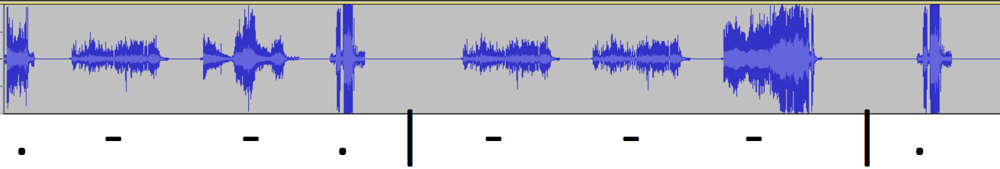

# Hummel (misc, 100p, 56 solved)

In the challenge we get a [video](challenge.mp4) with farting unicorn.
It's easy to notice that there are short and long farts, and that there are some spaces in between.

The first observation could mean some binary encoding, but the second observation suggest something like Morse code, and it's a right guess.

We extracted the soundtrack, loaded into Audacity and typed down the code: `.--. --- . - .-. -.-- .. -. ... .--. .. .-. . -.. -... -.-- -... .- -.- . -.. -... . .- -. ...`

which gives the flag: `hackover18{poetry inspired by baked beans}`
