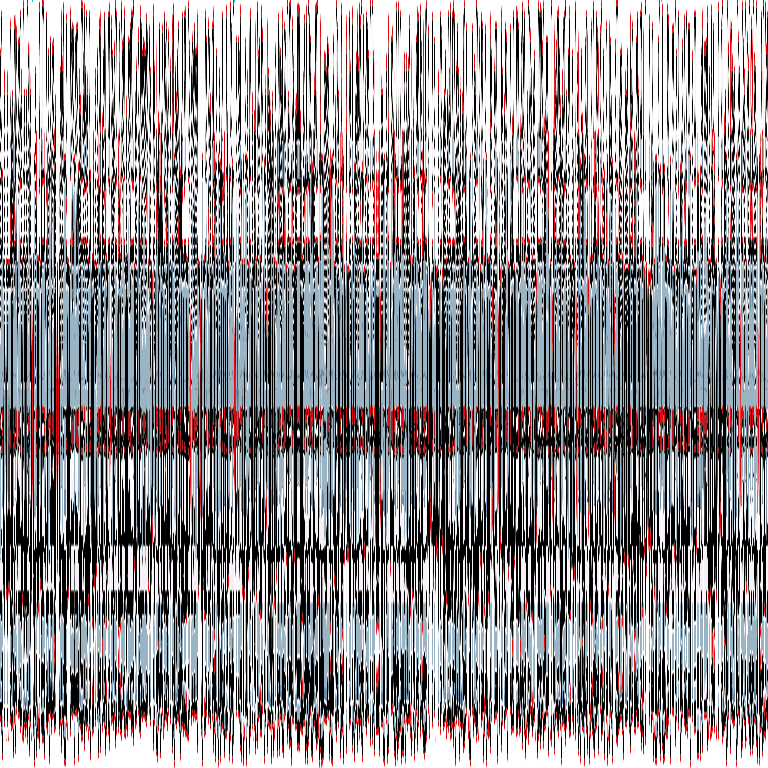
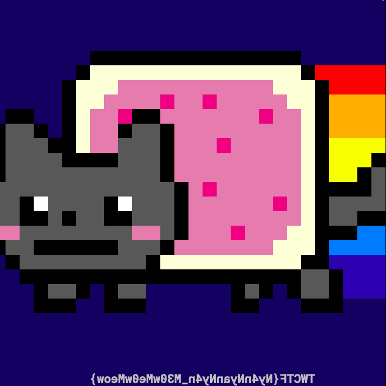

# Meow (re/crypto, 174p, 67 solved)

Officially this challenge was marked as `RE`, however we only reversed this as much as to be able to run it, and understand roughly what it might be doing, and then just solved this as blackbox crypto problem.

In the challenge we get [bytecode](meow.n) for NEKO VM and (encrypted flag)[flag_enc.png].
First thing we did was to dump the [disassembly](meow.dump) via `nekoc -d meow.n`.

After some reversing, and replacing the global references in the code, we noticed that it seems to be doing 2 steps:

- some kind of sorting
- loop with `get_pixel, xor, set_pixel`

From simple blackbox analysis we could notice that each color channel has to be xored with the same value, because in case all 3 color channels had the same value, in the output they would also always have the same value.
There was some complex logic in the code to generate this xor keystream, but we figured that we should be able to get the keystream easier, simply by encrypting picture with all (0,0,0) pixels.

It worked only with pictures 768x768 so we rescaled our test vector to this size and did a simple sanity check:

- Encrypt a black image, to recover potential keystream.
- Encrypt a known picture, in our case: .
- Create a new picture from pixel values from the encrypted black image (keystream) and pixels of our encrypted test vector.
- This way we got: 

It all confirmed our predictions.
We managed to recover image with proper colors, but it seems to have randomly shifted columns, probably because of the `sort` step applied to the image.

Now we had to invert this shuffling.
It could probably be done by reversing the sorting and the used comparator, but we figured out much easier approach.
We encrypted a diagonal line: .

Then we dexored it using keystream from the black image, just like above:

```python
black_image = Image.open("black_enc.png")
diagonal_image = Image.open("skos_enc.png")
scrambling_image = Image.new("RGB", (768, 768))
scrambling_pixels = scrambling_image.load()
diagonal_pixels = diagonal_image.load()
keystream_pixels = black_image.load()
lookup = {}
for i in range(diagonal_image.size[0]):
    for j in range(diagonal_image.size[1]):
        color1 = diagonal_pixels[i, j]
        color2 = keystream_pixels[i, j]
        d = diff(color1, color2)
        if d == (0, 0, 0):
            scrambling_pixels[i, j] = d
            lookup[i] = j
        else:
            scrambling_pixels[i, j] = (255, 255, 255,)
scrambling_image.save("scramble.png")
```

This way we got:


We included a lookup table in the loop, so we can use this now to invert the soring operation on the flag:

```python
    result_image = Image.new("RGB", (768, 768))
    result_pixels = result_image.load()
    flag_enc = Image.open("flag_enc.png")
    flag_enc_pixels = flag_enc.load()
    for i in range(flag_enc.size[0]):
        for j in range(flag_enc.size[1]):
            color1 = flag_enc_pixels[i, j]
            color2 = keystream_pixels[i, j]
            d = diff(color1, color2)
            if i in lookup:
                result_pixels[lookup[i], j] = d
    result_image.show()
    result_image.save("flag.png")
```

After running this get recover 
