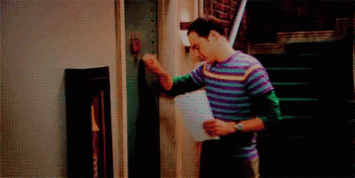

# Forensics 100 (forensics, 100p, ? solved)

In the challenge we get a [pcap](ctf.pcap) to analyse.
This time it's "only" 30 MB, so we include all of it.

With some help from NetworkMiner and Wireshark we're able to find a TCP stream:

```
Knock Knock
Who's there?
Flag Seeker
Go seek to a different place
```

We also find a request:

```
GET /data HTTP/1.1
Host: 172.16.123.177
User-Agent: Mozilla/5.0 (X11; Ubuntu; Linux x86_64; rv:68.0) Gecko/20100101 Firefox/68.0
Accept: text/html,application/xhtml+xml,application/xml;q=0.9,*/*;q=0.8
Accept-Language: en-US,en;q=0.5
Accept-Encoding: gzip, deflate
DNT: 1
Connection: keep-alive
Upgrade-Insecure-Requests: 1

HTTP/1.1 200 OK
Date: Tue, 16 Jul 2019 13:07:59 GMT
Server: Apache/2.4.27 (Debian)
Last-Modified: Tue, 16 Jul 2019 12:59:09 GMT
ETag: "b427d-58dcbf14ab2b2"
Accept-Ranges: bytes
Content-Length: 737917
Keep-Alive: timeout=5, max=100
Connection: Keep-Alive

PAYLOAD
```

The response is base64 encoded gif:



Both of those clues point into direction of `port knocking`.
However, we didn't really figure this out, until we've noticed some strange low port numbers in the pcap..
When we sort packets based on port number we can notice that there are in fact some connections on strange low port numbers, rather unusual, but all those numbers are in ASCII range.

Once we get all of them in order we can decode the flag:

```python
"".join(map(chr,[84,77,67,84,70,123,75,110,48,99,107,74,117,53,116,111,78,116,104,51,114,49,103,104,116,100,48,48,114,125]))
```

`TMCTF{Kn0ckJu5toNth3r1ghtd00r}`
