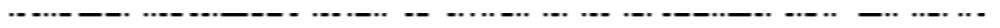
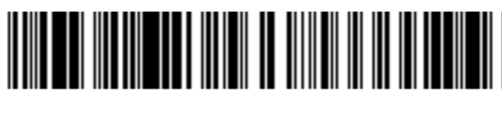
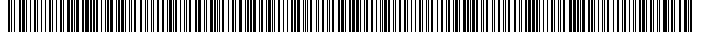

# PNGBomb (misc, 475p, 6 solved)

In this challenge we get a [png file](q.png.gz) which contains a very wide picture with 32 pixels height, which is supposed to be a barcode.
However it's too big to open with anything, or process in any reasonable way.

It's pretty clear from the contents of the file, that there are lots of repetitions of some kind.

One of our friends wrote a parser for zlib decompression to see what exactly is going on there and ended up with [bytecode](bytecode.txt) which describes how this picture should be generated from the input data.

The important part to take from this, is that the structure is:

- Add some unique pixels
- Many many times repeat
- Again add some unique pixels
- Again lots of repeats

We're looking for the flag, so most likely we're only interested in places with some reasonable entropy, so the `add some unique pixels` parts, not the repetitions.

We were unsure how those bytes from zlib translate to the pixels of the picture, especially that we were unable to find a tool which could create a 1-bit per pixel greyscale images, so we just tried it out with:

```python
def make_barcode(data):
    im = Image.new("RGB", (len(data) * 8, 0x20,))
    for k in range(0x20):
        for i in range(len(data)):
            by = bin(data[i])[2:].rjust(8, '0')
            for j in range(8):
                bi = int(by[j]) == 1
                if bi:
                    im.putpixel((i * 8 + j, k), (255, 255, 255))
                else:
                    im.putpixel((i * 8 + j, k), (0, 0, 0))
    im.show()
    im.save("out.png")
```

With this we could try out some stuff (like endianness, if bit=1 means white or black etc.), and compare the result with the prefix of the first line of the original file.
In order to get this reference first line prefix, we simply set in hexeditor the height to 1 and width to some small number like 100, and this way we could see how the real picture prefix should look like, and we could compare this with what we get.

The code above is the result of such tests.

Prefix we got was:



And the code above finally, for the first set of unique bytes: 

```python
data = [166, 84, 96, 66, 245, 35, 37, 1, 16, 207, 73, 161, 95, 35, 229, 181, 138, 244, 189, 39, 162, 228, 33, 80, 37, 229, 26, 252, 10, 245, 23, 89, 153, 24, 131, 15, 128, 21, 138, 192, 25, 211, 177, 166, 36, 152, 219, 42, 177, 150, 49, 41, 178, 207, 230, 140, 23, 4, 202, 50, 54, 0, 71, 44, 118, 22, 177, 207, 193, 216, 191, 206, 35, 125, 27, 182, 120, 150, 147, 51, 92, 190, 139, 194, 63, 156, 3, 0, 58, 152, 28, 32, 163, 224, 90, 96, 40, 201, 0, 62, 253, 184, 151, 110, 247, 142, 70, 104, 224, 61, 135, 209, 227, 118, 150, 7, 103, 153, 41, 172, 95, 230, 167, 212, 220, 225, 8, 216, 51, 144, 201, 90, 27, 24, 6, 173, 95, 56, 32, 185, 239, 75, 235, 186, 148, 60, 177, 143, 246, 107, 235, 83, 25, 61, 75, 9, 216, 136, 105, 22, 199, 87, 81, 187, 30, 0, 60, 155, 83, 103, 28, 75, 135, 141, 81, 220, 42, 250, 99, 221, 42, 121, 247, 55, 223, 239, 117, 84, 145, 4, 181, 193, 144, 221, 174, 96, 234, 64, 219, 146, 100, 98, 239, 17, 25, 9, 204, 172, 248, 123, 227, 30, 68, 81, 139, 94, 243, 82, 216, 219, 11, 4, 131, 136, 241, 193, 86, 140, 218, 55, 236, 53, 113, 3, 123, 14, 8, 80, 225, 128, 140, 66, 182, 19, 104, 178, 115, 122, 143, 61, 126, 227, 139, 128, 222, 141, 223, 172, 1]
```

Gave us:



It's pretty clear they match, however barcode scanners were unable to decode this.
Then we encoded the second chunk of unique bytes:

```python
data = [255, 45, 228, 93, 203, 187, 151, 114, 226, 81, 200, 73, 59, 164, 116, 139, 172, 243, 174, 185, 206, 138, 119, 89, 228,117, 196, 172, 247, 46, 58, 72, 233, 209, 92, 238, 228, 142, 172, 245, 206, 179, 200, 185, 17, 116, 231, 117, 19, 174, 114, 238, 229, 214, 123, 157, 58, 46, 37, 19, 172, 245, 206, 179, 206, 185, 17, 46, 238, 93, 103, 136, 148, 114, 93, 214, 123, 157, 59, 174, 69, 203, 174, 22, 94, 113, 79, 255]
```

And recovered the barcode:



Which decoded to `SECCON{ITS_HARD_TO_EXTRACT_A_SUBIMAGE_FROM_A_HUGE_PNG_FILE}`
