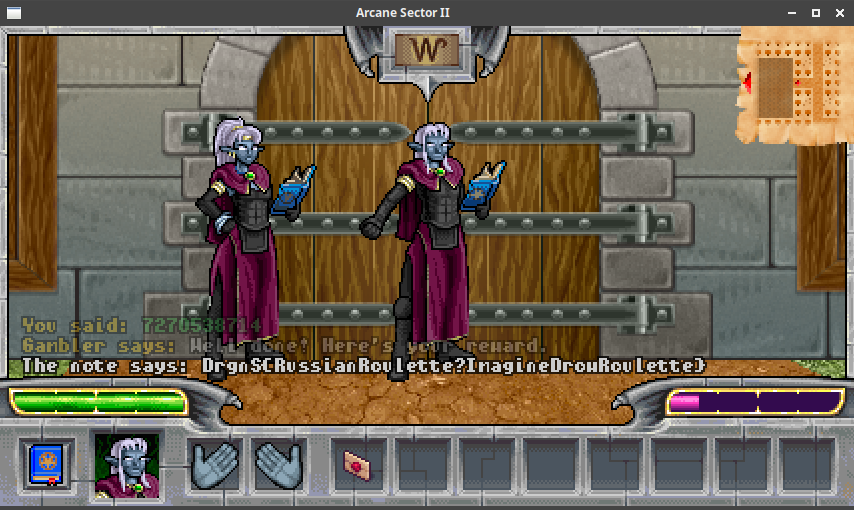

# Drow number guessing (game/crypto, 60p, 12 solved)

This challenge was part of the Arcane Sector 2 game.
We have a quest to guess the number an NPC is thinking of.

In the server code we can find the way the random number is generated:

```python

self.seed = bytearray(os.urandom(32))

  def gen_number(self, player):
    n = 146410935049
    for v in self.seed[:16]:
      n = (n + v * 186577649851) % 257084507917
    n = (n ^ (int(time.time()) * 117865751629)) % 257084507917
    for v in self.seed[16:]:
      n = (n + v * 186577649851) % 257084507917
    n = (n + player.id * 117865751629) % 257084507917
    return n % 10000000000
```

It might seem problematic, since there are 32 bytes of random seed to consider.
However, if we look closely what exactly is done with those values, it becomes much easier.

```
for v in self.seed[:16]:
  n = (n + v * 186577649851) % 257084507917
```

This is basically adding up all values from `self.seed[:16]` multiplied by constant `v` and then takes modulo.
The loop iterates over each byte of the seed. 
This literally kills the entropy.
If we take 2 bytes, separately they have 8*8=64 bits of entropy.
But if we add them, we get a single number `0..(256+256)` so only 9 bits.

It's the same here -> initially we had 16 bytes (128 bits), but if we add them, we have a number `0..4096` so only 12 bits.

The same happens in the second loop.
In the end we can simplify this function to:

```python
def gen_number(time_const, player_id_const):
    n1 = (sum(seed[:16]) * prime1 + n) % prime2
    n2 = (n1 ^ time_const) % prime2
    n3 = (sum(seed[16:]) * prime1 + n2) % prime2
    n4 = (n3 + player_id_const) % prime2
    return n4 % 10000000000
```

Now since we really need only those sums of seeds, we can easily brute-force them, looping over 4096 potential values for each of them.
Rest of the data are constants, and the last part is the timestamp, but we know it's epoch.

The idea is simple:

1. Go to the gambler and play the game once, sending any random answer.
2. Note the timestamp
3. Get the result from the gambler
4. Brute-force the seed sums using the real value and timestamp
5. Generate new value for some future timestamp
6. Play again at the exact time.

Recovering seeds is simple:

```python
def recover_seed_sums(result, time_const, player_id_const):
    for sum1 in range(4096):
        for sum2 in range(4096):
            if get_number(sum1, sum2, time_const, player_id_const) == result:
                return sum1, sum2
```

And generating new value for given seeds and timestamp:

```python
def get_number(sum1, sum2, time_const, player_id_const):
    n1 = (sum1 * prime1 + n) % prime2
    n2 = (n1 ^ time_const) % prime2
    n3 = (sum2 * prime1 + n2) % prime2
    n4 = (n3 + player_id_const) % prime2
    return n4 % 10000000000
```

