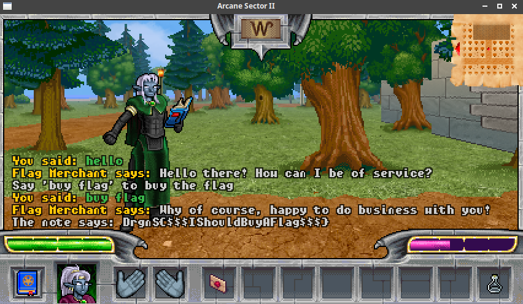

# Expensive flag (game, 140p, 10 solved)

In this quest we can simply buy the flag, assuming we have 100k of gold.
The only way to make money in the game is to sell metal ingots to the collector, and he pays 1k for every ingot he doesn't yet have.
There are 9 different metals, so we can get 9k.
What about the rest?

If we look closely at the Mob class, which is also base for all NPCs, we can see:

```python
class Mob(object):
  def __init__(self, world):
    # Initial values are for a non-existing mob.
    self.world = world
    self.id = MOB_NON_EXISTING_ID  # Must be set when adding to the world.
    self.gfx_id = ""
    self.name = "Unknown"
    self.type = MOB_TYPE_NPC
    self.hp = 100
    self.hp_max = 100
    self.mana = 100
    self.mana_max = 100
    self.visible = True
    self.inventory = [world.NON_EXISTING_ITEM] * 8
    self.move_count = 0
    self.killable = True

    self.pos_x, self.pos_y = None, None  # Position if on map.
```

Look closely at `self.inventory = [world.NON_EXISTING_ITEM] * 8`
There are only 8 slots, and in the game logic the item drops on the ground if it doesn't fit in the inventory.

This means we actually can sell the 9th ingot as many times as we want, since it will simply drop to the ground, and we can pick it up again.

The hard part now is to get all those ingots.
In order to do that we need to get a pickaxe and dig in specific place.
The type of metal we get is based on an algorithm:

```python
  def gen_random(self, player):
    n = 0xf0e1d2c3
    for a, b, c in self.last_used_locations:
      k = a ^ (b << 8) ^ (c << 16)
      n = ((n << 3) ^ k) & 0xffffffff
    self.last_used_locations.append(
      (player.pos_x, player.pos_y, player.direction)
    )
    self.last_used_locations = self.last_used_locations[-10:]
    return n
```

And:

```python
  metals = [
    ("ironium",     50000, 79999),
    ("shadovium",   80000, 89999),
    ("titanium",    90000, 94999),
    ("copperium",   95000, 97999),
    ("cobaltium",   98000, 98999),
    ("aurium",      99000, 99499),
    ("amethystium", 99500, 99959),
    ("royalium",    99960, 99998),
    ("dragonium",   99999, 99999),
  ]
```

The algorithm is pretty simple, and we can easily dump this directly to Z3 to solve for us:

```python
def generate_moves_for_value(target):
    last_positions = [(z3.BitVec('x%d' % i, 64), z3.BitVec('y%d' % i, 64), z3.BitVec('dir%d' % i, 64)) for i in range(10)]
    s = z3.Solver()
    for x, y, direction in last_positions:
        s.add(x < 428)
        s.add(x >= 420)
        s.add(y < 185)
        s.add(y >= 180)
        s.add(direction < 4)
        s.add(direction >= 0)
    n = gen_random(last_positions)
    s.add(n == target)
    print(s.check())
    model = s.model()
    results = []
    for x, y, direction in last_positions:
        results.append((model[x].as_long(), model[y].as_long(), model[direction].as_long()))
    return results


def gen_random(last_used_locations):
    n = 0xf0e1d2c3
    for a, b, c in last_used_locations:
        k = a ^ (b << 8) ^ (c << 16)
        n = ((n << 3) ^ k) & 0xffffffff
    return n % 
```

This will give us 10 locations where we need to dig, and after that digging once more will give the metal we want.
It's not the most efficient way, since it requires digging 10 times for 1 ingot, and we could use previous digging locations in the solver, to get next ingot in 1 shot, but it works anyway.

Once we collect all ingots we can start selling them and finally we get:



