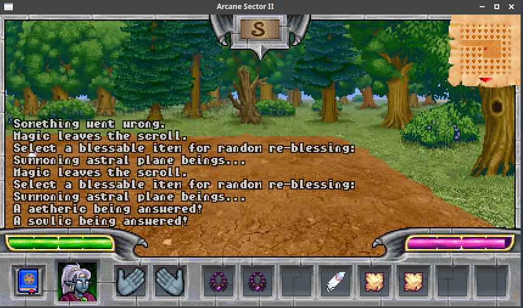
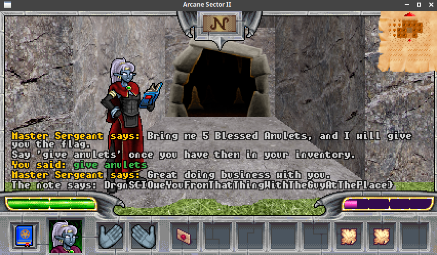

# Raiding party (game, 140p, 10 solved)

In this game challenge we have a quest to collect `5 blessed amulets`.
The issue is that there are only 4 of those on the map.

By looking at spells we have available, we found one that seemed interesting:

```python
@magic_spell("7071727374757677")
def spell_rebless(spell, player, world):
  player.show_text("Select a blessable item for random re-blessing:")

  for _ in player.YIELDING_select():  # yield from
    if _ is False:
      return
    yield _

  if player.select_result is None:
    player.show_text("Something's not right.")
    return

  target_type, target = player.select_result
  if target_type != "item":
    player.show_text("Something went wrong.")
    return

  item, item_location, item_location_info = target

  if not hasattr(item, "blessable") or not item.blessable:
    player.show_text("Wrong kind of item")
    return

  item_type = type(item)
  player.show_text("Summoning astral plane beings...")

  for _ in world.YIELDING_sleep(1.0):  # yield from
    yield _

  blessing_type = random.choice([
    "cosmic",
    "aetheric",
    "ghostic",
    "soulic",
    "magic",
    "voidic"
  ])

  player.show_text("A %s being answered!" % blessing_type)

  world.reclaim_item(item)
  item.id = ITEM_NON_EXISTING_ID
  item = world.register_item(item_type(blessing_type))
  player.add_to_inventory(item)
  player.send_inventory()
  player.send_ground()
```

The important part here is:

```python
  for _ in world.YIELDING_sleep(1.0):  # yield from
    yield _
```

which basically halts execution of this function for 1 second, while rest of the game is still going, and:

```python
  world.reclaim_item(item)
  item.id = ITEM_NON_EXISTING_ID
  item = world.register_item(item_type(blessing_type))
  player.add_to_inventory(item)
```

which pretty much removes the item, creates a new one, and adds it to our inventory.

The idea here is quite simple: if we could cast this spell twice on the same item, before it gets removed, we should get it back twice, effectively duplicating the item.

One problem is that we can't actually cast 2 spells at the same time, because there is a check for that.
However, this check does not include spells casted from scrolls, since casting from scroll is `item use` action and not `cast spell` action.

We need to do some running around to collect necessary items (empty scrolls, quill, mana potions), but eventually we can do:



Once we have a duplicate, we can collect rest of the amulets (or duplicate more, if we have enough mana) and collect the flag.


